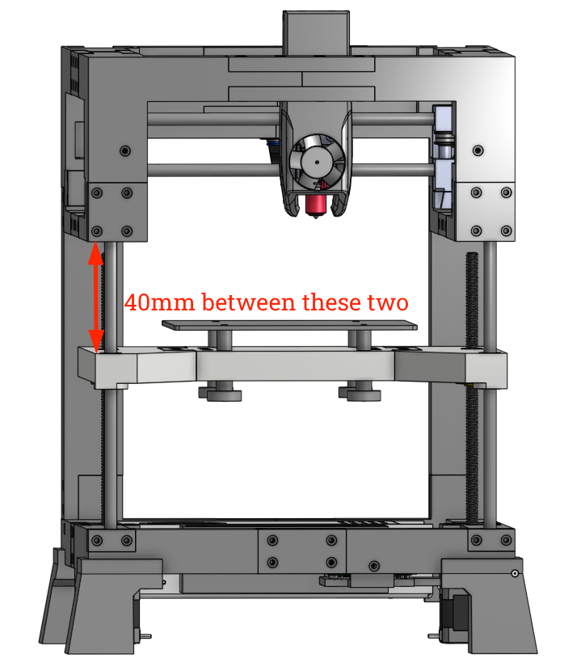

# Oh, you wanted 3d?
It turns out it's a requirement to move in the Z-axis if you want to print in 3d rather than 2d. Let's get that going now!

## Requirements 
  * You completed the steps in <a href="/t100/1.1/configure/first-gantry-movement/">the gantry movement guide</a>, and your `printer.cfg` is in the state it was left in at the end of that guide.
  * You have both of your Z-axis motors plugged in to your SKR Pico
  * You have access to fluidd/mainsail and it's connecting to your printer with no errors
  * You have an <a href="/t100/1.1/configure/preparing-for-movement/">understanding of CoreXY printers, motor wiring, and you have modified your cables as needed</a>
  * Just like I recommend not having the belt attached when you're first testing the gantry motors, I would recommend starting this process with either your Z motors not actually installed in the frame, or with the lead screw nuts disconnected from the bed so the rods can spin without actually moving the bed.
  * Lead screws should be attached to the Z motors with the couplers. It's important this is done so you can verify they aren't wobbling while testing motion. 
  
## Wiring
One important thing to understand about the SKR Pico is that while it has two separate outputs for two Z motors, they share the same driver. That means the power and everything is split in two. Typically the Z motors don't require nearly as much power as A/B motors because they don't move as much, but this is just something to be aware of. 

## Perspective
Just like the A/B motors, it's important to establish our perspective. Like a sane person, I'll be treating everything as if we're looking at the front of the printer from up above. Keep in mind that the Z motors are mounted facing up, so clockwise/counter-clockwise is reversed from the A/B motors which face down. Just look at everything from up above. 

<a href="images/the100_perspective.png" target="_blank"></a>

## Simple motor tests
We're now ready to send some simple commands to the Z motors to make sure that:

  1. They're plugged in to the right ports on the SKR Pico
  2. They're wired correctly
  3. They're spinning the correct directions
  4. The lead screws are staying straight

<div class="alert alert-warning" role="alert">
    🛑	In case you skipped the requirements above: your Z motors should either not actually be installed in the frame, or the lead screw nuts should be disconnected from the bed so the rods can spin without actually moving the bed. You're risking breaking things if it is.
</div>

You will send the following commands using the console in Fluidd, and observe what the motors do. Reminder that for clockwise/counter-clockwise, it's from the perspective of you looking down at the motors from up above. Check the screenshot at the top if you're confused. 

### Positive direction

```
SET_KINEMATIC_POSITION X=50 Y=50 Z=10
G91
G1 Z20 F100
```

Expected: both motors should rotate counter-clockwise, and the lead screws should not be wobbling at all.

##### Fixes
  * If both motors rotate clockwise
      * In your `printer.cfg` under the `[stepper_z]` section, change `dir_pin: gpio28` to `dir_pin: !gpio28`. Click `Save & Restart` and then repeat the test.
  * If the motors spin in opposite directions
      * Because the Z motors use a shared driver, this can only happen if your wiring is different between the two motors. Check the wiring on the one that is spinning counter-clockwise and make sure your other motor matches it. 
  * If no motor rotates
      * Check your motor wiring and that you have it plugged in to the correct port
  * If the lead screws are wobbling
      * Make sure the lead screws themselves are straight (easier to do if they aren't already attached). But more likely it means they aren't sitting straight up and down in the coupler. Loosen the coupler and get it perfectly straight, then tighten and retest. You need it to be as straight as possible to prevent binding when the bed moves.


### Negative direction

```
SET_KINEMATIC_POSITION X=50 Y=50 Z=30
G91
G1 Z-20 F100
```

Expected: both motors should rotate clockwise, and the lead screws should not be wobbling at all.

##### Fixes
  * If you got things working in the positive direction then no fix should be required here. If it isn't working as expected, go back to the previous step and do it again.

## Time to move the bed!
Completing those tests without the bed allows for much easier troubleshooting since it's clear what the motors are doing. Go ahead and get the motors installed in the frame now, and thread them in to the tightened lead screw nuts. It doesn't matter which motor goes on which side.

Using both hands to spin each lead screw at the same time, adjust the bed so you have at least 40mm between the top of the printed bed to the bottom of the top frame. 

<a href="images/bed_distance.png" target="_blank"></a>

Once you get it to roughly 40mm, use a caliper or something similar to actually measure the distance. This will be important coming up. 

```
SET_KINEMATIC_POSITION X=50 Y=50 Z=40
G91
G1 Z-20 F100
```

You really shouldn't have any failures here if you completed all the previous steps, but there is a critical final step: validate your screw pitch. Different lead screws will move the bed a different distance. Re-measure the distance between your bed and the top of the frame and verify it is now 20mm less than your first measurement. If it's close, that's fine. If it's way off, you will need to make changes to `rotation_distance`. I'm skipping describing that further now so hopefully yours was right! Please @ me on discord if yours wasn't. 

<div class="alert alert-info" role="alert">
    💾 	Take a moment now to download a copy of your `printer.cfg` to your computer and rename it to include today's date, or `printer.cfg-xyz_movement_works` or something like that. If you end up breaking your cfg in future steps, or if your SD card gets corrupted, or anything else like that... you'll be glad you have this saved! I highly recommend repeating this process any time you make important cfg changes. 
</div>

With X/Y/Z all working, it's time to home your printer for the first time! Spoiler alert: there's a few things we have to do first...