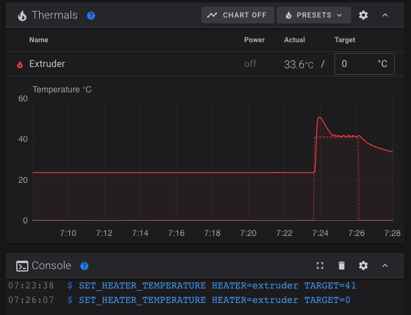
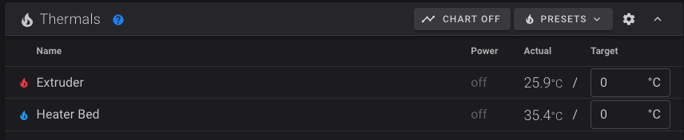
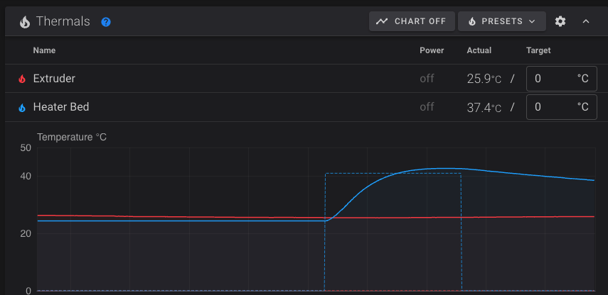
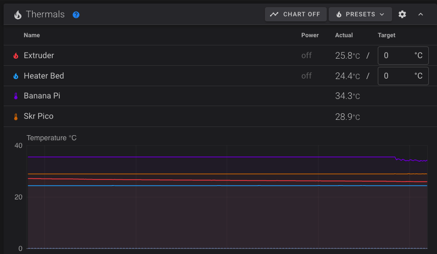

# Fans & Heaters
For whatever reason I'm always excited to test out the fans and heaters during a new build, but you can't (easily) test them until you have a lot of other pieces and parts working. Now that we have all the necessary items setup, let's get them going!

## Requirements 
  * You have completed the <a href="/t100/1.1/configure/extruder-setup/">extruder setup</a> guide, and your `printer.cfg` matches how we ended that one.
  * Your fans, thermistors, and heaters are connected to the SKR Pico and your power supply as needed

## Wiring
This guide doesn't cover wiring in detail, but it is important that you have your thermistors and heaters plugged in before you continue or you'll just get errors. 

## Fans

### Add fans to printer.cfg
To help keep your `printer.cfg` clean, I recommend adding this directly below the `[tmc2209 extruder]` section.

```
[multi_pin part_cooling]
pins: gpio17,gpio20

[fan]
pin: multi_pin:part_cooling

[fan_generic hotend_fan_test_only]
pin: gpio18
```

### Test part cooling fans
Run the following command in the fluidd console

```
M106 S128
```

Expected: Both part cooling fans spin up to 50%. You can run `M106 S255` if you want to hear them at 100%.

Run `M106 S0` to stop the fans.

#### Fixes
  * If no fans turn on or if the wrong fans turn on, check your wiring and their connections to the SKR Pico.

### Test the hot end fan
Run the following command in the fluidd console

```
SET_FAN_SPEED FAN=hotend_fan_test_only SPEED=0.5
```

Expected: The hot end fan spins up to 50%. You can run `SET_FAN_SPEED FAN=hotend_fan_test_only SPEED=1.0` if you want to hear it at 100%.

Run `SET_FAN_SPEED FAN=hotend_fan_test_only SPEED=0` to stop the fan.

#### Fixes
  * If the fan doesn't turn on, check your writing and the connection to the SKR Pico
      * If the wiring looks right, it's possible your fan is being prevented from moving due to how it's installed in the hot end fan shroud. I would suggest disassembling it and pulling the fan out and seeing if it works then. If it works: carefully reinstall, ensuring that nothing is getting in the way of the blades spinning. I actually had to do some light sanding on the sides of my shroud to prevent it from squeezing the fan which was causing the outside of the fan to push in to fan blades.

### Update hot end config
The `printer.cfg` above has a section that allows you to easily test the hot end fan manually. Now that it's tested and working we need to update that part of the config so that it works along with the hot end thermistor as expected. 

Delete the following 2 lines:
```
[fan_generic hotend_fan_test_only]
pin: gpio18
```

And replace them with:
```
[heater_fan hotend_fan]
pin: gpio18
heater: extruder
heater_temp: 40.0
```

Then do Save & Restart before continuing. Note that the `SET_FAN_SPEED FAN=hotend_fan_test_only...` command will no longer work after this change, but making this change is necessary for the fan to work as expected.

## Heaters
Your printer has a heater for the hot end and a heater for the bed. These next steps will walk you through setting up the heaters and their thermistors. 

As before, it's assumed you have done the wiring; that won't be covered in this tutorial. 

### Hot end
If you have been following along then you already have everything in your `printer.cfg` to test out the the heater on your hot end! 

Run `SET_HEATER_TEMPERATURE HEATER=extruder TARGET=41` which will tell it to heat to 41. You should immediately hear the hot end fan come on, and you should see the temperature on the graph go up. If your hot end fan doesn't turn on immediately, make sure you updated the `[heater_fan hotend_fan]` section above. 

After verifying the temp went up as expected, run `SET_HEATER_TEMPERATURE HEATER=extruder TARGET=0` to turn the heater back off. The configuration tells the fan to turn off once the heater temp is below 40, so the fan should turn off after a few seconds. The hot end will continue to cool off until it returns to room temp.

<a href="images/hot_end_heater.png" target="_blank"></a>

In the tuning phase tutorials we'll pid tune it and everything. 

### Bed
For the bed you need to add the following to your `printer.cfg`. To keep things organized, I suggest doing it directly after the `[heater_fan hotend_fan]` section.

```
[heater_bed]
heater_pin: gpio21
sensor_type: EPCOS 100K B57560G104F
sensor_pin: gpio26
control: pid
pid_Kp: 54.027
pid_Ki: 0.770
pid_Kd: 948.182
min_temp: 0
max_temp: 130

[bed_screws]
screw1: 33, 25
screw2: 128, 25
screw3: 33, 135
screw4: 128, 135
```

Then save and restart.

#### Thermistor sensor type
The `sensor_type` value is based on the thermistor that comes with Ender 2 Pro bed. If you're using a different bed then you may need to change it to a different value. `ATC Semitec 104NT-4-R025H42G` is another common option, but check your heated bed documentation.

If things are working then you should now see your heated bed, along with a valid temp, displayed in fluidd.



#### Testing
We can now test the bed by running `SET_HEATER_TEMPERATURE HEATER=heater_bed TARGET=41`. The bed doesn't heat up nearly as fast as the hot end, and no fans will come on, but you should see the temp begin to rise on the graph. 

Once it becomes obvious that it's working as expected, run `SET_HEATER_TEMPERATURE HEATER=heater_bed TARGET=0` to turn it back off. 

<a href="images/bed_heater.png" target="_blank"></a>


## Additional sensors
It's always fun to see more temperatures. Add the following to your `printer.cfg` to display temperatures for your SKR Pico and BananaPi. I suggest doing it just below the `[bed_screws]` section. 

```
[temperature_sensor skr_pico]
sensor_type: temperature_mcu
min_temp: 0
max_temp: 100

[temperature_sensor banana_pi]
sensor_type: temperature_host
min_temp: 10
max_temp: 100
```

After a save and restart, you should now see them displayed in fluidd. 

<a href="images/all_temps.png" target="_blank"></a>

<div class="alert alert-info" role="alert">
    💾 	Take a moment now to download a copy of your `printer.cfg` to your computer and rename it to include today's date, or `printer.cfg-fans_thermistors` or something like that. If you end up breaking your cfg in future steps, or if your SD card gets corrupted, or anything else like that... you'll be glad you have this saved! I highly recommend repeating this process any time you make important cfg changes. 
</div>

Holy crap... that's the last configuration step! All hardware and components are now tested and verified working!!! It's time to move on to some basic tuning so we can complete our first print!