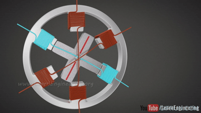
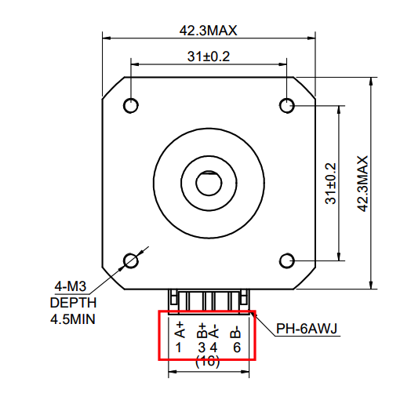

# It's (almost) alive!
We're almost ready to start applying power to your motors and getting things moving... but before we do, it's important that you understand how the motors work so you can set them up correctly. Doing it wrong won't break anything (aside from your patience and mental stability), but knowing why it's wrong and how to fix it is critical for moving forward with the printer.

## Requirements 
  * Your motors, the cables to connect them, and your motor technical sheets

## Understanding movement
I set out to write a guide on how to get the printer moving, and how to troubleshoot it when it inevitably wasn't working on your first try. But as I wrote it I realized more and more that I needed to explain motor wiring and how CoreXY printers work in general. If you're super experienced with stepper motors and CoreXY printers then you can skip to the next section, but I highly recommend reading through this. 

I've kept things as simple as I could, while providing enough detail to help you get your printer working! This is one of the most common places that people get stuck and frustrated, so take the time now to understand it before you start doing it. 

## CoreXY basics
I'm not using this as a spot to explain why a CoreXY printer is better than cartesian -- or to even say that it actually is better for that matter -- it's just important to understand how they're different. 

A cartesian printer (there's a million of them but think: Ender 3, Prusa MK3, etc, etc, etc) most often has a single motor that controls movement on the X axis, a single motor that controls movement on the Y axis, and a single motor that controls movement on the Z axis. That means if you're building or troubleshooting movement on one, it's super obvious that if it won't move in the X-direction then it's something with the X motor. Or if the Y-direction moves the opposite of how you expect then it's the Y motor. 

With a CoreXY printer, movement in the X or Y direction actually requires two separate motors working together. So if your printer isn't moving in the X-direction, it could be either motor causing it. Or if the Y-direction is reversed, it could be either motor. It makes things more complex, but the good news is that troubleshooting this is easy if you take it slow and pay attention to how things should be working. 

It's worth mentioning here that while people still often refer to motors on a CoreXY printer as the X motor and the Y motor, it often makes more sense to refer to them as A and B to prevent your brain from thinking that a single motor controls a single direction. But you'll still see references to X and Y everywhere so there isn't really any avoiding it. 

## Stepper motor basics
Without getting too deep in to the details, it's important to understand how a stepper motor works so that you can figure out how to wire one up. I'm keeping this as simple as possible so again, if you're super knowledgable with stepper motors then you'll probably want to correct me on stuff, but this isn't meant to be a class on elecromagnetism (unless you want it to be...). 

Your stepper motor has a shaft sticking out of it. This is the part that you see spinning around. Inside the motor, that shaft is attached to a magnetized rotor. In a circle around the shaft/rotor are sets of electronic magnets. The shaft/rotor can't actually touch the magnets around it, but they're close enough that they're attracted to each other. Like 2 magnets that want to snap together. 

Remember from grade school that all magnets have a north and south pole, and that opposite poles attract each other while matching poles repel each other? That's exactly how this works. One set of electromagnets is energized which causes the magnetic shaft/rotor to be attracted to it. Now that set is turned off and the next set is turned on; this causes the shaft to rotate due to magnetic attraction. Now repeat that a bunch of times and the shaft will rotate in a circle. Repeat the process but turn the magnets on in the opposite direction and your motor will turn in the other direction.

Here is a top-down view of the motor. The shaft is sticking up towards the camera, attached to the rotor that you see spinning as the different magnet groups are electrified (<a href="https://www.youtube.com/watch?v=eyqwLiowZiU" target="_blank">gif source</a>):

## Stepper motor wiring
Hopefully I haven't lost you yet. Stick with me a little longer! We're going to get a <i>little</i> more advanced here but I promise it's easy.

I explained that to explain this: the 4 wires that come out of your stepper motor are used to power the series of magnets inside the motor. Power them on in one sequence and it spins clockwise, the oposite sequence and its counter-clockwise. Power them incorrectly and it won't work at all because the magnet isn't generated. Therefore, it's important to get the wires from the motor to your SKR Pico in the correct order. The problem with that is the wire order isn't standardized or consistent. You must look at the diagram for your motor to determine the pinout order, and use that to ensure it matches what the Pico wants. 

Every motor is going to have two wires for `A` and two wires for `B`. If you look at the spec sheet for your motor (note: you must look at the sheet for your exact motor!), there will be a diagram that shows the pinout. 

Here is a screenshot from mine, model 17HE19-2004S from Stepper Online:

Notice at the bottom it says `A+ B+ A- B-`? That indicates that pin 1 is the positive wire for A, pin 2 is positive for B, pin 3 is negative for A, and pin 4 is negative for B. And again, for a refresher, the Pico would send power down these 4 pins in sequence to cause the motor shaft to turn one direction or the other. Ok... great! We have our pin order and we have at least some idea how this is supposed to work. Hopefully. :) 

## SKR Pico wiring
Here's the last of the technical bits, and it's easier than the stuff above. The SKR Pico expects the motor wires to be in the following order `A+ A- B+ B-`. The good news here is you can reverse the A and B groups and things will still work (it will possibly spin in the wrong direction but that's a simple fix in klipper and is covered in the next section), but it's important that A is grouped together as +/- and B is grouped as +/-. 

If you hadn't noticed, my motor is a problem because it goes ABAB. If I were to just plug it up as-is to the Pico then nothing would work because the magnets won't be properly powered. The fix is very easy though. Rather than leaving the cable how it is where pin 1 on the motor would connect to pin 1 on the Pico, pin 2 to 2, etc, I just need to pull pins 2 and 3 from one end of the cable and reverse them. This doesn't require any special tools other than a small poker (a paperclip will do). 

This pin swap is extremely easy to do regardless of <a href="https://theforgetful.dev/t100/1.1/overview/faq/#what-motors-should-i-get">your connector style</a>. Just do a quick search on how to remove a pin based on the style you have and you'll be all set. 

By making that change I haven't actually done anything to the motor itself; the pins on the motor are still `A+ B+ A- B-`, but the order they're actually connected to the Pico in becomes `A+ A- B+ B-`. 

Ok... Hopefully I covered that in enough detail to explain it, but not so much that you're more confused than when you started. As always, let me know if you have questions or suggestions. Class is adjourned! Take a quick break and then let's get your printer gantry moving!
