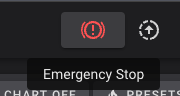

# Homing
Homing is the process your printer completes to determine the printhead's location in all 3 dimensions. Traditionally this is done using a limit switch on each axis, but THE 100 uses a new process that doesn't require the switches -- that's where the name "sensorless" comes from. The primary benefit is it reduces the cost and some complexity of the build itself, but it does add extra configuration steps. 

## Sensorless homing 
Sensorless homing is a Klipper feature where it moves the carriage and bed until they hit the frame of the printer. Once that happens, the stepper motor loses steps. The stepper driver senses those lost steps which Klipper can then use to know that it has hit the end of the axis. Other than that, it works the same way as a limit switch. 


## Requirements 
  * You have completed the <a href="/t100/1.1/configure/first-gantry-movement/">gantry movement</a> and <a href="/t100/1.1/configure/first-bed-movement/">bed movement</a> guides, and your `printer.cfg` matches how we ended the bed movement guide.
  * Know how to do an emergency stop in fluidd/mainsail so you can immediately stop the homing process if your stepper driver doesn't properly report a stall. This will help prevent damage to the printer and motion systems. 
      * 

<div class="alert alert-warning" role="alert">
    🛑	Skipping steps and not slowly iterating will result in you getting increasingly frustrated. It's important to make one change at a time, test one thing at a time, and document your progress as you go. If you've made it this far then you're doing great! But for those that have never setup a printer like this before, this is where a lot of frustration will come if you aren't patient and methodical about your setup.
</div>

## Relevant printer.cfg sections
If you have been following my configuration guide then these already exist in your `printer.cfg`, but it's still important you understand what options are doing what so you can troubleshoot them later if needed. 

The examples below are just snippets of the config

```
[stepper_x]
endstop_pin: tmc2209_stepper_x:virtual_endstop    # Use a virtual endstop
homing_retract_dist: 0                            # Don't find the endstop, then retract and find it again. Just do it once.

[tmc2209 stepper_x]
diag_pin: ^gpio4        # The pin your stepper driver diagnostic output is connected to
driver_SGTHRS: 115      # The stallguard threshold / sensitivity level
```

Similar options are repeated for `stepper_y` and `stepper_z`.

## Stallguard threshold aka driver_SGTHRS
When your axis hits the printer frame and reports the missed steps back to the MCU via the diagnostic pin as described above, it reports a stallguard value. A very high / very sensitive value, like 255, will trigger simply from the friction of the motor moving. A very low / least sensitive value, like 0, will likely never trigger since your motor will likely overpower your belt. 

The goal for this part of the guide is to find the right stallguard value for your setup so that it detects when your axis has hit the frame without triggering too early or too late. It's important to note that this value can change if you make changes to your motor current, homing speed, load on the printer, and some other variables. So if you find your homing process stops working while you continue tuning the printer, you may need to revisit this guide and re-tune driver_SGTHRS.

## Enough talking, let's get tuning!
The process for determining your stallguard threshold involves setting it to the highest value, then continuing to lower it until it stops as expected. It's generally recommended to only lower the value by 5-10 at a time, however you start at 255 and most motors will require something around 100, so I personally make bigger jumps at first to save time. Then once you start to get around the right number, make smaller steps. 

Just be ready with the emergency stop button in case you go too far and it's causing the axis to repeatedly crash in to the frame.

<div class="alert alert-danger" role="alert">
    🛑	If your printer.cfg isn't following this guide exactly then the G28 command may not work as described. In particular if you are using the printer.cfg from Matt's github then you should be able to replace G28 with G280 in the commands below, but I'm not going to cover that further as the recommendation here is to follow all parts of this guide.
</div>

Be sure to wait a few seconds between each `G28 X0` command. After the driver detects a stall it may take a little time for it to clear its internal indicator and be capable of detecting another stall.

## X-axis
With your printer powered on, physically move the printhead to the center of the X and Y axis so it's over the middle of your bed. Issue the following commands using your fluidd/mainsail console

```
SET_TMC_FIELD FIELD=SGTHRS STEPPER=stepper_x VALUE=255
G28 X0
```

This temporarily overrides your cfg and sets the stallguard value to `255`, and it then tries to home the X axis. It's expected that the gantry moves a tiny amount but stops almost immediately. If it moves all the way to the frame then you should immediately hit the stop button. You either have an issue with your diag pin wiring, or you aren't using a `TMC2209` stepper driver. 

If the motor moves a tiny amount and then stops, let's save time and jump to a lower threshold. 

```
SET_TMC_FIELD FIELD=SGTHRS STEPPER=stepper_x VALUE=200
G28 X0
```

  * If it moved a tiny amount and then stopped (most likely), continue with the next step
  * If it moved to the end of the frame and stopped, jump to <a href="/t100/1.1/configure/sensorless-homing-prep/#fine-tuning-x-axis">fine tuning</a>
  * If it moved to the end of the frame and didn't immediately stop, increase the `VALUE` until it stops when it collides, then jump to <a href="/t100/1.1/configure/sensorless-homing-prep/#fine-tuning-x-axis">fine tuning</a>.

```
SET_TMC_FIELD FIELD=SGTHRS STEPPER=stepper_x VALUE=170
G28 X0
```

  * If it moved a tiny amount then stopped (most likely), you should continue repeating the steps above but lower the `VALUE` in increments of 10. So the next steps would be 160, 150, 140, etc. 
    * You may need to disable the motors and physically move the printhead back to the center of the print bed if it is getting too close to the frame due to the number of tests it is taking to find the right value for your motors. 
    * Eventually you will find a low enough number where the printhead moves all the way to the frame and then stops once it bumps it. You should now jump to <a href="/t100/1.1/configure/sensorless-homing-prep/#fine-tuning-x-axis">fine tuning</a>.
  * If it moved to the end of the frame and stopped, jump to <a href="/t100/1.1/configure/sensorless-homing-prep/#fine-tuning-x-axis">fine tuning</a>
  * If it moved to the end of the frame and didn't immediately stop, increase the `VALUE` until it stops when it collides, then jump to <a href="/t100/1.1/configure/sensorless-homing-prep/#fine-tuning-x-axis">fine tuning</a>.

### Fine tuning X-axis
You found the value where stallguard stops homing once the carriage hit the frame... excellent! But we still need to do a little more tuning. There is a range of values where it will stop and we don't currently know if you're at the top or bottom of that range. Our goal here is to get somewhere in the middle so small changes to your printer won't break homing. 

As mentioned above, be sure to wait a few seconds between each `G28 X0` command. After the driver detects a stall it may take a little time for it to clear its internal indicator and be capable of detecting another stall. You may also need to disable the motors and physically move the printhead back to the center if you're getting too close to the frame. 

#### Max value
Our first step here is to increase your value by 10 and test. This is increasing sensitivity meaning it's likely to move slightly and then stop. Move the printhead back to the center of the bed, then replace `VALUE` with the actual value you found above +10. In my example I'm going to start with `120` for my printer because the value I found above was `110`. Yours will very likely be different. 

```
SET_TMC_FIELD FIELD=SGTHRS STEPPER=stepper_x VALUE=120
G28 X0
```

  * If it stops right away (mine did) then you know the value you found before is the upper threshold of your printer. For me that means 110 but again, yours will likely be different. Continue to min value.
  * If it moves all the way to the frame and then stops, you aren't at your upper threshold yet. Increase the value by another 5 and then repeat until it stops right away. Then continue to the next step. 

#### Min value
The process is the same, but we want to decrease values of 10 to find the lower threshold. Our goal here isn't to push it to the point of crashing the toolhead in to the frame and grinding the belt, but to find the value where it homes without a large bang or click. 

Move the printhead back to the center of the bed, then replace `VALUE` with the value you found above minus 10. In my example I'm going to start with `100` for my printer because the value I found above was `110`. Yours will very likely be different. 

```
SET_TMC_FIELD FIELD=SGTHRS STEPPER=stepper_x VALUE=100
G28 X0
```

  * If it moves to the end and stops just as quietly as it did before, subtract another 10 (decrease sensitivity) and repeat until you find your minimum value. Again, you aren't trying to find a point where it reaches the frame and then keeps going. That means you've pushed it way too far. You're just trying to find where it makes a louder bang or click than it had before.
  * If it moves all the way to the frame and makes a loud bang, add 5 (increase sensitivity) to your value and repeat until it stops quietly. 

For me that value is 70. 

If you're starting to get to numbers that are 50 or more lower than your max value then your ears likely aren't picking up the difference in how it sounds when it stops. I wouldn't recommend continuing to go lower as it doesn't benefit you any. 

### Setting the value
I now know my max value is 110 and my minimum value is 70, meaning the middle is 90. That's what I'll set as my new value. Update your `printer.cfg` in the correct section to match your value, then save and restart. 

```
[tmc2209 stepper_x]
driver_SGTHRS: 90
```

Now we'll repeat the same process for Y and Z!


## Y-axis
The process for the Y-axis is exactly with the same except we'll update our commands to use `stepper_y` and to home the Y axis rather than X. I'm not going to go in to as much detail as I did above because it would be redundant. Refer to the steps above as needed. 

With your printer powered on, physically move the printhead to the center of the X and Y axis so it's over the middle of your bed. Issue the following commands using your fluidd/mainsail console

```
SET_TMC_FIELD FIELD=SGTHRS STEPPER=stepper_y VALUE=255
G28 Y0
```

This should move a tiny amount and then stop. Repeat the steps above until you find the value where it moves on the y-axis until it hits the frame and then stops. I would save time by initially making some big jumps by changing `VALUE` 200, then 170, then 150. At that point I would start moving in increments of 10: 140, 130, 120, etc until you get it to move to the frame. 

As mentioned above, be sure to wait a few seconds between each `G28 Y0` command. After the driver detects a stall it may take a little time for it to clear its internal indicator and be capable of detecting another stall. You may also need to disable the motors and physically move the printhead back to the center if you're getting too close to the frame. 

Once you find a good VALUE, repeat the steps outlined above for max value and min value; just don't forget to update the commands to reference `stepper_y` instead of `stepper_x`, and `Y0` instead of `X0`.

### Setting the value
At this point you should know the max and min values for your Y axis. Pick a value in the middle of the two and then update the relevant section of your `printer.cfg`. Then save and restart. 

```
[tmc2209 stepper_y]
driver_SGTHRS: 95
```

## Z-axis
The process for the Z-axis is exactly with the same as the Y-axis, which was exactly the same as the X-axis. Except, of course, we'll update our commands to use `stepper_z` and to home the Z axis. I'm going to go in to even less detail than before. Refer to the steps above as needed. 

Important change for Z-axis: ensure your toolhead is pushed all the way back so the bed doesn't collide with your nozzle while it homes. 

With your printer powered on, physically move the printhead to the back frame. Then turn the lead screws so there is a decent gap between the top of the bed and the top frame (40mm or so). Issue the following commands using your fluidd/mainsail console

```
SET_TMC_FIELD FIELD=SGTHRS STEPPER=stepper_z VALUE=255
G28 Z0
```

This should move a tiny amount and then stop. Repeat the steps above until you find the value where the bed moves up until it hits the frame and then stops.

As mentioned above, be sure to wait a few seconds between each `G28 Z0` command. After the driver detects a stall it may take a little time for it to clear its internal indicator and be capable of detecting another stall. You may also need to disable the motors and physically move the bed back down if you're getting too close to the frame. 

Once you find a good VALUE, repeat the steps outlined above for max value and min value; just don't forget to update the commands to reference `stepper_z` `Z0`.

### Setting the value
At this point you should know the max and min values for your Z axis. Pick a value in the middle of the two and then update the relevant section of your `printer.cfg`. Then save and restart. 

```
[tmc2209 stepper_z]
driver_SGTHRS: 70
```

## Final thoughts
Check out the Klipper <a href="https://www.klipper3d.org/TMC_Drivers.html#sensorless-homing">sensorless homing</a> documentation for additional details and troubleshooting steps if you're running in to problems.

I mentioned this above but you will potentially need to recalibrate your `driver_SGTHRS` values if you change motor currents, change, homing speed, or make other big changes to the motion systems. If that happens, just come back to this guide and rerun the steps. The good news is that by setting a value that's in the middle of min and max, you can hopefully make most changes without breaking homing.

With all of this set, you're now ready to actually complete a homing! But you don't want to just hit the homing button in Fluidd. Now that you have stallguard configured, we need to talk about the custom homing macro required for sensorless homing. This guide is already long enough so I'm going to cover it in the next one. See you there!

<div class="alert alert-info" role="alert">
    💾 	Take a moment now to download a copy of your `printer.cfg` to your computer and rename it to include today's date, or `printer.cfg-endstops_work` or something like that. If you end up breaking your cfg in future steps, or if your SD card gets corrupted, or anything else like that... you'll be glad you have this saved! I highly recommend repeating this process any time you make important cfg changes. 
</div>