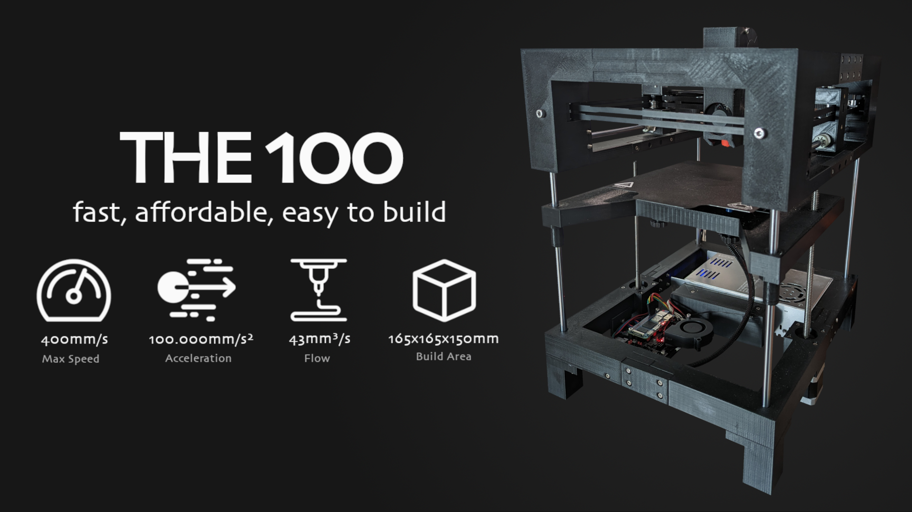

# THE 100 3d Printer

## Welcome!
If you found this page then you probably already know what THE 100 project is, but just in case you don't: it's a 3d printable 3d printer designed by <a href="https://github.com/MSzturc">Matt</a>. 

Matt himself has created a <a href="https://www.youtube.com/watch?v=fC4BB4BhjOo&list=PLM01o_dfwbDcKYB-9yV0vLs5k0CrHUv0W&pp=iAQB">great assembly guide on YouTube</a> but those videos don't go in to detail about how to actually print the parts. I struggled with knowing how many of each part to print and which parts I actually needed. As I've spent more time in THE 100 discord, I've seen these same questions come up often. 

## What is this guide for?
This guide is meant to answer questions about THE 100 like:

  * How many of each part do I need?
  * How many screws do I need of each size? How many heat inserts? And how many nuts?
  * How much filament does each piece need?
  * Mistakes to avoid
  * How do I build it?
  * How to I configure it?
  * And a lot more

Now you may be wondering: <a href="/t100/1.1/overview/why-print-the-100/">why should I even print one of these</a>?