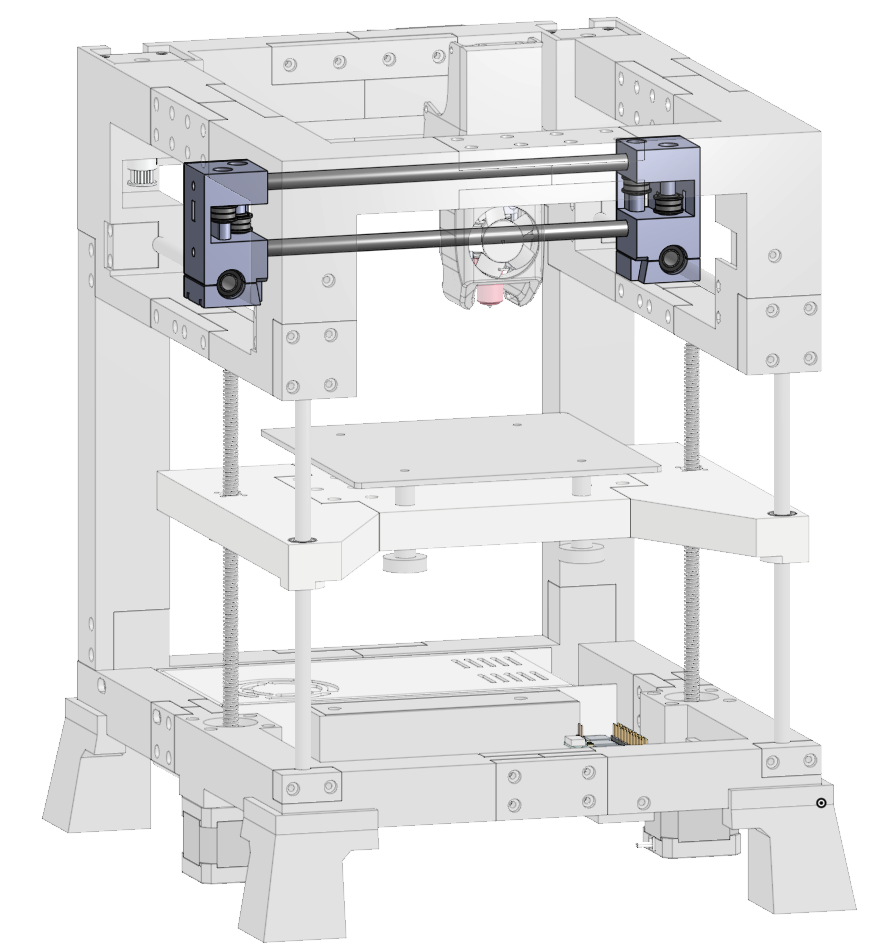
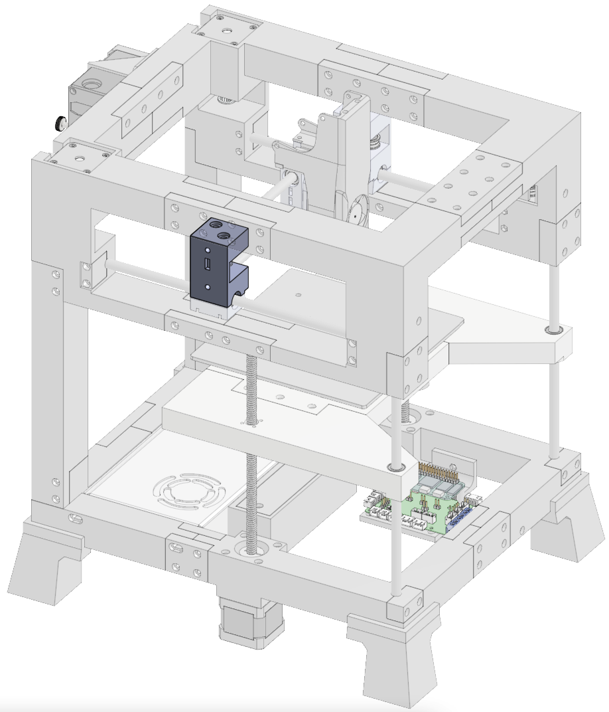
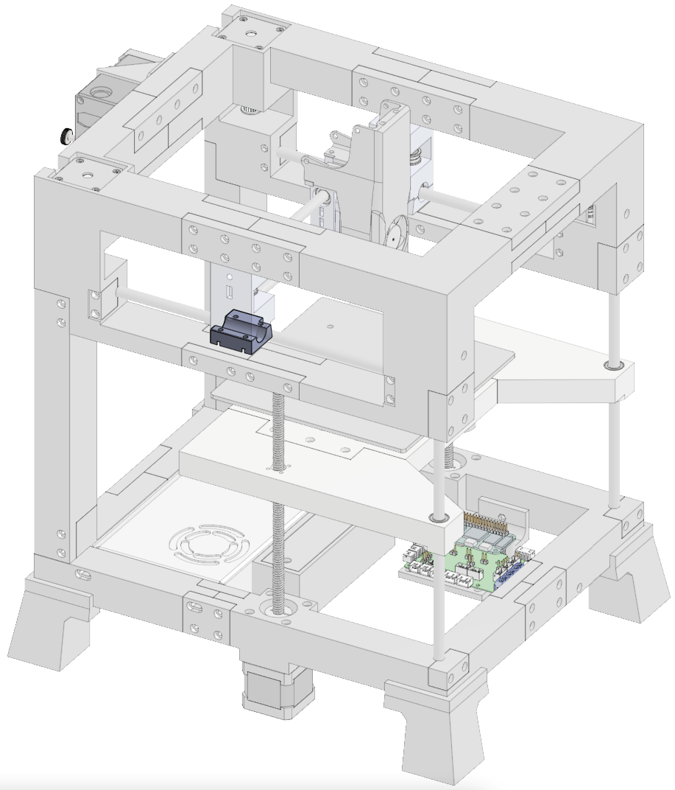
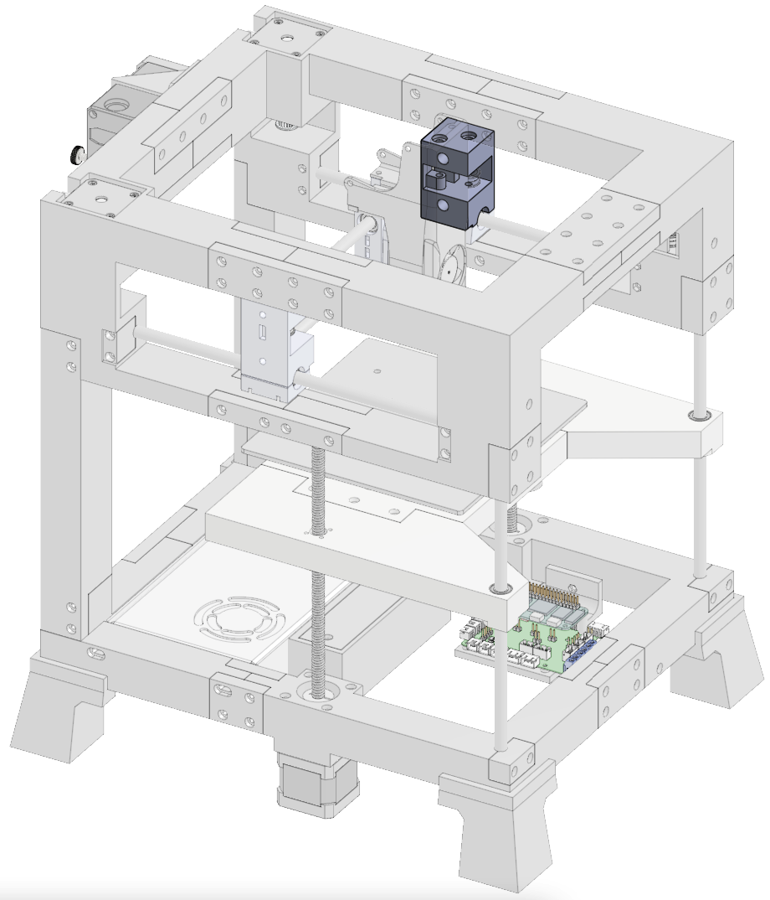
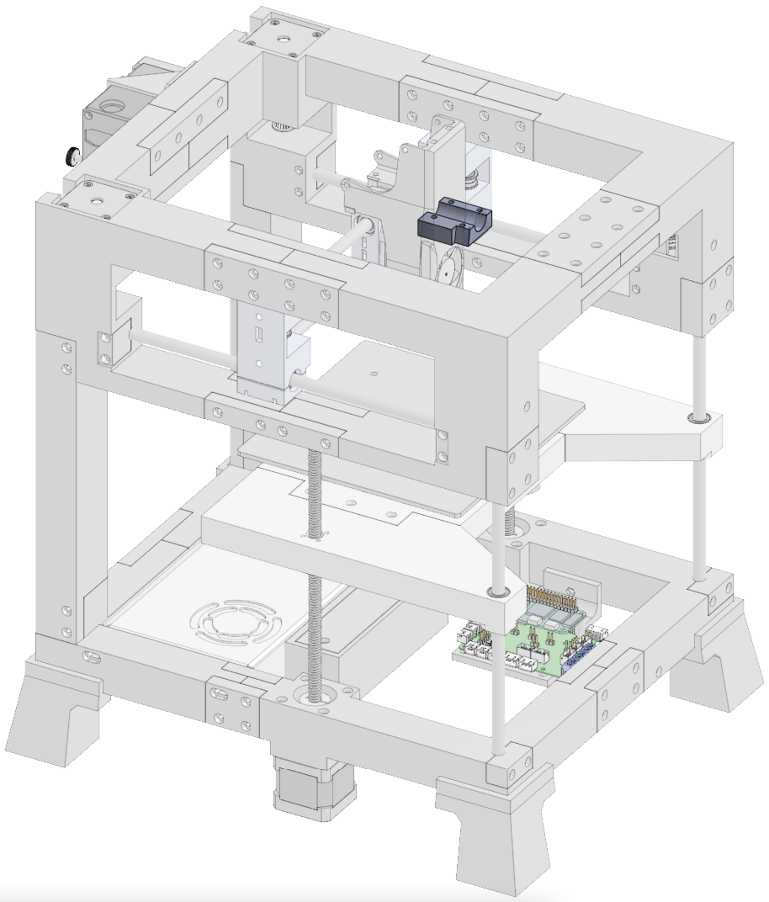

# Gantry

  

      
  

  

    <ul class="list-group">
      <li class="list-group-item d-flex justify-content-between align-items-center">
        
Printed parts

        
4

      </li>
    </ul>
     
    <ul class="list-group">
      <li class="list-group-item d-flex justify-content-between align-items-center">
        
Purchased parts

        
44

      </li>
    </ul>   
     
    <ul class="list-group">
      <li class="list-group-item d-flex justify-content-between align-items-center">
        
Filament

        
30.4m | 90.8g

      </li>
    </ul>   
     
    <ul class="list-group">
      <li class="list-group-item d-flex justify-content-between align-items-center">
        
Print time

        
3h 17m

      </li>
    </ul>   
  

### Printed parts
<table class="table table-sm">
  <thead>
    <tr>
      <th scope="col">Part Name</th>
      <th scope="col">STL</th>
      <th scope="col">Qty</th>
      <th scope="col">Notes</th>
    </tr>
  </thead>
  <tbody>
    <tr>
      <td>Left Gantry</td>
      <td class="no-wrap"><a target="_blank" href="https://github.com/MSzturc/t100/blob/main/STL/Gantry/Left%20Gantry.stl">github</a> / <a href="https://files.printables.com/media/prints/572689/stls/4581549_00354996-cefb-40e9-bc7f-1838937cf501/left-gantry.stl">printables</a></td>
      <td>1</td>
      <td><a href="#left-gantry">More info</a></td>
    </tr>
    <tr>
      <td>Left Gantry Bottom</td>
      <td class="no-wrap"><a target="_blank" href="https://github.com/MSzturc/t100/blob/main/STL/Gantry/Left%20Gantry%20Bottom.stl">github</a> / <a href="https://files.printables.com/media/prints/572689/stls/4581552_39902278-386f-4236-a312-620a327ffd3a/left-gantry-bottom.stl">printables</a></td>
      <td>1</td>
      <td><a href="#left-gantry-bottom">More info</a></td>
    </tr>
    <tr>
      <td>Right Gantry</td>
      <td class="no-wrap"><a target="_blank" href="https://github.com/MSzturc/t100/blob/main/STL/Gantry/Right%20Gantry.stl">github</a> / <a href="https://files.printables.com/media/prints/572689/stls/4581551_c2dd1e18-28a2-41bf-b6e6-85b05d4153d8/right-gantry.stl">printables</a></td>
      <td>1</td>
      <td><a href="#right-gantry">More info</a></td>
    </tr>
    <tr>
      <td>Right Gantry Bottom</td>
      <td class="no-wrap"><a target="_blank" href="https://github.com/MSzturc/t100/blob/main/STL/Gantry/Right%20Gantry%20Bottom.stl">github</a> / <a href="https://files.printables.com/media/prints/572689/stls/4581550_449599ad-afa7-4b63-ab2b-89604bf1e875/right-gantry-bottom.stl">printables</a></td>
      <td>1</td>
      <td><a href="#right-gantry-bottom">More info</a></td>
    </tr>
  </tbody>
</table>

### Purchased Parts
<table class="table table-sm no-margin">
  <thead>
    <tr>
      <th scope="col">Item</th>
      <th scope="col">Qty</th>
      <th scope="col">Notes</th>
    </tr>
  </thead>
  <tbody>
    <tr>
      <td>m3 heat inserts</td>
      <td>12</td>
      <td></td>
    </tr>
    <tr>
      <td>m3x12 screw</td>
      <td>8</td>
      <td></td>
    </tr>
    <tr>
      <td>m5x30 screw</td>
      <td>2</td>
      <td></td>
    </tr>
    <tr>
      <td>m5x40 screw</td>
      <td>2</td>
      <td></td>
    </tr>
    <tr>
      <td>m5 washer</td>
      <td>8</td>
      <td>Exactly 1mm thick each</td>
    </tr>
    <tr>
      <td>Rod</td>
      <td>2</td>
      <td>Quality matters</td>
    </tr>
    <tr>
      <td>F695 bearing</td>
      <td>8</td>
      <td></td>
    </tr>
    <tr>
      <td>Drylin</td>
      <td>2</td>
      <td>Recommend brand name</td>
    </tr>
  </tbody>
</table>

### Details

#### Left Gantry
  
  
##### Print
<table class="table table-striped table-hover no-margin">
  <tbody class="table-group-divider">
    <tr>
      <th scope="row" class="no-wrap">Quantity</th>
      <td> </td>
      <td>1</td>
    </tr>
    <tr>
      <th scope="row" class="no-wrap">Filament Length</th>
      <td> </td>
      <td>12.2m</td>
    </tr>
    <tr>
      <th scope="row" class="no-wrap">Filament Weight</th>
      <td> </td>
      <td>36.4g</td>
    </tr>
    <tr>
      <th scope="row" class="no-wrap">Supports?</th>
      <td> </td>
      <td>No</td>
    </tr>
  </tbody>
</table>

##### Purchase
<table class="table table-striped table-hover no-margin">
  <thead>
    <tr>
      <th scope="col">Item</th>
      <th scope="col">Qty</th>
      <th scope="col">Note</th>
    </tr>
  </thead>
  <tbody>
    <tr>
      <td>m3 heat inserts</td>
      <td>6</td>
      <td></td>
    </tr>
    <tr>
      <td>m5x30 screw</td>
      <td>1</td>
      <td></td>
    </tr>
    <tr>
      <td>m5x40 screw</td>
      <td>1</td>
      <td></td>
    </tr>
    <tr>
      <td>m5 washer</td>
      <td>4</td>
      <td>Exactly 1mm thick</td>
    </tr>
  </tbody>
</table>

#### Left Gantry Bottom
  
  
##### Print
<table class="table table-striped table-hover no-margin">
  <tbody class="table-group-divider">
    <tr>
      <th scope="row" class="no-wrap">Quantity</th>
      <td> </td>
      <td>1</td>
    </tr>
    <tr>
      <th scope="row" class="no-wrap">Filament Length</th>
      <td> </td>
      <td>3m</td>
    </tr>
    <tr>
      <th scope="row" class="no-wrap">Filament Weight</th>
      <td> </td>
      <td>9g</td>
    </tr>
    <tr>
      <th scope="row" class="no-wrap">Supports?</th>
      <td> </td>
      <td>No</td>
    </tr>
  </tbody>
</table>

##### Purchase
<table class="table table-striped table-hover no-margin">
  <thead>
    <tr>
      <th scope="col">Item</th>
      <th scope="col">Qty</th>
      <th scope="col">Note</th>
    </tr>
  </thead>
  <tbody>
    <tr>
      <td>m3x12 screw</td>
      <td>4</td>
      <td></td>
    </tr>
    <tr>
      <td>Drylin linear bearing</td>
      <td>1</td>
      <td></td>
    </tr>
  </tbody>
</table>

#### Right Gantry
  
  
##### Print
<table class="table table-striped table-hover no-margin">
  <tbody class="table-group-divider">
    <tr>
      <th scope="row" class="no-wrap">Quantity</th>
      <td> </td>
      <td>1</td>
    </tr>
    <tr>
      <th scope="row" class="no-wrap">Filament Length</th>
      <td> </td>
      <td>12.2m</td>
    </tr>
    <tr>
      <th scope="row" class="no-wrap">Filament Weight</th>
      <td> </td>
      <td>36.4g</td>
    </tr>
    <tr>
      <th scope="row" class="no-wrap">Supports?</th>
      <td> </td>
      <td>No</td>
    </tr>
  </tbody>
</table>

##### Purchase
<table class="table table-striped table-hover no-margin">
  <thead>
    <tr>
      <th scope="col">Item</th>
      <th scope="col">Qty</th>
      <th scope="col">Note</th>
    </tr>
  </thead>
  <tbody>
    <tr>
      <td>m3 heat inserts</td>
      <td>6</td>
      <td></td>
    </tr>
    <tr>
      <td>m5x30 screw</td>
      <td>1</td>
      <td></td>
    </tr>
    <tr>
      <td>m5x40 screw</td>
      <td>1</td>
      <td></td>
    </tr>
    <tr>
      <td>m5 washer</td>
      <td>4</td>
      <td>Exactly 1mm thick</td>
    </tr>
  </tbody>
</table>

#### Right Gantry Bottom
  
  
##### Print
<table class="table table-striped table-hover no-margin">
  <tbody class="table-group-divider">
    <tr>
      <th scope="row" class="no-wrap">Quantity</th>
      <td> </td>
      <td>1</td>
    </tr>
    <tr>
      <th scope="row" class="no-wrap">Filament Length</th>
      <td> </td>
      <td>3m</td>
    </tr>
    <tr>
      <th scope="row" class="no-wrap">Filament Weight</th>
      <td> </td>
      <td>9g</td>
    </tr>
    <tr>
      <th scope="row" class="no-wrap">Supports?</th>
      <td> </td>
      <td>No</td>
    </tr>
  </tbody>
</table>

##### Purchase
<table class="table table-striped table-hover no-margin">
  <thead>
    <tr>
      <th scope="col">Item</th>
      <th scope="col">Qty</th>
      <th scope="col">Note</th>
    </tr>
  </thead>
  <tbody>
    <tr>
      <td>m3x12 screw</td>
      <td>4</td>
      <td></td>
    </tr>
    <tr>
      <td>Drylin linear bearing</td>
      <td>1</td>
      <td></td>
    </tr>
  </tbody>
</table>