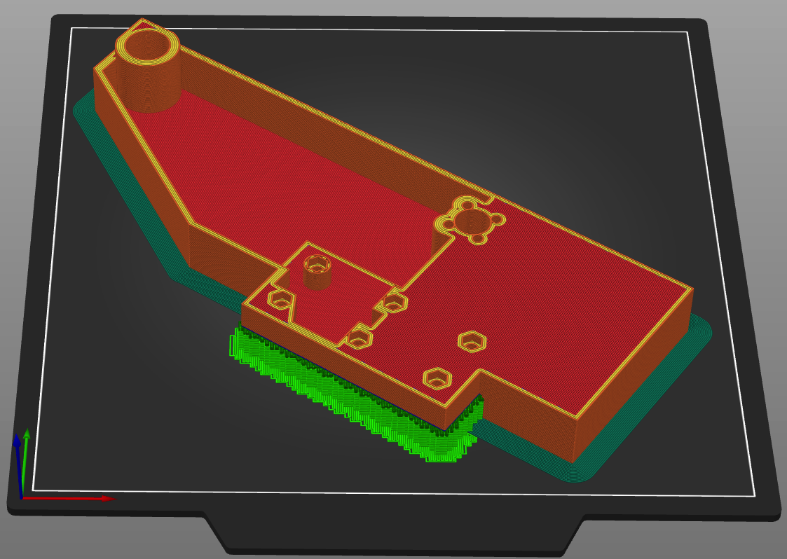

# Bed
Everything you need to print for THE 100 bed.

As mentioned in <a href="/t100/overview/before-you-print/#print-settings">print settings</a>, these parts should be printed with 30% infill. 

## v1.0

### Parts List
<table class="table table-sm">
  <thead>
    <tr>
      <th scope="col">GitHub</th>
      <th scope="col">Printables</th>
      <th scope="col">Qty</th>
      <th scope="col">Notes</th>
    </tr>
  </thead>
  <tbody>
    <tr>
      <td><a href="https://github.com/MSzturc/t100/blob/main/STL/Bed/Center.stl">Center</a></td>
      <td><a href="https://files.printables.com/media/prints/430339/stls/3564416_e3f2e0b0-8d64-4022-89af-17159b7de61b/bed-center.stl">Bed-Center</a></td>
      <td>1</td>
      <td><a href="#center">More info</a></td>
    </tr>
    <tr>
      <td><a href="https://github.com/MSzturc/t100/blob/main/STL/Bed/Left.stl">Left</a></td>
      <td><a href="https://files.printables.com/media/prints/430339/stls/3564426_db9391c8-82f4-497a-851d-506891bc1b62/bed-right.stl">Bed-Right</a></td>
      <td>1</td>
      <td><a href="#left">More info</a></td>
    </tr>
    <tr>
      <td><a href="https://github.com/MSzturc/t100/blob/main/STL/Bed/Right.stl">Right</a></td>
      <td><a href="https://files.printables.com/media/prints/430339/stls/3564413_f90868f1-1f46-42cb-a85a-6df9317f094a/bed-left.stl">Bed-Left</a></td>
      <td>1</td>
      <td><a href="#right">More info</a></td>
    </tr>
  </tbody>
</table>

### More Info

#### Center

##### Printing details
  - Qty: 1
  - Filament (length/weight): 72m / 215g
  - Supports: No

##### Notes
A brim is recommended to help keep the bed from warping. 

#### Left

##### Printing details
  - Qty: 1
  - Filament (length/weight): 42m / 125g
  - Supports: Yes

##### Notes
A brim is recommended to help keep the bed from warping. Needs to be oriented at an angle to fit on a 225x225 bed like the Ender 3 (or be willing to override settings in your slicer to tell it to slice anyways). 

#### Right

##### Printing details
  - Qty: 1
  - Filament (length/weight): 42m / 125g
  - Supports: Yes

##### Notes
A brim is recommended to help keep the bed from warping. Needs to be oriented at an angle to fit on a 225x225 bed like the Ender 3 (or be willing to override settings in your slicer to tell it to slice anyways). 

