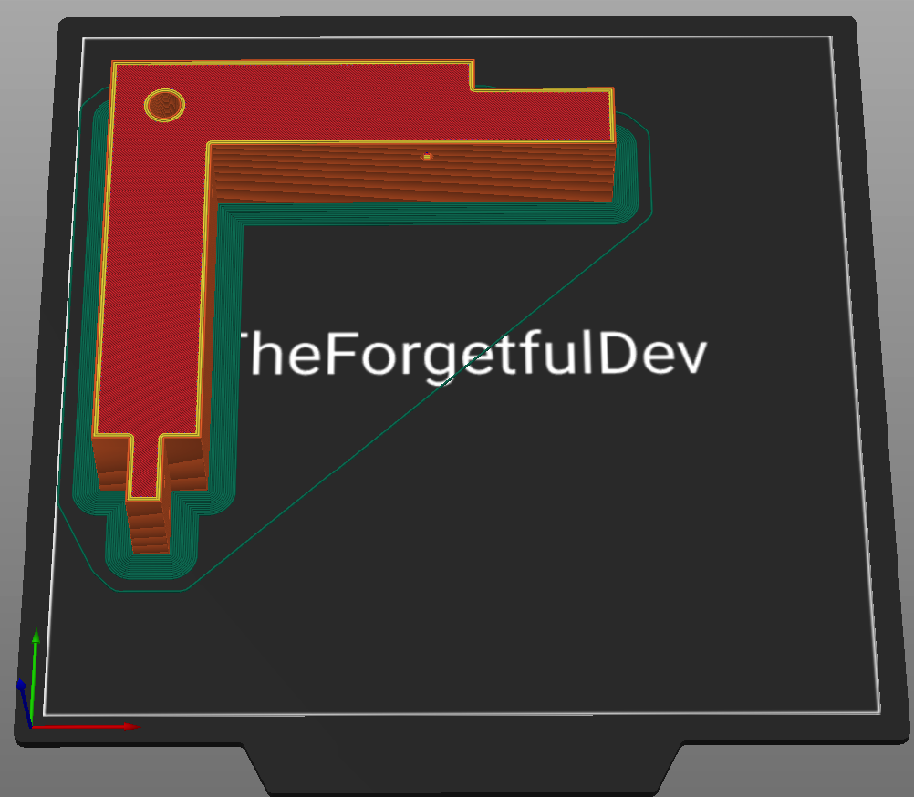
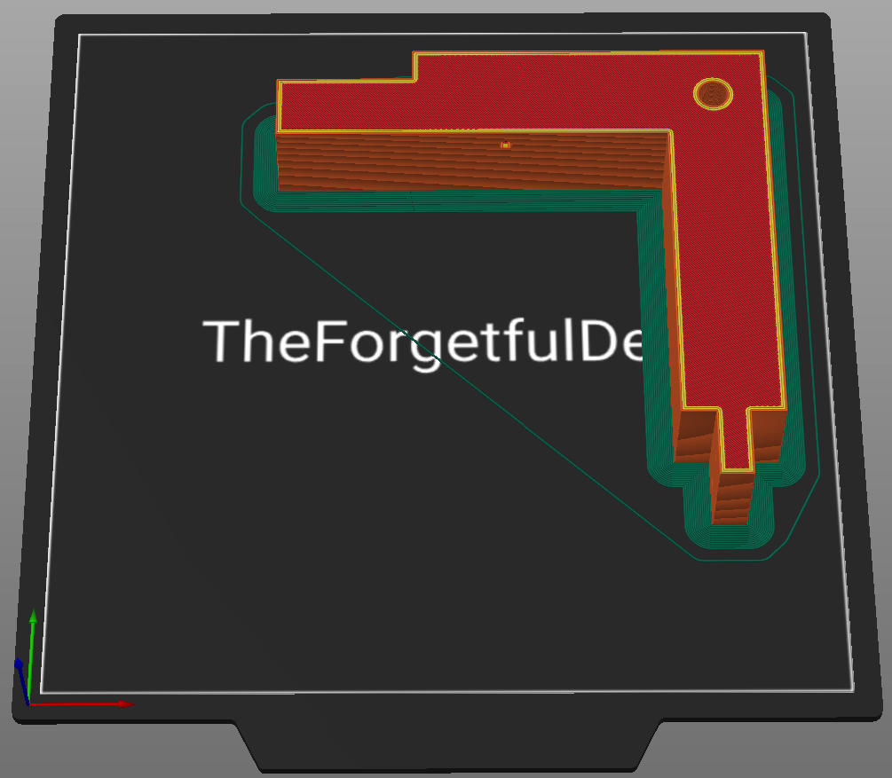
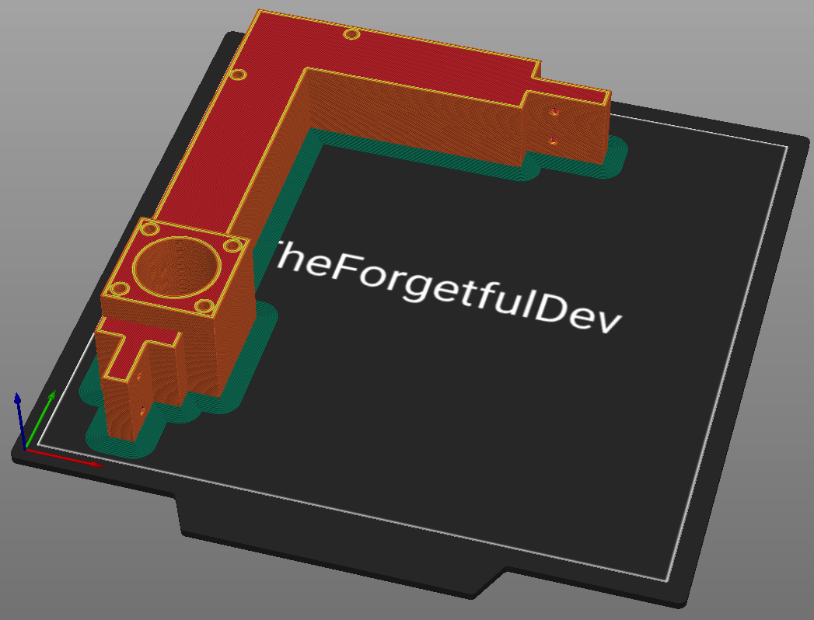
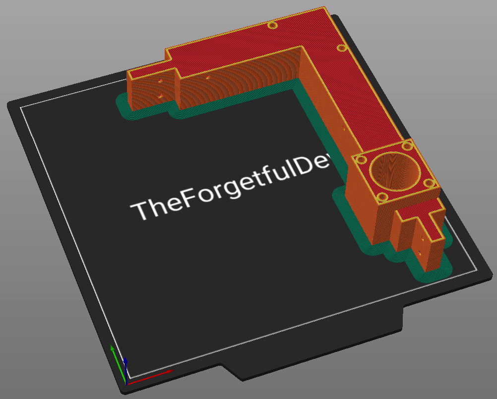
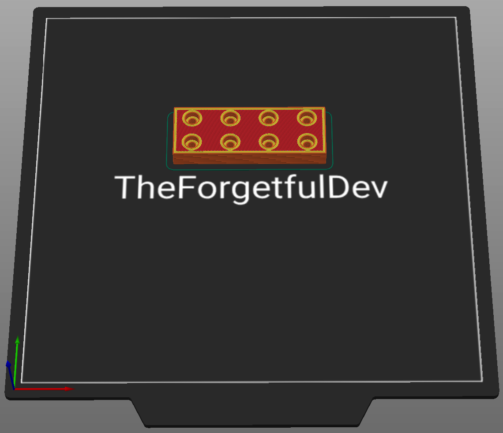
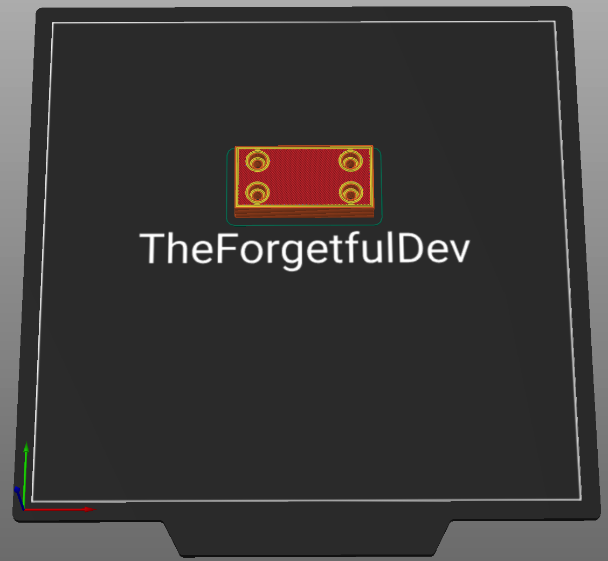
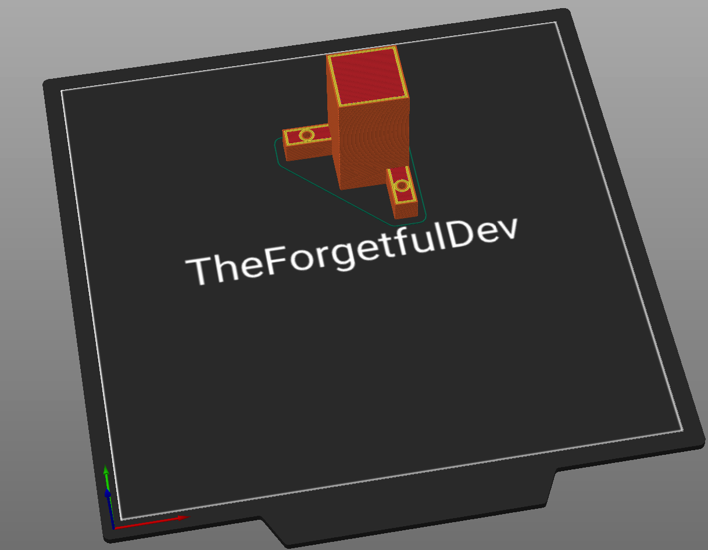

# Bottom Frame
## v1.0

### Parts List
These parts are required regardless of which hotend you're using. 
<table class="table table-sm">
  <thead>
    <tr>
      <th scope="col">GitHub</th>
      <th scope="col">Printables</th>
      <th scope="col">Qty</th>
      <th scope="col">Notes</th>
    </tr>
  </thead>
  <tbody>
    <tr>
      <td><a href="https://github.com/MSzturc/the100/blob/main/STL/Bottom%20Frame/Bottom%201.stl">Bottom 1</a></td>
      <td><a href="https://files.printables.com/media/prints/430339/stls/3564418_21f0869b-b5ae-4c2a-80cf-f1be2cf639b5/bottom-frame-back-left.stl">Bottom Frame Back Left</a></td>
      <td>1</td>
      <td><a href="#back-left">More info</a></td>
    </tr>
    <tr>
      <td><a href="https://github.com/MSzturc/the100/blob/main/STL/Bottom%20Frame/Bottom%202.stl">Bottom 2</a></td>
      <td><a href="https://files.printables.com/media/prints/430339/stls/3564421_adf6ab3d-a6b8-42ec-974a-da9ccf200aae/bottom-frame-back-right.stl">Bottom Frame Back Right</a></td>
      <td>1</td>
      <td><a href="#back-right">More info</a></td>
    </tr>
    <tr>
      <td><a href="https://github.com/MSzturc/the100/blob/main/STL/Bottom%20Frame/Bottom%203.stl">Bottom 3</a></td>
      <td><a href="https://files.printables.com/media/prints/430339/stls/3564428_418fdab3-c5c8-4d97-ac88-ef0fffa61c0d/bottom-frame-front-left.stl">Bottom Frame Front Left</a></td>
      <td>1</td>
      <td><a href="#front-left">More info</a></td>
    </tr>
    <tr>
      <td><a href="https://github.com/MSzturc/the100/blob/main/STL/Bottom%20Frame/Bottom%204.stl">Bottom 4</a></td>
      <td><a href="https://files.printables.com/media/prints/430339/stls/3564409_2ee0713c-c46e-4681-8bb1-50b12ee2195b/bottom-frame-front-right.stl">Bottom Frame Front Right</a></td>
      <td>1</td>
      <td><a href="#front-right">More info</a></td>
    </tr>
    <tr>
      <td><a href="https://github.com/MSzturc/the100/blob/main/STL/Bottom%20Frame/Connection%20Back.stl">Connection Back</a></td>
      <td><a href="https://files.printables.com/media/prints/430339/stls/3564420_a1449d3b-6783-44b8-82ad-53782753ae51/bottom-frame-connector-back.stl">Bottom Frame Connector Back</a></td>
      <td>1</td>
      <td><a href="#connector-back">More info</a></td>
    </tr>
    <tr>
      <td><a href="https://github.com/MSzturc/the100/blob/main/STL/Bottom%20Frame/Connection%20Front%201.stl">Connection Front 1</a></td>
      <td><a href="https://files.printables.com/media/prints/430339/stls/3564415_84477a66-25ea-4094-b21b-741d9e834e63/bottom-frame-connector-front-1.stl">Bottom Frame Connector Front 1</a></td>
      <td>1</td>
      <td><a href="#connector-front-1">More info</a></td>
    </tr>
    <tr>
      <td><a href="https://github.com/MSzturc/the100/blob/main/STL/Bottom%20Frame/Connection%20Front%202.stl">Connection Front 2</a></td>
      <td><a href="https://files.printables.com/media/prints/430339/stls/3564419_f0b60644-d1cf-48e0-866e-c45ae660c17f/bottom-frame-connector-front-2.stl">Bottom Frame Connector Front 2</a></td>
      <td>1</td>
      <td><a href="#connector-front-2">More info</a></td>
    </tr>
    <tr>
      <td><strike>Connection Left</strike></td>
      <td><a href="https://files.printables.com/media/prints/430339/stls/3564410_9e694d5d-cf28-4172-8b55-69274073c180/bottom-frame-connector-left-1.stl">Bottom Frame Connector Left 1</a></td>
      <td>1</td>
      <td><a href="#connector-left-1">More info</a></td>
    </tr>
    <tr>
      <td>See info</td>
      <td><a href="https://files.printables.com/media/prints/430339/stls/3564414_82e2226d-9537-4c4f-a1dc-31044f685f3f/bottom-frame-connector-left-2.stl">Bottom Frame Connector Left 2</a></td>
      <td>1</td>
      <td><a href="#connector-left-2">More info</a></td>
    </tr>
    <tr>
      <td><strike>Connection Right</strike></td>
      <td><a href="https://files.printables.com/media/prints/430339/stls/3564412_139d64d7-5bfd-4b9b-84b1-a57581b02cee/bottom-frame-connector-right-1.stl">Bottom Frame Connector Right 1</a></td>
      <td>1</td>
      <td><a href="#connector-right-1">More info</a></td>
    </tr>
    <tr>
      <td>See info</td>
      <td><a href="https://files.printables.com/media/prints/430339/stls/3564402_ab155e55-95cc-4285-8caf-35985d2e5be8/bottom-frame-connector-right-2.stl">Bottom Frame Connector Right 2</a></td>
      <td>1</td>
      <td><a href="#connector-right-2">More info</a></td>
    </tr>
    <tr>
      <td><a href="https://github.com/MSzturc/the100/blob/main/STL/Bottom%20Frame/Foot.stl">Foot</a></td>
      <td><a href="https://files.printables.com/media/prints/430339/stls/3564423_bfd498fa-dd66-4345-96a6-25d1be53fe75/bottom-foot-back-left.stl">Bottom Foot Back Left</a></td>
      <td>4</td>
      <td><a href="#foot">More info</a></td>
    </tr>
    <tr>
      <td>n/a</td>
      <td><a href="https://files.printables.com/media/prints/430339/stls/3564393_03d9394b-5c80-48cf-a571-ee4341b42e73/5mm-8mm-coupler.stl">5mm - 8mm Coupler</a></td>
      <td>2</td>
      <td><a href="#5mm---8mm-coupler">More info</a></td>
    </tr>
  </tbody>
</table>

### More Info

#### Back Left
##### Printing details
  - Qty: 1
  - Filament (length/weight): 37.4m / 111.5g
  - Supports: No

##### Notes
A brim is recommended to prevent warping.

#### Back Right
##### Printing details
  - Qty: 1
  - Filament (length/weight): 37.1m / 110.7g
  - Supports: No

##### Notes
A brim is recommended to prevent warping.

#### Front Left
##### Printing details
  - Qty: 1
  - Filament (length/weight): 50.9m / 151.9g
  - Supports: Yes - only needed for countersunk screw holes that are touching the build plate

##### Notes
A brim is recommended to prevent warping. 

#### Front Right
##### Printing details
  - Qty: 1
  - Filament (length/weight): 51.5m / 153.8g
  - Supports: Yes - only needed for countersunk screw holes that are touching the build plate

##### Notes
A brim is recommended to prevent warping.

#### Connector Back
##### Printing details
  - Qty: 1
  - Filament (length/weight): 5.5m / 16.5g
  - Supports: No

##### Notes
None

#### Connector Front 1
##### Printing details
  - Qty: 1
  - Filament (length/weight): 4.1m / 12.4g
  - Supports: No

##### Notes
None

#### Connector Front 2
##### Printing details
  - Qty: 1
  - Filament (length/weight): 4.2m / 12.4g
  - Supports: No

##### Notes
None

#### Connector Left 1
##### Printing details
  - Qty: 1
  - Filament (length/weight): 3m / 8.8g
  - Supports: No

##### Notes
The github version only contains `Connection Left` with no matching part for the other side, meaning it has nothing to attach to. You need to also get `Bottom Frame Connector Left 1` from Printables.  

#### Connector Left 2
##### Printing details
  - Qty: 1
  - Filament (length/weight): 2.9m / 8.7g
  - Supports: No

##### Notes
The github version doesn't have this part. You need to get it from Printables. 

#### Connector Right 1
##### Printing details
  - Qty: 1
  - Filament (length/weight): 2.9m / 8.7g
  - Supports: No

##### Notes
The github version only contains `Connection Right` with no matching part for the other side, meaning it has nothing to attach to. You need to also get `Bottom Frame Connector Right 1` from Printables.  

#### Connector Right 2
##### Printing details
  - Qty: 1
  - Filament (length/weight): 2.9m / 8.7g
  - Supports: No

##### Notes
The github version doesn't have this part. You need to get it from Printables. 

#### Foot
##### Printing details
  - Qty: 4
  - Filament (length/weight): 10.5m / 31.4g
  - Supports: No

##### Notes
Printables contains separate 4 stls for the 4 separate feet but they're all the same thing. Just print 1 of them 4 times. 

#### 5mm - 8mm Coupler
##### Printing details
  - Qty: 2
  - Filament (length/weight): 2.1m / 6.4g
  - Supports: No

##### Notes
This doesn't exist on GitHub but is a necessary part if you didn't purchase it. These allow you to connect the screw rod to the motor. I printed mine in petg but that's mainly because it was already loaded in my printer. I think PLA is perfectly fine for this part. 