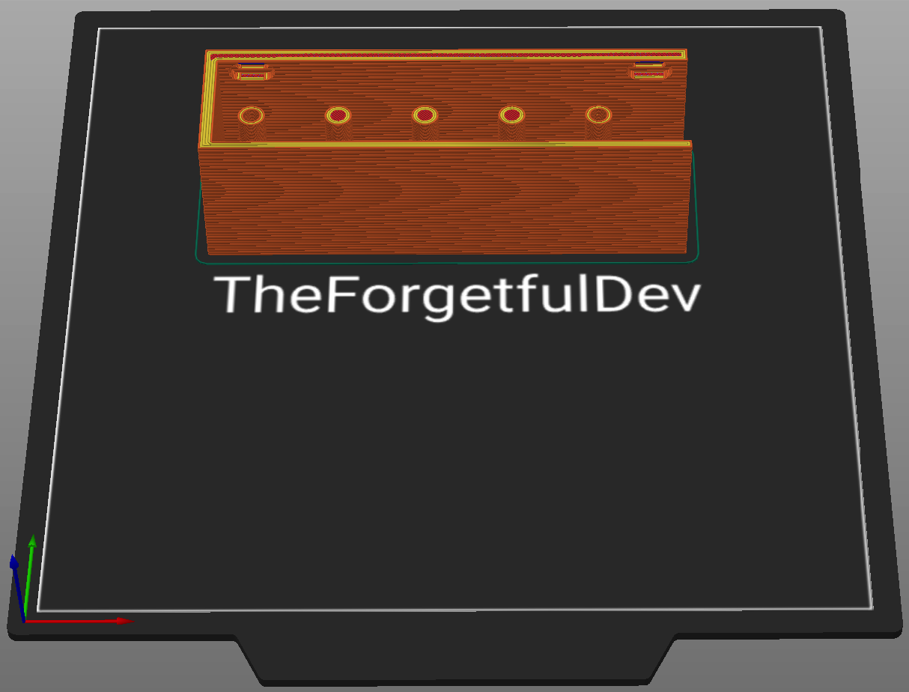
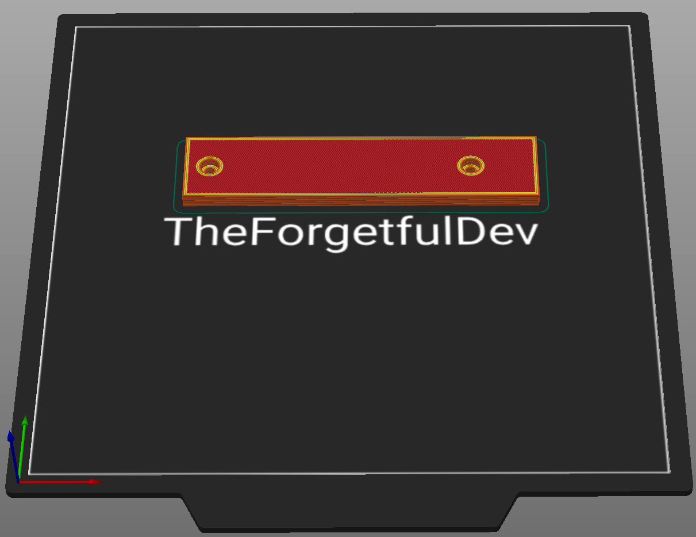
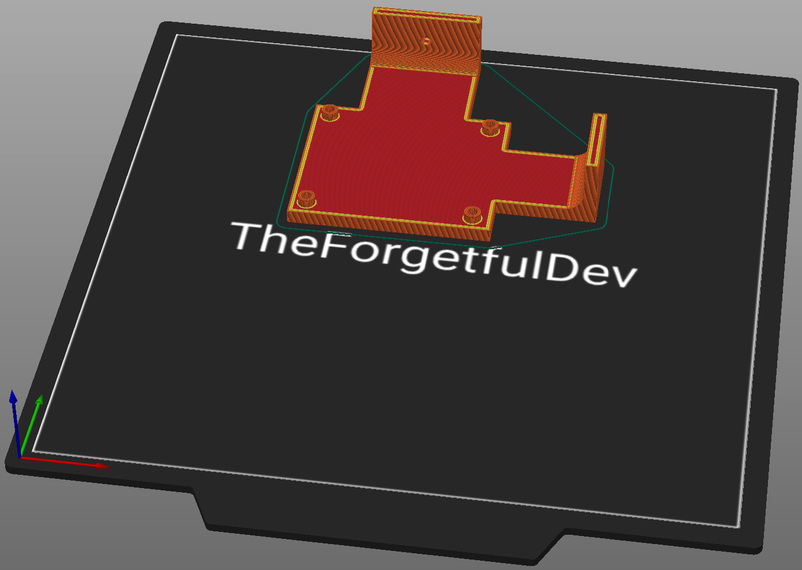

# Electronics
Everything you need to print for THE 100 electronics.

## v1.0

### Parts List - All

<table class="table table-sm">
  <thead>
    <tr>
      <th scope="col">GitHub</th>
      <th scope="col">Printables</th>
      <th scope="col">Qty</th>
      <th scope="col">Notes</th>
    </tr>
  </thead>
  <tbody>
    <tr>
      <td><a href="https://github.com/MSzturc/t100/blob/main/STL/Electronics/CableHolder.stl">CableHolder</a></td>
      <td><a href="https://files.printables.com/media/prints/430339/stls/3564398_d9bbaf82-8061-486f-846e-187a0d8403ab/cable-holder-top.stl">Cable Holder Top</a></td>
      <td>1</td>
      <td><a href="#cable-holder">More info</a></td>
    </tr>
    <tr>
      <td><a href="https://github.com/MSzturc/t100/blob/main/STL/Electronics/CableHolderTop.stl">CableHolderTop</a></td>
      <td><a href="https://files.printables.com/media/prints/430339/stls/3564395_ae9a1a7a-de9d-4b92-918b-68323fd70c03/cable-holder-frame.stl">Cable Holder Frame</a></td>
      <td>1</td>
      <td><a href="#cable-holder-top">More info</a></td>
    </tr>
    <tr>
      <td><a href="https://github.com/MSzturc/t100/blob/main/STL/Electronics/MainboardHolder.stl">MainboardHolder</a></td>
      <td><a href="https://files.printables.com/media/prints/430339/stls/3564387_aba3401a-202d-4cc9-8165-8f92b87a6177/mainboard-holder.stl">Mainboard Holder</a></td>
      <td>1</td>
      <td><a href="#mainboard-holder">More info</a></td>
    </tr>
    <tr>
      <td><a href="https://github.com/MSzturc/t100/blob/main/STL/Electronics/Spacer15mm.stl">Spacer15mm</a></td>
      <td><a href="https://files.printables.com/media/prints/430339/stls/3564394_7a06f0f7-ccd6-45a9-b77b-5a91f037212f/spacer-15mm.stl">Spacer 15mm</a></td>
      <td>4</td>
      <td><a href="#spacer-15mm">More info</a></td>
    </tr>
  </tbody>
</table>

### More Info

#### Cable Holder
##### Printing details
  - Qty: 1
  - Filament (length/weight): 28m / 83.5g
  - Supports: No

##### Notes
The upload on Printables has the name wrong. It says `Cable Holder Top` but is actually the cable holder itself. 

#### Cable Holder Top
##### Printing details
  - Qty: 1
  - Filament (length/weight): 5.9m / 17.7g
  - Supports: No

##### Notes
The upload on Printables has the name wrong. It says `Cable Holder Frame` but is actually the cable holder top. 

#### Mainboard Holder
##### Printing details
  - Qty: 1
  - Filament (length/weight): 11m / 32.8g
  - Supports: Yes - only in the countersunk holes that touch the build plate

##### Notes
None

#### Spacer 15mm
##### Printing details
  - Qty: 2
  - Filament (length/weight): 0.1m / 0.4g
  - Supports: No

##### Notes
These can be used to create a space between the skr pico and the banana pi zero. They may not be necessary depending on how you setup your electronics stack.