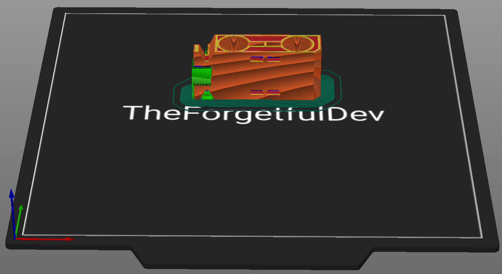
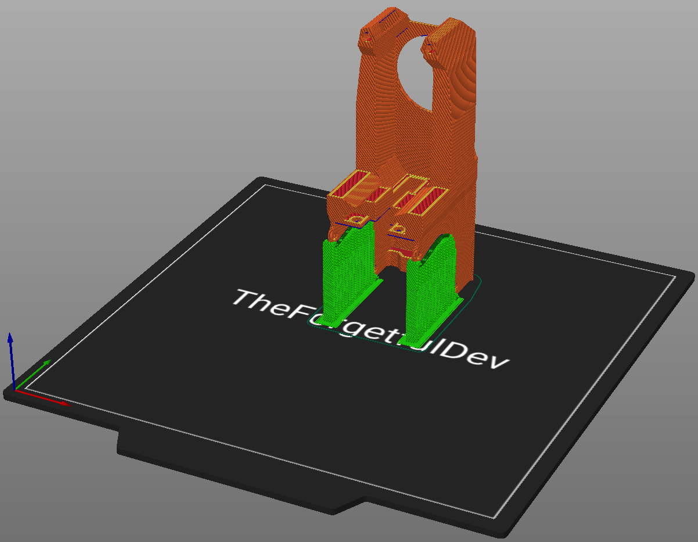

# THE 100 Toolhead
Everything you need to print for THE 100 toolhead.

There are five total parts you need to print for the toolhead. Three are the same for all hotends and two vary depending on if you're using the CHC or CHC Pro hotend. 

## v1.0

### Parts List - All Hotends
These parts are required regardless of which hotend you're using. 
<table class="table table-sm">
  <thead>
    <tr>
      <th scope="col">GitHub</th>
      <th scope="col">Printables</th>
      <th scope="col">Qty</th>
      <th scope="col">Notes</th>
    </tr>
  </thead>
  <tbody>
    <tr>
      <td><a href="https://github.com/MSzturc/t100/blob/main/STL/Hotend/Connection%20Fanhead.stl">Connection Fanhead</a></td>
      <td><a href="https://files.printables.com/media/prints/430339/stls/3564396_25aa452a-3a7d-4a5a-b203-1c0284850b7d/adapter-plate.stl">Adapter Plate</a></td>
      <td>1</td>
      <td><a href="#adapter-plate">More info</a></td>
    </tr>
    <tr>
      <td><a href="https://github.com/MSzturc/t100/blob/main/STL/Hotend/Rod-Cradle.stl">Rod Cradle</a></td>
      <td><a href="https://files.printables.com/media/prints/430339/stls/3564389_4fe028b8-ebe9-4c5a-9efd-981826b06630/rod-carriage.stl">Rod Carriage</a></td>
      <td>1</td>
      <td><a href="#rod-carriage">More info</a></td>
    </tr>
    <tr>
      <td><a href="https://github.com/MSzturc/t100/blob/main/STL/Hotend/TD6%20Fanhead.stl">TD6 Fanhead</a></td>
      <td><a href="https://files.printables.com/media/prints/430339/stls/3564386_5ab1e0bd-4a8d-454e-baed-8f8e13749b73/fanhead.stl">Fanhead</a></td>
      <td>1</td>
      <td><a href="#fanhead">More info</a></td>
    </tr>
  </tbody>
</table>

### Parts List - CHC Pro Only
Print these if you're using the CHC Pro as your hotend. 
<table class="table table-sm">
  <thead>
    <tr>
      <th scope="col">GitHub</th>
      <th scope="col">Printables</th>
      <th scope="col">Qty</th>
      <th scope="col">Notes</th>
    </tr>
  </thead>
  <tbody>
    <tr>
      <td><a href="https://github.com/MSzturc/t100/blob/main/STL/Hotend/CHC%20Pro/TD6%20PRO%20Tool-Mount.stl">TD6 PRO Tool-Mount</a></td>
      <td><a href="https://files.printables.com/media/prints/430339/stls/3564397_6b45327a-8ad4-4698-b4a5-531f8660638e/chc-pro-mount.stl">CHC Pro Mount</a></td>
      <td>1</td>
      <td><a href="#chc-pro-mount">More info</a></td>
    </tr>
    <tr>
      <td><a href="https://github.com/MSzturc/t100/blob/main/STL/Hotend/CHC%20Pro/TD6%20Pro%20Front.stl">TD6 Pro Front</a></td>
      <td><a href="https://files.printables.com/media/prints/430339/stls/3564388_47d61a0b-f98a-4692-88e8-fd640e794ecf/chc-pro-mount-front.stl">CHC PRO Mount Front</a></td>
      <td>1</td>
      <td><a href="#chc-pro-mount-front">More info</a></td>
    </tr>
  </tbody>
</table>

### Parts List - CHC Only
Print these if you're using the CHC (not pro) as your hotend. 
<table class="table table-sm">
  <thead>
    <tr>
      <th scope="col">GitHub</th>
      <th scope="col">Printables</th>
      <th scope="col">Qty</th>
      <th scope="col">Notes</th>
    </tr>
  </thead>
  <tbody>
    <tr>
      <td><a href="https://github.com/MSzturc/t100/blob/main/STL/Hotend/CHC/TD6%20Tool-Mount.stl">TD6 Tool-Mount</a></td>
      <td><a href="https://files.printables.com/media/prints/430339/stls/3564401_f91ab511-ed0d-4e4b-ba4d-471b86d19df3/chc-mount.stl">CHC Mount</a></td>
      <td>1</td>
      <td><a href="#chc-mount">More info</a></td>
    </tr>
        <tr>
      <td><a href="https://github.com/MSzturc/t100/blob/main/STL/Hotend/CHC/TD6%20Front.stl">TD6 Front</a></td>
      <td><a href="https://files.printables.com/media/prints/430339/stls/3564401_f91ab511-ed0d-4e4b-ba4d-471b86d19df3/chc-mount.stl">CHC Mount Front</a></td>
      <td>1</td>
      <td><a href="#chc-mount-front">More info</a></td>
    </tr>
  </tbody>
</table>

### More Info

#### Adapter Plate

##### Printing details
  - Qty: 1
  - Filament (length/weight): 1m / 2.9g
  - Supports: No

  

##### Notes
None

#### Rod Carriage

##### Printing details
  - Qty: 1
  - Filament (length/weight): 8.6m / 25.7g
  - Supports: Yes

  

##### Notes
I rarely struggle with bed adhesion but out of the entire printer, this is the only one that gave me trouble. It kept getting knocked off. I ended up having to use a brim and enable z-hop to prevent it. Make sure supports are only used on the one end and that you don't generate supports through the square holes in the middle where the belts will go in the future.

#### Fanhead

##### Printing details
  - Qty: 1
  - Filament (length/weight): 20.7m / 61.6g
  - Supports: Yes

  

##### Notes
Only generate suports under the curved parts against the build plate. This piece is printed upside down to limit the amount of supports that need generated while still maintaining the openings for the airways. 

#### CHC Pro Mount

##### Printing details
  - Qty: 1
  - Filament (length/weight): 3.5m / 10.4g
  - Supports: Yes

  

##### Notes
None

#### CHC Pro Mount Front

##### Printing details
  - Qty: 1
  - Filament (length/weight): 0.69m / 2g
  - Supports: No

  

##### Notes
None

#### CHC Mount

##### Printing details
  - Qty: 1
  - Filament (length/weight): 3.5m / 10.4g
  - Supports: Yes

##### Notes
See CHC Pro Toolhead for print orientation

#### CHC Mount Front

##### Printing details
  - Qty: 1
  - Filament (length/weight): 0.66m / 1.9g
  - Supports: No

##### Notes
See CHC Pro Front for print orientation