# Top Frame
Everything you need to print for THE 100 top frame.

## v1.0

### Parts List
These parts are required regardless of which hotend you're using. 
<table class="table table-sm">
  <thead>
    <tr>
      <th scope="col">GitHub</th>
      <th scope="col">Printables</th>
      <th scope="col">Qty</th>
      <th scope="col">Notes</th>
    </tr>
  </thead>
  <tbody>
    <tr>
      <td><a href="https://github.com/MSzturc/the100/blob/main/STL/Top%20Frame/BeltFastener.stl">BeltFastener</a></td>
      <td><a href="https://files.printables.com/media/prints/430339/stls/3564390_ddfa3de1-714e-44a9-b9f8-72145f202c47/belt-fastener.stl">Belt Fastener</a></td>
      <td>2</td>
      <td><a href="#belt-fastener">More info</a></td>
    </tr>
    <tr>
      <td><a href="https://github.com/MSzturc/the100/blob/main/STL/Top%20Frame/Connection%20Back%201.stl">Connection Back 1</a></td>
      <td><a href="https://files.printables.com/media/prints/430339/stls/3564411_7cf449ba-444e-43f2-b526-7b290b5dcee5/top-connector-back-1.stl">Top Connector Back 1</a></td>
      <td>1</td>
      <td><a href="#top-connector-back-1">More info</a></td>
    </tr>
    <tr>
      <td><a href="https://github.com/MSzturc/the100/blob/main/STL/Top%20Frame/Connection%20Back%202.stl">Connection Back 2</a></td>
      <td><a href="https://files.printables.com/media/prints/430339/stls/3564417_d1e46c84-f62e-468b-a5f7-c69d9b4f8ab5/top-connector-back-2.stl">Top Connector Back 2</a></td>
      <td>1</td>
      <td><a href="#top-connector-back-2">More info</a></td>
    </tr>
    <tr>
      <td><a href="https://github.com/MSzturc/the100/blob/main/STL/Top%20Frame/Connection%20Front%201.stl">Connection Front 1</a></td>
      <td><a href="https://files.printables.com/media/prints/430339/stls/3564399_dc9e1757-861b-4e85-8e95-2cce881eab23/top-connector-top-2.stl">Top Connector Top 1</a></td>
      <td>1</td>
      <td><a href="#top-connector-top-1">More info</a></td>
    </tr>
    <tr>
      <td><a href="https://github.com/MSzturc/the100/blob/main/STL/Top%20Frame/Connection%20Front%202.stl">Connection Front 2</a></td>
      <td><a href="https://files.printables.com/media/prints/430339/stls/3564399_dc9e1757-861b-4e85-8e95-2cce881eab23/top-connector-top-2.stl">Top Connector Top 2</a></td>
      <td>1</td>
      <td><a href="#top-connector-top-2">More info</a></td>
    </tr>
    <tr>
      <td><a href="https://github.com/MSzturc/the100/blob/main/STL/Top%20Frame/Connection%20Side%201.stl">Connection Side 1</a></td>
      <td><a href="https://files.printables.com/media/prints/430339/stls/3564405_5d425572-0da8-4a00-8df0-95a4e943c9a5/top-connector-side-1.stl">Top Connector Side 1</a></td>
      <td>4</td>
      <td><a href="#top-connector-side-1">More info</a></td>
    </tr>
    <tr>
      <td><a href="https://github.com/MSzturc/the100/blob/main/STL/Top%20Frame/Connection%20Side%202.stl">Connection Side 2</a></td>
      <td><a href="https://files.printables.com/media/prints/430339/stls/3564408_42dada54-5699-4778-8489-f2a1cf6e4681/top-connector-side-2.stl">Top Connector Side 2</a></td>
      <td>4</td>
      <td><a href="#top-connector-side-2">More info</a></td>
    </tr>
    <tr>
      <td><a href="https://github.com/MSzturc/the100/blob/main/STL/Top%20Frame/RodHolder.stl">RodHolder</a></td>
      <td><a href="https://files.printables.com/media/prints/430339/stls/3564392_4cd4773d-97a5-44f3-8adc-8ec6a5f399d0/top-rod-holder.stl">Top Rod Holder</a></td>
      <td>2</td>
      <td><a href="#top-rod-holder">More info</a></td>
    </tr>
    <tr>
      <td><a href="https://github.com/MSzturc/the100/blob/main/STL/Top%20Frame/Top%201.stl">Top 1</a></td>
      <td><a href="https://files.printables.com/media/prints/430339/stls/3564407_4ed66338-69f7-4bd8-8858-80af97338baf/top-back-left.stl">Top Back-Left</a></td>
      <td>1</td>
      <td><a href="#top-back-left">More info</a></td>
    </tr>
    <tr>
      <td><a href="https://github.com/MSzturc/the100/blob/main/STL/Top%20Frame/Top%202.stl">Top 2</a></td>
      <td><a href="https://files.printables.com/media/prints/430339/stls/3564424_8661f5e9-837a-49df-92e6-aa714adf748f/top-back-right.stl">Top Back-Right</a></td>
      <td>1</td>
      <td><a href="#top-back-right">More info</a></td>
    </tr>
    <tr>
      <td><a href="https://github.com/MSzturc/the100/blob/main/STL/Top%20Frame/Top%203.stl">Top 3</a></td>
      <td><a href="https://files.printables.com/media/prints/430339/stls/3564406_c8453471-ca49-43b2-92ea-2808661a3bc1/top-front-left.stl">Top Front-Left</a></td>
      <td>1</td>
      <td><a href="#top-front-left">More info</a></td>
    </tr>
    <tr>
      <td><a href="https://github.com/MSzturc/the100/blob/main/STL/Top%20Frame/Top%204.stl">Top 4</a></td>
      <td><a href="https://files.printables.com/media/prints/430339/stls/3564403_9b4173cf-4c82-41aa-97dc-27d2593f87ac/top-front-right.stl">Top Front-Right</a></td>
      <td>1</td>
      <td><a href="#top-front-right">More info</a></td>
    </tr>
  </tbody>
</table>

### More Info

#### Belt Fastener 

##### Printing details
  - Qty: 2
  - Filament (length/weight): 2.7m / 8.2g
  - Supports: No

  <a href="images/belt_fastener.png">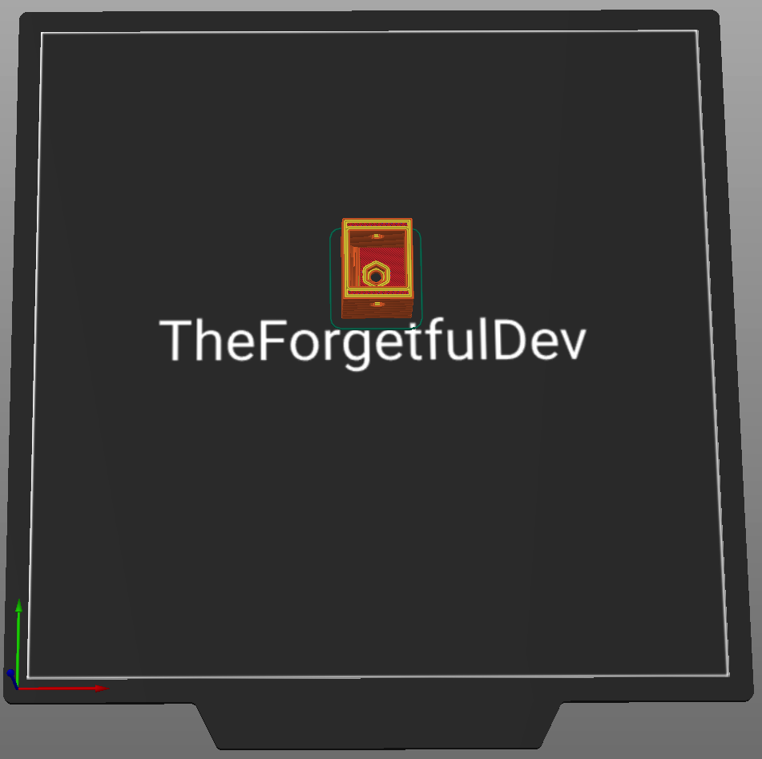</a>

##### Notes
None

#### Top Connector Back 1

##### Printing details
  - Qty: 1
  - Filament (length/weight): 4.7m/ 14g
  - Supports: 

  <a href="images/top_connector_back_1.png">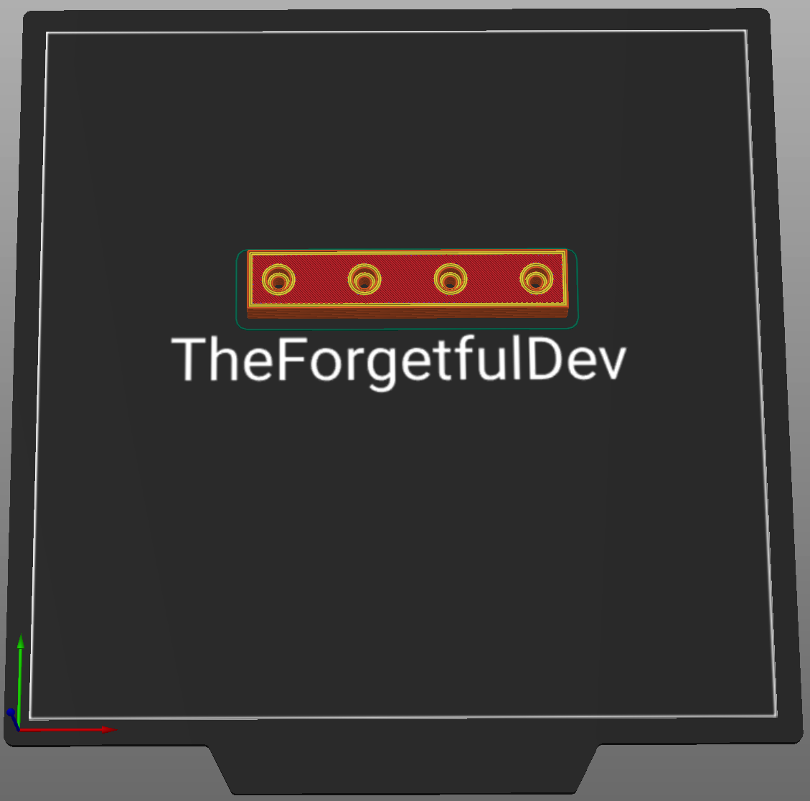</a>

##### Notes
None

#### Top Connector Back 2

##### Printing details
  - Qty: 1
  - Filament (length/weight): 4.3m / 12.7g
  - Supports: No

  

##### Notes
None

#### Top Connector Top 1

##### Printing details
  - Qty: 1
  - Filament (length/weight): 9.1m / 27.2g
  - Supports: No

  <a href="images/top_connector_top_1.png">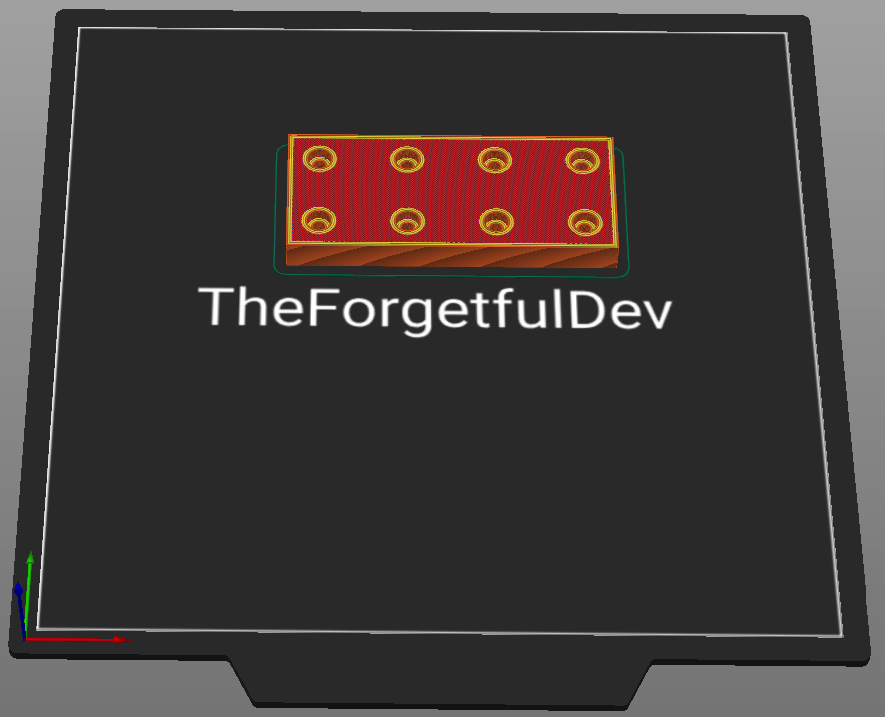</a>

##### Notes
None

#### Top Connector Top 2

##### Printing details
  - Qty: 1
  - Filament (length/weight): 9.1m / 27.2g
  - Supports: No

  <a href="images/top_connector_top_2.png">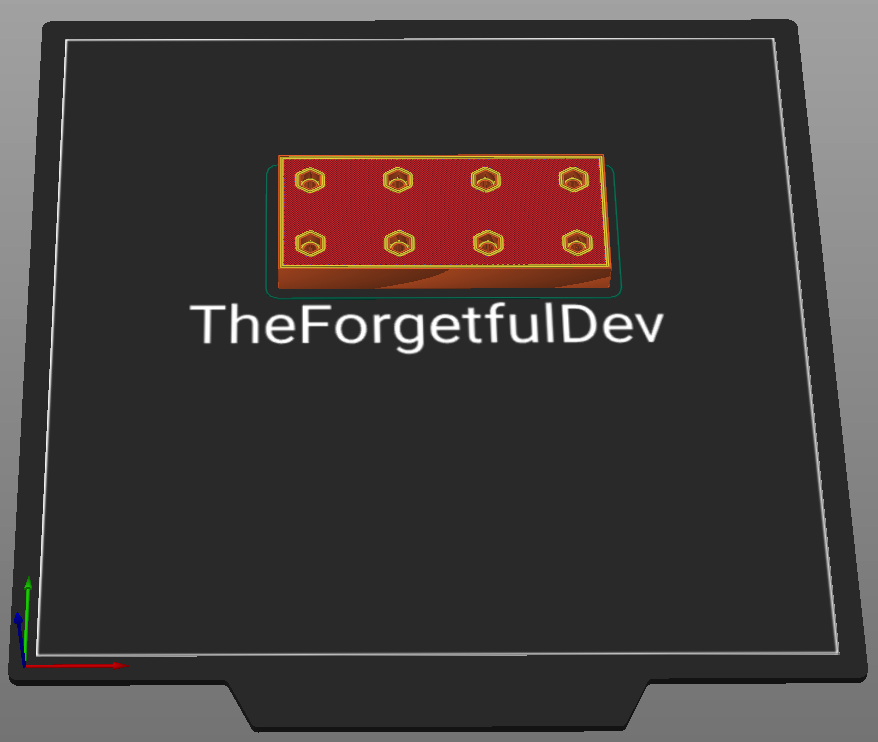</a>

##### Notes
None

#### Top Connector Side 1

##### Printing details
  - Qty: 4
  - Filament (length/weight): 6.7m / 20.1g
  - Supports: No

  <a href="images/top_connector_side_1.png">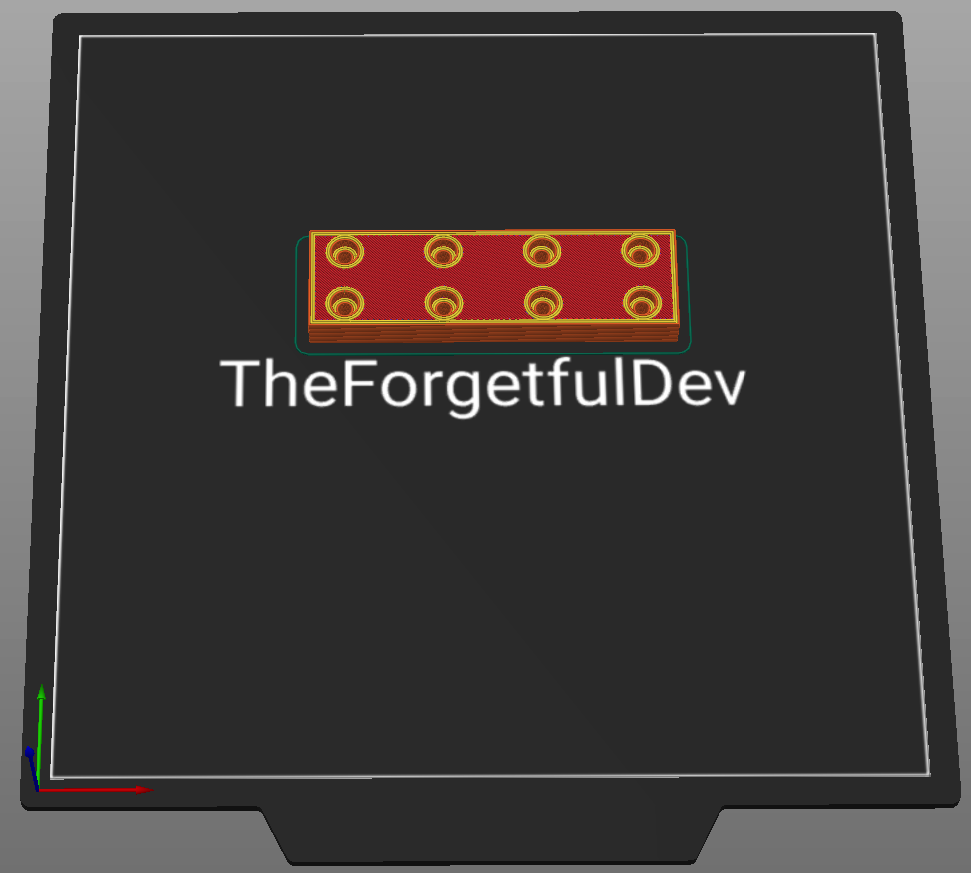</a>

##### Notes
None

#### Top Connector Side 2

##### Printing details
  - Qty: 4
  - Filament (length/weight): 3.9m / 11.6g
  - Supports: No

  <a href="images/top_connector_side_2.png">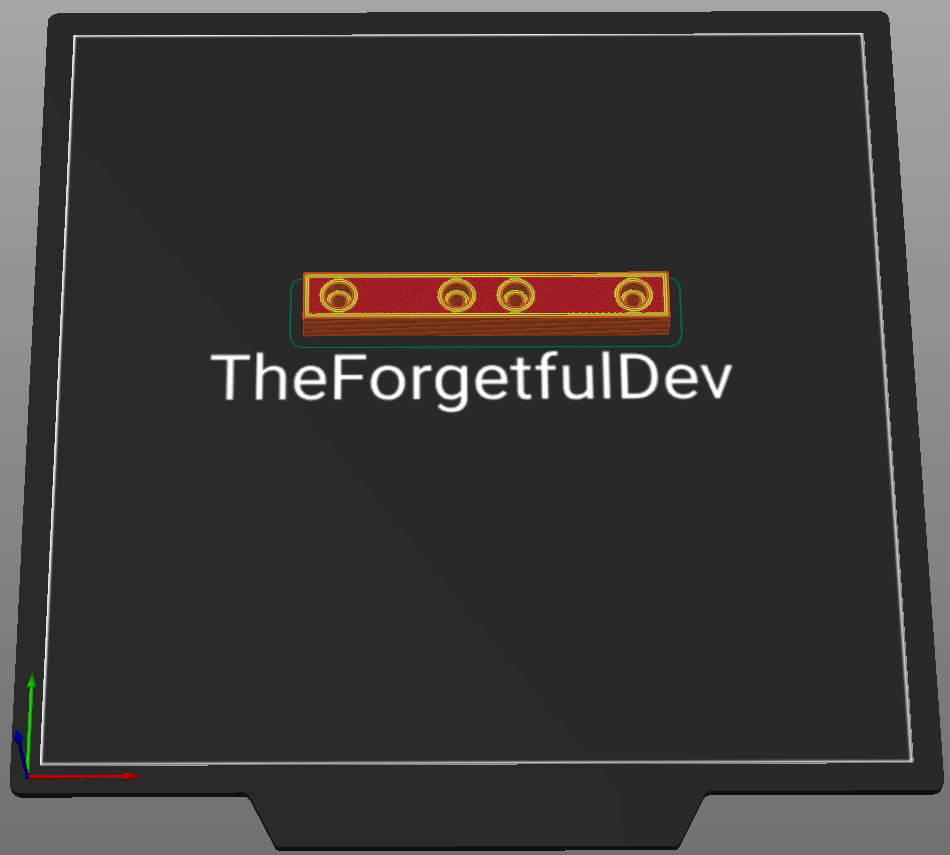</a>

##### Notes
None

#### Top Rod Holder

##### Printing details
  - Qty: 2
  - Filament (length/weight): 1.9m / 5.6g
  - Supports: Yes

  <a href="images/top_rod_holder.png">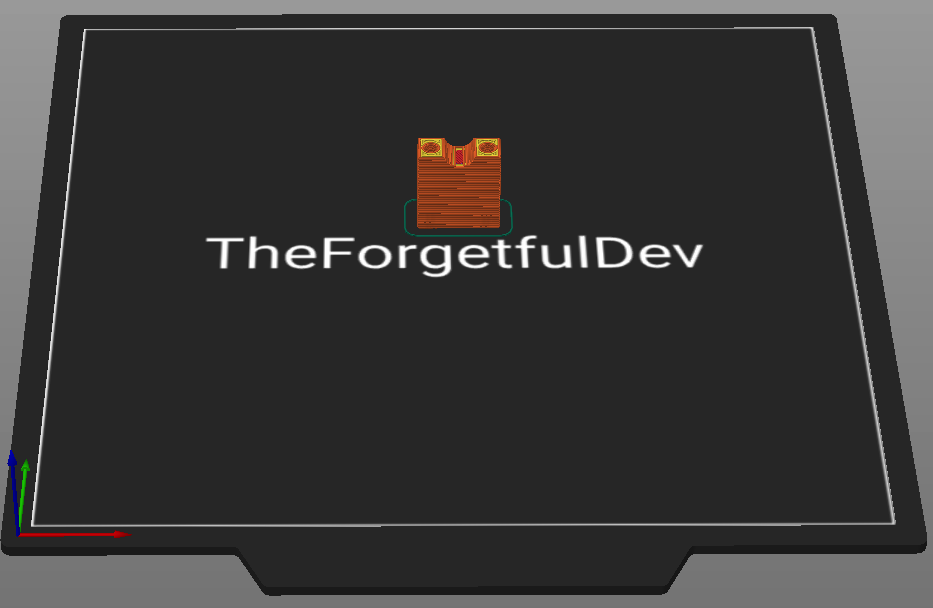</a>

##### Notes
Supports in the screw holes touching the build plate.

#### Top Back-Left

##### Printing details
  - Qty: 1
  - Filament (length/weight): 104m / 310g
  - Supports: Yes

  <a href="images/top_back_left.png">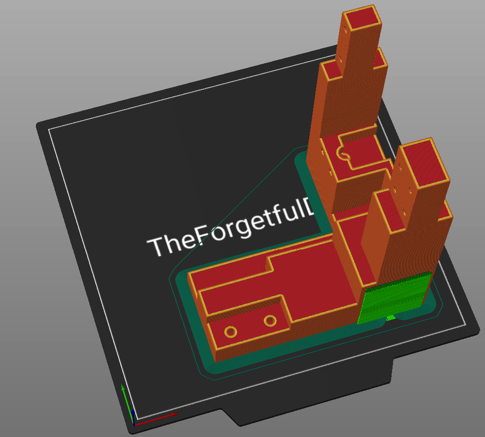</a>

##### Notes
You may be able to print this without supports if your printer can bridge over the square where the motor goes. I recommend printing this piece with a brim to prevent warping. 

#### Top Back-Right

##### Printing details
  - Qty: 1
  - Filament (length/weight): 104m / 310g
  - Supports: Yes

  <a href="images/top_back_right.png">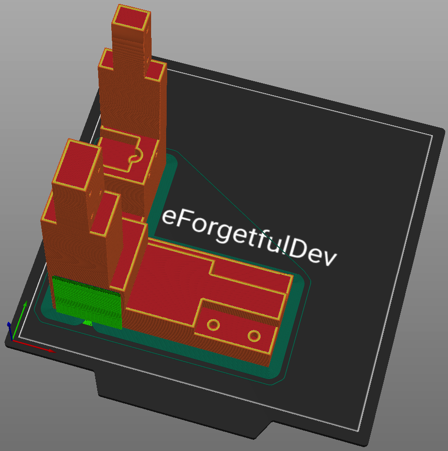</a>

##### Notes
You may be able to print this without supports if your printer can bridge over the square where the motor goes. I recommend printing this piece with a brim to prevent warping. 

#### Top Front-Left

##### Printing details
  - Qty: 1
  - Filament (length/weight): 91.2m / 272g
  - Supports: Yes

  <a href="images/top_front_left.png">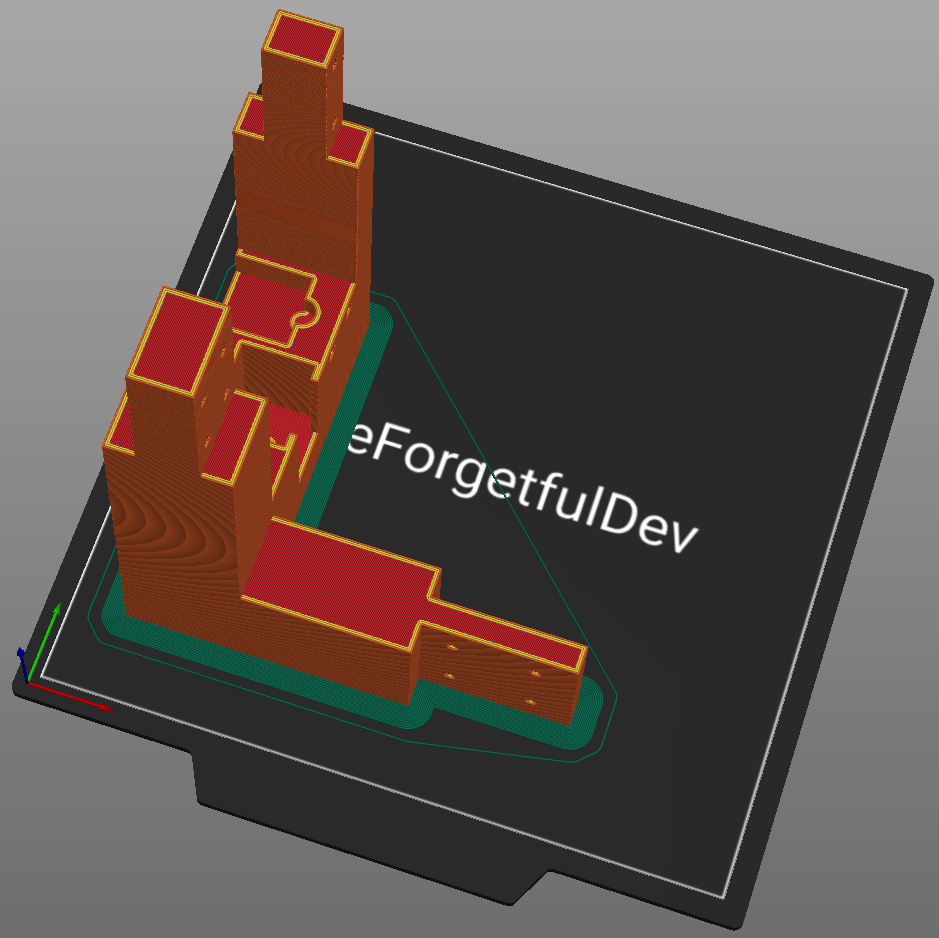</a>

##### Notes
The only support needed is a single screw hole that touches the build plate. I recommend printing this piece with a brim to prevent warping. 

#### Top Front-Right

##### Printing details
  - Qty: 1
  - Filament (length/weight): 91.2m / 272g
  - Supports: 

  <a href="images/top_front_right.png">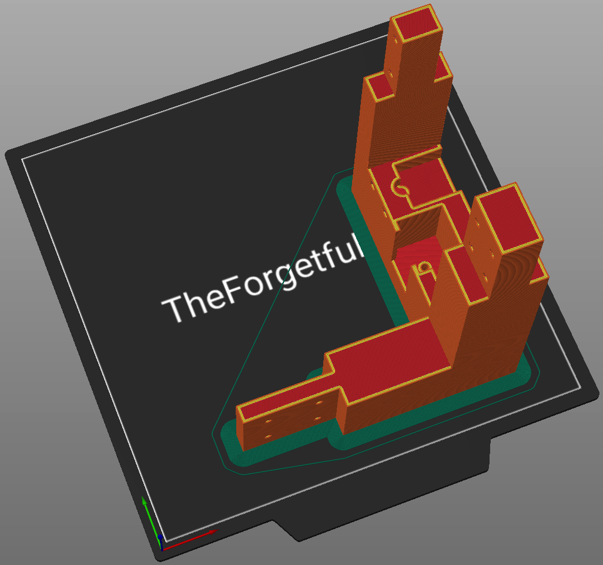</a>

##### Notes
The only support needed is a single screw hole that touches the build plate. I recommend printing this piece with a brim to prevent warping. 