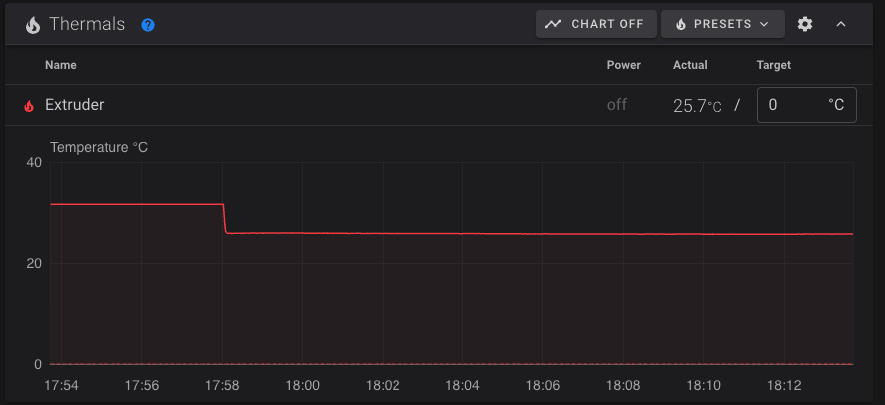

# Extruder
The extruder works just like any of the other motors except it has a lot more settings. Thankfully those settings don't matter until you're in the tuning phase so for now you'll mostly just copy/paste the config, do some quick testing, and you should be ready to move on!

## Requirements 
  * You have completed the guides up to this point and your `printer.cfg` matches how we ended the homing guide.
  * Your extruder motor is connected to the SKR Pico and assembled along with your extruder
  * Your hot end's thermistor is connected to the SKR Pico

## Wiring
This guide doesn't cover wiring in detail, but it is important that you have your extruder motor and hot end thermistor plugged in before you continue or you'll just get errors. Every motor is different so how mine is wired won't necessarily be how yours should be wired. <a href="/the100/1.1/configure/preparing-for-movement/">But you knew that already... right</a>?


## Add to printer.cfg
To help keep your `printer.cfg` clean, I recommend adding this directly below the `[tmc2209 stepper_z]` section.

```
[extruder]
step_pin: gpio14
dir_pin: gpio13
enable_pin: !gpio15
microsteps: 16
rotation_distance: 22.596444
gear_ratio: 50:17
full_steps_per_rotation: 200
nozzle_diameter: 0.4
filament_diameter: 1.75
heater_pin: gpio23
sensor_type: ATC Semitec 104NT-4-R025H42G
sensor_pin: gpio27
control: pid
pid_Kp: 22.2
pid_Ki: 1.08
pid_Kd: 114
min_temp: 0
max_temp: 300
max_extrude_cross_section:2
pressure_advance: 0.354
max_extrude_only_distance: 500
max_extrude_only_velocity: 120
max_extrude_only_accel: 800
instantaneous_corner_velocity: 20
min_extrude_temp: 0   # Only for testing. Should be increased to 190+ when done configuring.

[tmc2209 extruder]
uart_pin: gpio9
tx_pin: gpio8
uart_address: 3
run_current: 0.8
stealthchop_threshold: 999999
```

### Possible changes needed
You may need to make a couple changes to the thermistor sensor type and gear ratio before continuing:

#### Thermistor sensor type
The `sensor_type` value is based on the thermistor that comes with CHC Pro. If you're using a different hot end then you may need to change it to a different value. `EPCOS 100K B57560G104F` is another common option, but check your hot end documentation.

If things are working then you should see your extruder, along with a valid temp, displayed in fluidd.

<a href="images/extruder_temp.png" target="_blank"></a>

#### Gear ratio
If you aren't using a BMG (or clone) then you may not need the `gear_ratio` setting. Read more about it in the <a href="https://www.klipper3d.org/Rotation_Distance.html#using-a-gear_ratio" target="_blank">Klipper config</a>

## Testing
I recommend removing the bowden tube from the top of your extruder before continuing. This makes it very easy to test without worrying about the hot end. 

Manually feed some filament through the extruder until it's coming out of the top. 

### Extrude
Run the following commands in the fluidd console

```
M83
G1 E20 F300
```

Expected: Filament "extrudes" out of the top, coming off your spool. 

##### Fixes
  * If the filament actually retracts back towards the spool
      * In your `printer.cfg` under the `[extruder]` section, change `dir_pin: gpio13` to `dir_pin: !gpio13`. Click `Save & Restart` and then repeat the test.
  * If nothing happens
      * Check your motor wiring and that you have it plugged in to the correct port

### Retract
Run the following commands in the fluidd console
```
M83
G1 E-20 F300
```

Expected: Filament "retracts" back towards the spool. If they did work as expected, I recommend changing `min_extrude_temp: 0` from 0 to whatever the lowest temp is that you think you'll ever extrude at. 190 is typically a safe number. This will prevent your extruder from working until the hot end has reached that temp.

##### Fixes
  * If things worked when you extruded then no fix should be required here. If it isn't working as expected, go back to the previous step and do it again.

<div class="alert alert-info" role="alert">
    💾 	Take a moment now to download a copy of your `printer.cfg` to your computer and rename it to include today's date, or `printer.cfg-extruder_works` or something like that. If you end up breaking your cfg in future steps, or if your SD card gets corrupted, or anything else like that... you'll be glad you have this saved! I highly recommend repeating this process any time you make important cfg changes. 
</div>

With the extruder working, let's get the fans and heaters going! 