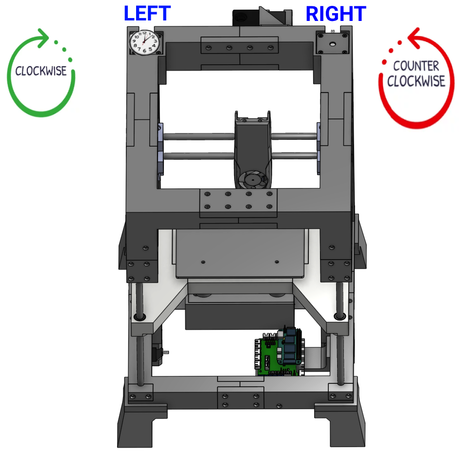

# It's (about to be) alive!
If you have been following along then you now have your printer to a point that things are wired up, the BananaPi and SKR Pico are connected, and you can access the fluidd/mainsail UI without any errors. Now the fun begins... seeing your printer move for the first time!

<div class="alert alert-info" role="alert">
    ℹ️ 	This guide doesn't go in to detail yet on how to wire everything to the SKR Pico. Making that guide is on my to do list, but for now it's just assumed that you have things plugged in.
</div>

## Requirements 
  * You have your A/B (aka X/Y) motors plugged in to your SKR Pico
  * You have access to fluidd/mainsail and it's connecting to your printer with no errors
  * You have an <a href="/the100/1.1/configure/preparing-for-movement/">understanding of CoreXY printers, motor wiring, and you have modified your cables as needed</a>
  * I would recommend starting with no belt, or at least having it loose enough to allow the motor pulleys to rotate without moving the belt. This way you can test and verify both motors are working as expected without risk of crashing your printhead.

<div class="alert alert-warning" role="alert">
    🛑	Skipping steps and not slowly iterating will result in you getting increasingly frustrated. It's important to make one change at a time, test one thing at a time, and document your progress as you go. If you've made it this far then you're doing great! But for those that have never setup a printer like this before, this is where a lot of frustration will come if you aren't patient and methodical about your setup.
</div>

## Wiring
This guide doesn't cover wiring in detail, but it is important that you have your A/B (aka X/Y) motors plugged in before you continue or you'll just get errors. Every motor is different so how mine is wired won't necessarily be how yours should be wired. <a href="/the100/1.1/configure/preparing-for-movement/">But you knew that already... right</a>?

However, to save some trouble, you should have:
  * Your left motor plugged in to the `Y` plug on SKR
  * Your right motor to `X` plug on SKR pico

## Perspective
Because we'll be talking about left/right and clockwise/counter-clockwise, it's important to establish our perspective. Like a sane person, I'll be treating everything as if we're looking at the front of the printer from up above. Even still, it can be confusing for some to understand "clockwise" for the motor shaft when it's actually pointed down. Just imagine there's a little clock sitting on top of the motor, and visualize what direction the shaft is moving underneith.

<a href="images/the100_perspective.png" target="_blank"></a>

## My method of printer configuration
Matt has a completed `printer.cfg` published on GitHub, but I recommend building your `printer.cfg` up in stages. This allows you to get individual pieces established and working, rather than trying to troubleshoot the whole cfg at once. Not to mention that Matt's config is written for his specific printer and is for once the printer is fully working. I highly suggest you follow my process, rather than copy/pasting his whole config at once. You'll learn more this way, and be in a better place to troubleshoot when needed.

## Fluidd
I use both Fluidd and Mainsail on my builds, and I like them both. Matt's videos initially mention Fluidd so I'm sticking with that for this guide. If you're using Mainsail instead then the steps will be nearly identical, but the screenshots and `printer.cfg` won't match exactly. 

Reminder: you access fluidd/mainsail by going to the IP address of your BananaPi in your web browser. Then click on the configuration icon on the left side and click on `printer.cfg` to open it in the editor.



## Add A/B (X/Y) motors to cfg
If you have been following along with my guides then your `printer.cfg` should currently look like this:

```
[include fluidd.cfg]
[virtual_sdcard]
path: /home/klipper/printer_data/gcodes
on_error_gcode: CANCEL_PRINT

[mcu]
serial: /dev/ttyS3
restart_method: command

[printer]
kinematics: none
max_velocity: 1000
max_accel: 1000
```

Update it so it looks like this:

<div class="alert alert-info" role="alert">
    ℹ️ 	CORRECTION: Prior to 2023-10-03 I had a lower value for "max_accel" in the config below, but it was causing issues. Please update your config if yours is set to something below 1000. 
</div>

```
[include fluidd.cfg]
[virtual_sdcard]
path: /home/klipper/printer_data/gcodes
on_error_gcode: CANCEL_PRINT

[mcu]
serial: /dev/ttyS3
restart_method: command

[printer]
kinematics: corexy      # tell klipper it's a corexy
max_velocity: 100       # these are all intentionally slow for initial testing purposes
max_accel: 1000         # ^
max_z_velocity: 15      # ^
max_z_accel: 50         # ^

[force_move]
enable_force_move: true     # allows us to move the motors without homing

[stepper_x]
step_pin: gpio11
dir_pin: gpio10
enable_pin: !gpio12
rotation_distance: 40
microsteps: 64
endstop_pin: tmc2209_stepper_x:virtual_endstop
position_min: -1
position_endstop: 157
position_max: 157
homing_speed: 50
homing_retract_dist: 0

[tmc2209 stepper_x]
uart_pin: gpio9
tx_pin: gpio8
uart_address: 0
run_current: 0.8
stealthchop_threshold: 999999
diag_pin: ^gpio4
driver_SGTHRS: 115
interpolate: true

[stepper_y]
step_pin: gpio6
dir_pin: gpio5
enable_pin: !gpio7
microsteps: 64
rotation_distance: 40
endstop_pin: tmc2209_stepper_y:virtual_endstop
homing_retract_dist: 0
position_min: 0
position_endstop: 174
position_max: 174
homing_speed: 50
homing_positive_dir: true

[tmc2209 stepper_y]
uart_pin: gpio9
tx_pin: gpio8
uart_address: 2
run_current: 0.8
stealthchop_threshold: 999999
diag_pin: ^gpio3
driver_SGTHRS: 100
interpolate: true

[stepper_z]
step_pin: gpio19
dir_pin: gpio28
enable_pin: !gpio2
microsteps: 16
rotation_distance: 8
full_steps_per_rotation: 200
endstop_pin: tmc2209_stepper_z:virtual_endstop
#position_min: -6
position_min: -21
position_max: 140
homing_speed: 4
position_endstop = 0.650
homing_retract_dist: 0

[tmc2209 stepper_z]
uart_pin: gpio9
tx_pin: gpio8
uart_address: 1
run_current: 0.7
diag_pin: ^gpio25
driver_SGTHRS: 70
stealthchop_threshold: 999999
```

Click `Save & Restart`. Verify there are no errors and that klipper/fluidd reconnects to your printer. 

## Simple motor tests
We're now ready to send some simple commands to the A/B motors to make sure that:

  1. They're plugged in to the right ports on the SKR Pico
  2. They're wired correctly
  3. They're spinning the correct directions

<div class="alert alert-warning" role="alert">
    🛑	In case you skipped the requirements above: your belt should not be attached to the motors right now. You're risking breaking things if it is.
</div>

You will send the following commands using the console in Fluidd, and observe what the motors do. Reminder that for clockwise/counter-clockwise, it's from the perspective of you looking down at the motors from up above. Check the screenshot at the top if you're confused. 

### Test right motor
#### Positive direction
`FORCE_MOVE STEPPER=stepper_x DISTANCE=300 VELOCITY=30 ACCEL=300`

Expected: the right motor should rotate clockwise

##### Fixes
  * If the left motor rotates
      * Swap your X and Y connectors on the SKR Pico
  * If no motor rotates
      * Check your motor wiring and that you have it plugged in to the correct port
  * If it rotates counter-clockwise
      * In your `printer.cfg` under the `[stepper_x]` section, change `dir_pin: gpio10` to `dir_pin: !gpio10`. Click `Save & Restart` and then repeat the test.

#### Negative direction
`FORCE_MOVE STEPPER=stepper_x DISTANCE=-300 VELOCITY=30 ACCEL=300`

Expected: the right motor should rotate counter-clockwise

##### Fixes
  * If you got things working in the positive direction then no fix should be required here. If it isn't working as expected, go back to the previous step and do it again.

### Test left motor
#### Positive direction
`FORCE_MOVE STEPPER=stepper_y DISTANCE=300 VELOCITY=30 ACCEL=300`

Expected: the left motor should rotate clockwise

##### Fixes
  * If the right motor rotates
      * You did something wrong in the previous section. Go back up to the right motor and start over.
  * If no motor rotates
      * Check your motor wiring and that you have it plugged in to the correct port
  * If it rotates counter-clockwise
      * In your `printer.cfg` under the `[stepper_y]` section, change `dir_pin: gpio5` to `dir_pin: !gpio5`. Click `Save & Restart` and then repeat the test.


#### Negative direction
`FORCE_MOVE STEPPER=stepper_y DISTANCE=-300 VELOCITY=30 ACCEL=300`

Expected: the left motor should rotate counter-clockwise

##### Fixes
  * If you got things working in the positive direction then no fix should be required here. If it isn't working as expected, go back to the previous step and do it again.


### Test X direction
Our previous tests moved one motor at a time. Despite being labeled `stepper_x` and `stepper_y`, if you had the belt connected then the printhead would have actually been moving diagonal. Let's test movement of both motors now. 
#### Positive X
```
SET_KINEMATIC_POSITION X=50 Y=50 Z=50
G91
G1 x100 F1000
```

Expected: both motors turn clockwise at the same time

##### Fixes
  * No fixes should be necessary if you followed the steps above. Return to the top and start again. 


#### Negative X
```
SET_KINEMATIC_POSITION X=150 Y=50 Z=50
G91
G1 x-100 F1000
```

Expected: both motors turn counter-clockwise at the same time

##### Fixes
  * No fixes should be necessary if you followed the steps above. Return to the top and start again. 


### Test Y direction
Pretty interesting to see both motors turn despite only telling it to move on one axis, right? Now let's repeat for Y. 
#### Positive Y
```
SET_KINEMATIC_POSITION X=50 Y=50 Z=50
G91
G1 y100 F1000
```

Expected: Left motor turns counter-clockwise, right motor turns clockwise

##### Fixes
  * No fixes should be necessary if you followed the steps above. Return to the top and start again. 


#### Negative Y
```
SET_KINEMATIC_POSITION X=50 Y=110 Z=50
G91
G1 y-100 F1000
```

Expected: Left motor turns clockwise, right motor turns counter-clockwise

##### Fixes
  * No fixes should be necessary if you followed the steps above. Return to the top and start again. 


## Time to see the gantry move!
Completing all those tests without the belts on allows for much easier troubleshooting since it's clear what the motors are doing. Once they're done, you are ready to string and tighten the belt! 

When your belt is routed and tightened, physically move the printhead to the middle of the gantry and ensure the bed is low enough that the printhead won't hit it. And then...

```
SET_KINEMATIC_POSITION X=50 Y=50 Z=50
G91

G1 x10 F1000    # should move to the right
G1 x-10 F1000   # should move to the left
G1 y10 F1000    # should move towards the back
G1 y-10 F1000   # should move towards the front
```

You really shouldn't have any failures here if you completed all the previous steps. If things aren't moving in the correct direction, or if they're moving diagonal, take the belt off again and start back at the top. 

<div class="alert alert-info" role="alert">
    💾 	Take a moment now to download a copy of your `printer.cfg` to your computer and rename it to include today's date, or `printer.cfg-xy_movement_works` or something like that. If you end up breaking your cfg in future steps, or if your SD card gets corrupted, or anything else like that... you'll be glad you have this saved! I highly recommend repeating this process any time you make important cfg changes. 
</div>

Now let's move on to getting the Z axis going!