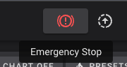

# There's no place like home
The guide for homing your printer could have been much shorter, but I'm hoping people use these guides to learn just as much as they do to accomplish something. I also could have made the guides 100x longer and gone in to much more detail, but I want people to actually read them instead of saying "this is way too much!" 

We're finally close... let's slide in to home.

## Requirements 
  * You have completed the <a href="/the100/1.1/configure/sensorless-homing-prep/">sensorless homing prep</a> guide and your `printer.cfg` matches how we ended the bed movement guide.
  * Know how to do an emergency stop in fluidd/mainsail so you can immediately stop the homing process if your stepper driver if needed. This will help prevent damage to the printer and motion systems. 
      * 

<div class="alert alert-warning" role="alert">
    🛑	Skipping steps and not slowly iterating will result in you getting increasingly frustrated. It's important to make one change at a time, test one thing at a time, and document your progress as you go. If you've made it this far then you're doing great! But for those that have never setup a printer like this before, this is where a lot of frustration will come if you aren't patient and methodical about your setup.
</div>

<div class="alert alert-danger" role="alert">
    🛑	CORRECTION: Prior to 2023-10-03 I had "max_accel: 300", but it was causing homing issues. Please update your printer.cfg to "max_accel: 1000" to prevent issues with the following steps.
</div>


## Homing macro
The standard homing gcode command is `G28`. The issue with using the default command is the way THE 100 needs to home is different from the norm. This is because we use sensorless homing on all 3 axis, and because we use part of the homing process to ensure the dual Z motors are equal so that the bed is level. 

To override the default `G28` behavior, we have to add a few custom macros to our `printer.cfg`. I'm going to just include the macros and steps to install first, and later I'll explain how they work.

### Add the macro
Open your `printer.cfg` and scroll to the bottom. Paste the following below the last line

```
##### HOMING MACROS START #####

[gcode_macro G28]
rename_existing: G280
gcode:
  M80
  SET_KINEMATIC_POSITION Z=0
  G90
  G1 Z5 F200
  SENSORLESS_HOME_X
  SENSORLESS_HOME_Y
  SENSORLESS_HOME_Z

[gcode_macro SENSORLESS_HOME_X]
gcode:
    SENSORLESS_DELAY
    # Home
    G280 X
    # Move away
    G1 X{ printer.toolhead.axis_maximum.x/2 } F6000

[gcode_macro SENSORLESS_HOME_Y]
gcode:
    SENSORLESS_DELAY
    # Home
    G280 Y
    # Move away
    G90
    G1 Y{ printer.toolhead.axis_maximum.y/2 } F6000

[gcode_macro SENSORLESS_HOME_Z]
gcode:
    SENSORLESS_DELAY
    # Home
    G1 X{ printer.toolhead.axis_maximum.x/2 } Y{ printer.toolhead.axis_maximum.y } F6000
    G280 Z
    SET_KINEMATIC_POSITION Z=1
    G1 Z0 F120
    G1 Z5 F120
    SENSORLESS_DELAY
    G280 Z
    G1 Z5 F120   # Make sure we clear the toolhead
    G1 X{ printer.toolhead.axis_minimum.x +5 } Y{ printer.toolhead.axis_maximum.y -2 } F6000


[gcode_macro SENSORLESS_DELAY]
gcode:
    # Pause to ensure driver stall flag is clear
    G4 P2000

[gcode_macro M80]
gcode:
  SET_STEPPER_ENABLE STEPPER=stepper_x ENABLE=1
  SET_STEPPER_ENABLE STEPPER=stepper_y ENABLE=1
  SET_STEPPER_ENABLE STEPPER=stepper_z ENABLE=1

##### HOMING MACROS END #####
```

Then click `Save & Restart`.

## Your first home
The time as finally come to home for the first time! I would highly suggest two things before continuing:
  1. Restart Klipper to have a clean slate: 3 dots in the top right > Service > Klipper > Restart icon
  1. Manually move your printhead to roughly the middle of the gantry and slightly lower the bed just to give things the best chance of working right

Press the `🏠 All` button in fluidd, or send `G28` via the console. Be prepared to hit `Emergency Stop` if needed!

If all goes well then your printer should follow these steps:

  1. Bed moves down slightly
  1. Toolhead moves to the right until it contacts the frame. It then moves to the center of the bed. 
  1. Toolhead moves to the back until it contacts the frame. It then moves to the center of the bed. 
  1. Toolhead moves to the back of the frame again -- this is done to avoid the bed colliding with it
      1. Note: If you're using a modified bed that isn't the original, you may have issues with the bed colliding due to the size. The proper fix for that is to use an actual endstop on the Z-axis.
  1. Bed moves down slightly, then up until it contacts the frame
  1. Bed moves down slightly again, then up until it contacts the frame again
  1. Bed moves down, then toolhead moves to the back left

Your printer is now homed!!

### Troubleshooting
  * If your toolhead homes to the left instead of right, or front instead of back
      * If you completed all the steps required to ensure your motors move in the proper direction then this probably isn't an issue. The direction it homes is controlled by the `position_endstop` settings in your printer.cfg and they ultimately don't actually matter. If you followed my guide then they SHOULD be going to the right and to the back, but <b><u>as long as position `0,0` is in the front left corner of the bed then it doesn't actually matter</b></u>. 
  * If you encounter some other issue, please post about it in Discord

<div class="alert alert-info" role="alert">
    💾 	Take a moment now to download a copy of your `printer.cfg` to your computer and rename it to include today's date, or `printer.cfg-homing_works` or something like that. If you end up breaking your cfg in future steps, or if your SD card gets corrupted, or anything else like that... you'll be glad you have this saved! I highly recommend repeating this process any time you make important cfg changes. 
</div>

Now that your printer is homing correctly, let's get the other components working. Or continue reading if you're interested in what the macro does. 

## The macro explained
Coming soon. Focusing on moving the guide forward for now. Ping me in discord if this is important to you and I'll work on it. 
