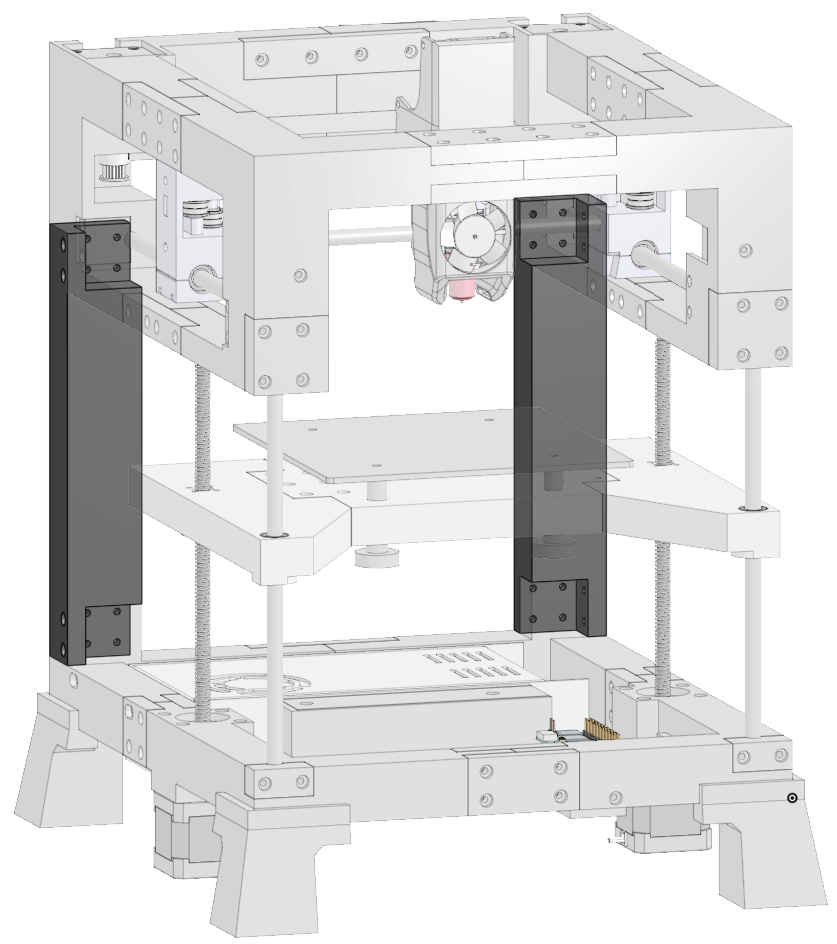
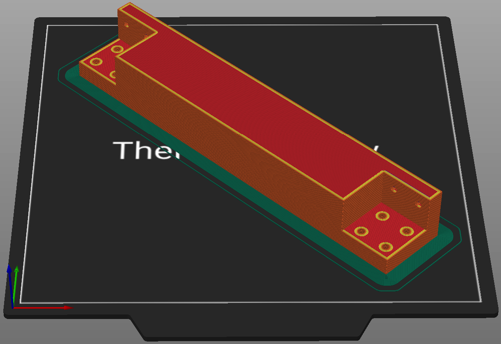

# Back Frame
The back frame is one of the big changes from v1.0 to v1.1. It removes 2 rods from the back and solidifies the whole frame. 

  

      

  

  

    <ul class="list-group">
      <li class="list-group-item d-flex justify-content-between align-items-center">
        
Printed parts

        
2

      </li>
    </ul>
     
    <ul class="list-group">
      <li class="list-group-item d-flex justify-content-between align-items-center">
        
Purchased parts

        
24

      </li>
    </ul>   
     
    <ul class="list-group">
      <li class="list-group-item d-flex justify-content-between align-items-center">
        
Filament

        
80m | 238.6g

      </li>
    </ul>   
     
    <ul class="list-group">
      <li class="list-group-item d-flex justify-content-between align-items-center">
        
Print time

        
10h 56m

      </li>
    </ul>  
  

### Printed parts

<table class="table table-sm">
  <thead>
    <tr>
      <th scope="col">Part Name</th>
      <th scope="col">STL</th>
      <th scope="col">Qty</th>
      <th scope="col">Notes</th>
    </tr>
  </thead>
  <tbody>
    <tr>
      <td>Back Connector Left</td>
      <td class="no-wrap"><a target="_blank" href="https://github.com/MSzturc/the100/blob/main/STL/Back/Back%20Connector%20Left.stl">github</a> / <a href="https://files.printables.com/media/prints/572689/stls/4585086_c556e237-101a-4acd-a392-098b7c88e9a1/back-connector-left.stl">printables</a></td>
      <td>1</td>
      <td><a href="#back-frame-1">More info</a></td>
    </tr>
    <tr>
      <td>Back Connector Right</td>
      <td class="no-wrap"><a target="_blank" href="https://github.com/MSzturc/the100/blob/main/STL/Back/Back%20Connector%20Right.stl">github</a> / <a href="https://files.printables.com/media/prints/572689/stls/4585087_9b00f09c-1c11-4350-a192-ece4abe3a657/back-connector-right.stl">printables</a></td>
      <td>1</td>
      <td><a href="#back-frame-1">More info</a></td>
    </tr>
  </tbody>
</table>

### Purchased Parts
<table class="table table-sm no-margin">
  <thead>
    <tr>
      <th scope="col">Item</th>
      <th scope="col">Qty</th>
      <th scope="col">Notes</th>
    </tr>
  </thead>
  <tbody>
    <tr>
      <td>m3x10 screw</td>
      <td>24</td>
      <td></td>
    </tr>
  </tbody>
</table>

### Details
#### Back frame
  
  
##### Print
<table class="table table-striped table-hover no-margin">
  <tbody class="table-group-divider">
    <tr>
      <th scope="row" class="no-wrap">Quantity</th>
      <td> </td>
      <td>2</td>
    </tr>
    <tr>
      <th scope="row" class="no-wrap">Print Time</th>
      <td> </td>
      <td>36m</td>
    </tr>
    <tr>
      <th scope="row" class="no-wrap">Filament Length</th>
      <td> </td>
      <td>40m</td>
    </tr>
    <tr>
      <th scope="row" class="no-wrap">Filament Weight</th>
      <td> </td>
      <td>119.3g</td>
    </tr>
    <tr>
      <th scope="row" class="no-wrap">Supports?</th>
      <td> </td>
      <td>Yes - only in the countersunk holes touching the build plate.</td>
    </tr>
    <tr>
      <th scope="row">Note</th>
      <td> </td>
      <td>There are 2 different STLs but in reality it's the same part twice.</td>
    </tr>
  </tbody>
</table>

##### Purchase
<table class="table table-striped table-hover no-margin">
  <thead>
    <tr>
      <th scope="col">Item</th>
      <th scope="col">Qty</th>
      <th scope="col">Note</th>
    </tr>
  </thead>
  <tbody>
    <tr>
      <td>m3x10 screw</td>
      <td>12</td>
      <td></td>
    </tr>
  </tbody>
</table>