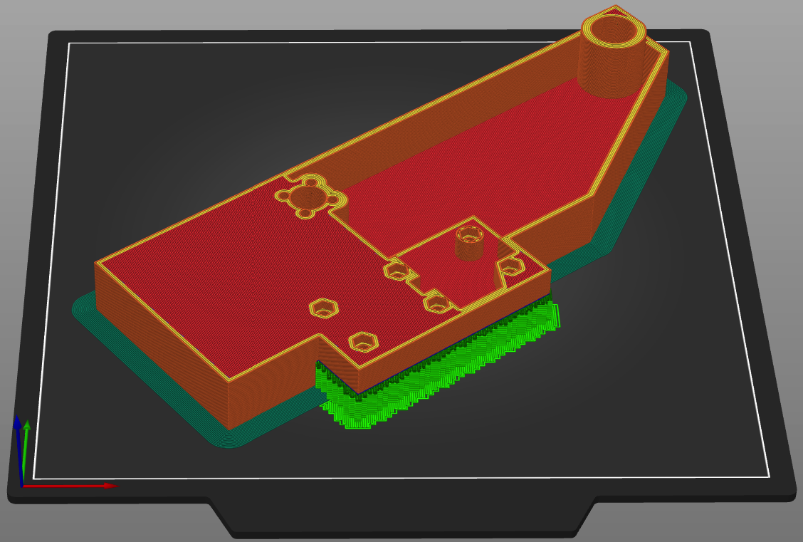

# Bed
As mentioned in <a href="/t100/1.1/overview/before-you-print/#print-settings">print settings</a>, these parts should be printed with 30% infill. 

  

      
  

  

    <ul class="list-group">
      <li class="list-group-item d-flex justify-content-between align-items-center">
        
Printed parts

        
3

      </li>
    </ul>
     
    <ul class="list-group">
      <li class="list-group-item d-flex justify-content-between align-items-center">
        
Purchased parts

        
35

      </li>
    </ul>   
     
    <ul class="list-group">
      <li class="list-group-item d-flex justify-content-between align-items-center">
        
Filament

        
156m | 465g

      </li>
    </ul>   
     
    <ul class="list-group">
      <li class="list-group-item d-flex justify-content-between align-items-center">
        
Print time

        
21h 0m

      </li>
    </ul>   
  

### Printed parts
<table class="table table-sm">
  <thead>
    <tr>
      <th scope="col">Part Name</th>
      <th scope="col">STL</th>
      <th scope="col">Qty</th>
      <th scope="col">Notes</th>
    </tr>
  </thead>
  <tbody>
    <tr>
      <td>Center</td>
      <td class="no-wrap"><a target="_blank" href="https://github.com/MSzturc/t100/blob/main/STL/Bed/Center.stl">github</a> / <a href="https://files.printables.com/media/prints/572689/stls/4581588_09eb6d6c-8caa-4684-978e-19dcb8971a19/center.stl">printables</a></td>
      <td>1</td>
      <td><a href="#center">More info</a></td>
    </tr>
    <tr>
      <td>Left</td>
      <td class="no-wrap"><a target="_blank" href="https://github.com/MSzturc/t100/blob/main/STL/Bed/Left.stl">github</a> / <a href="https://files.printables.com/media/prints/572689/stls/4581590_128c4603-3ed4-423d-9a37-d211a697060c/left.stl">printables</a></td>
      <td>1</td>
      <td><a href="#left">More info</a></td>
    </tr>
    <tr>
      <td>Right</td>
      <td class="no-wrap"><a target="_blank" href="https://github.com/MSzturc/t100/blob/main/STL/Bed/Right.stl">github</a> / <a href="https://files.printables.com/media/prints/572689/stls/4581589_b78f9bc8-574d-4154-bc54-77deda70e43d/right.stl">printables</a></td>
      <td>1</td>
      <td><a href="#right">More info</a></td>
    </tr>
  </tbody>
</table>

### Purchased Parts
<table class="table table-sm no-margin">
  <thead>
    <tr>
      <th scope="col" width="30%">Item</th>
      <th scope="col" width="10%">Qty</th>
      <th scope="col" width="60%">Notes</th>
    </tr>
  </thead>
  <tbody>
    <tr>
      <td>m3x10 screw</td>
      <td>8</td>
      <td></td>
    </tr>
    <tr>
      <td>m3x20 screw</td>
      <td>12</td>
      <td></td>
    </tr>
    <tr>
      <td>m3 nut</td>
      <td>12</td>
      <td></td>
    </tr>
    <tr>
      <td class="no-wrap">LM8UU steel bearing</td>
      <td>2</td>
      <td></td>
    </tr>
    <tr>
      <td>Bed spring kit</td>
      <td>1</td>
      <td>More than a singular item but is sold as a kit. 4 springs, 4 adjustment nuts. 4 screws. The kit I got was m4x40.</td>
    </tr>
  </tbody>
</table>

### Details

#### Center
  
  
##### Print
<table class="table table-striped table-hover no-margin">
  <tbody class="table-group-divider">
    <tr>
      <th scope="row" class="no-wrap">Quantity</th>
      <td> </td>
      <td>1</td>
    </tr>
    <tr>
      <th scope="row" class="no-wrap">Filament Length</th>
      <td> </td>
      <td>72m</td>
    </tr>
    <tr>
      <th scope="row" class="no-wrap">Filament Weight</th>
      <td> </td>
      <td>215g</td>
    </tr>
    <tr>
      <th scope="row" class="no-wrap">Supports?</th>
      <td> </td>
      <td>No</td>
    </tr>
    <tr>
      <th scope="row" class="no-wrap">Note</th>
      <td> </td>
      <td>A brim is recommended to help keep the bed from warping. </td>
    </tr>
  </tbody>
</table>

##### Purchase
<table class="table table-striped table-hover no-margin">
  <thead>
    <tr>
      <th scope="col">Item</th>
      <th scope="col">Qty</th>
      <th scope="col">Note</th>
    </tr>
  </thead>
  <tbody>
    <tr>
      <td>m3 nut</td>
      <td>12</td>
      <td></td>
    </tr>
  </tbody>
</table>

#### Left
  
  
##### Print
<table class="table table-striped table-hover no-margin">
  <tbody class="table-group-divider">
    <tr>
      <th scope="row" class="no-wrap">Quantity</th>
      <td> </td>
      <td>1</td>
    </tr>
    <tr>
      <th scope="row" class="no-wrap">Filament Length</th>
      <td> </td>
      <td>42m</td>
    </tr>
    <tr>
      <th scope="row" class="no-wrap">Filament Weight</th>
      <td> </td>
      <td>125g</td>
    </tr>
    <tr>
      <th scope="row" class="no-wrap">Supports?</th>
      <td> </td>
      <td>Yes</td>
    </tr>
    <tr>
      <th scope="row" class="no-wrap">Note</th>
      <td> </td>
      <td>A brim is recommended to help keep the bed from warping. Needs to be oriented at an angle to fit on a 225x225 bed like the Ender 3 (or be willing to override settings in your slicer to tell it to slice anyways).</td>
    </tr>
  </tbody>
</table>

##### Purchase
<table class="table table-striped table-hover no-margin">
  <thead>
    <tr>
      <th scope="col">Item</th>
      <th scope="col">Qty</th>
      <th scope="col">Note</th>
    </tr>
  </thead>
  <tbody>
    <tr>
      <td>m3x10</td>
      <td>4</td>
      <td>For the lead screw nut</td>
    </tr>
    <tr>
      <td>m3x20 screw</td>
      <td>6</td>
      <td></td>
    </tr>
  </tbody>
</table>

#### Right
  
  
##### Print
<table class="table table-striped table-hover no-margin">
  <tbody class="table-group-divider">
    <tr>
      <th scope="row" class="no-wrap">Quantity</th>
      <td> </td>
      <td>1</td>
    </tr>
    <tr>
      <th scope="row" class="no-wrap">Filament Length</th>
      <td> </td>
      <td>42m</td>
    </tr>
    <tr>
      <th scope="row" class="no-wrap">Filament Weight</th>
      <td> </td>
      <td>125g</td>
    </tr>
    <tr>
      <th scope="row" class="no-wrap">Supports?</th>
      <td> </td>
      <td>Yes</td>
    </tr>
    <tr>
      <th scope="row" class="no-wrap">Note</th>
      <td> </td>
      <td>A brim is recommended to help keep the bed from warping. Needs to be oriented at an angle to fit on a 225x225 bed like the Ender 3 (or be willing to override settings in your slicer to tell it to slice anyways).</td>
    </tr>
  </tbody>
</table>

##### Purchase
<table class="table table-striped table-hover no-margin">
  <thead>
    <tr>
      <th scope="col">Item</th>
      <th scope="col">Qty</th>
      <th scope="col">Note</th>
    </tr>
  </thead>
  <tbody>
    <tr>
      <td>m3x10</td>
      <td>4</td>
      <td>For the lead screw nut</td>
    </tr>
    <tr>
      <td>m3x20 screw</td>
      <td>6</td>
      <td></td>
    </tr>
  </tbody>
</table>