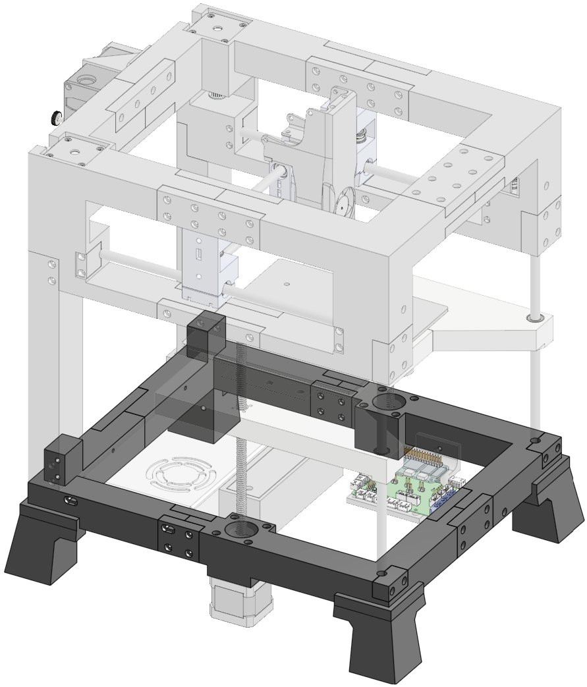
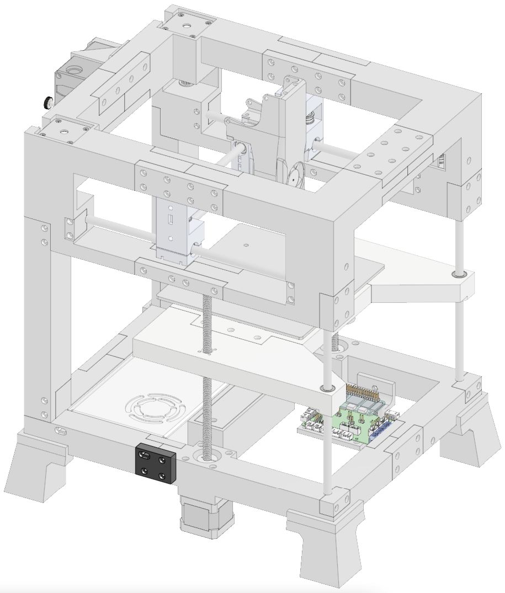

# Bottom Frame

  

      
  

  

    <ul class="list-group">
      <li class="list-group-item d-flex justify-content-between align-items-center">
        
Printed parts

        
19

      </li>
    </ul>
     
    <ul class="list-group">
      <li class="list-group-item d-flex justify-content-between align-items-center">
        
Purchased hardware

        
110

      </li>
    </ul>   
     
    <ul class="list-group">
      <li class="list-group-item d-flex justify-content-between align-items-center">
        
Filament

        
296.9m / 885.9g

      </li>
    </ul>   
     
    <ul class="list-group">
      <li class="list-group-item d-flex justify-content-between align-items-center">
        
Print time

        
44h 34m

      </li>
    </ul>  
  

### Printed Parts
<table class="table table-sm">
  <thead>
    <tr>
      <th scope="col">Part Name</th>
      <th scope="col">Link</th>
      <th scope="col">Qty</th>
      <th scope="col">Notes</th>
    </tr>
  </thead>
  <tbody>
    <tr>
      <td>Frame Back Left</a></td>
      <td class="no-wrap"><a target="_blank" href="https://github.com/MSzturc/t100/blob/main/STL/Bottom%20Frame/Frame%20Back%20Left.stl">github</a> / <a href="https://files.printables.com/media/prints/572689/stls/4581574_d26601dd-8dd4-467a-98df-87ee82356d1a/frame-back-left.stl">printables</a></td>
      <td>1</td>
      <td><a href="#frame-back-left">More info</a></td>
    </tr>
    <tr>
      <td>Frame Back Right</td>
      <td class="no-wrap"><a target="_blank" href="https://github.com/MSzturc/t100/blob/main/STL/Bottom%20Frame/Frame%20Back%20Right.stl">github</a> / <a href="https://files.printables.com/media/prints/572689/stls/4581583_f97f3d93-7a8d-412a-a32b-f8ce275d0b51/frame-back-right.stl">printables</a></td>
      <td>1</td>
      <td><a href="#frame-back-right">More info</a></td>
    </tr>
    <tr>
      <td>Frame Front Left</td>
      <td class="no-wrap"><a target="_blank" href="https://github.com/MSzturc/t100/blob/main/STL/Bottom%20Frame/Frame%20Front%20Left.stl">github</a> / <a href="https://files.printables.com/media/prints/572689/stls/4581571_fd5acb79-92c9-4185-875c-d3ac22fda0c7/frame-front-left.stl">printables</a></td>
      <td>1</td>
      <td><a href="#frame-front-left">More info</a></td>
    </tr>
    <tr>
      <td>Frame Front Right</td>
      <td class="no-wrap"><a target="_blank" href="https://github.com/MSzturc/t100/blob/main/STL/Bottom%20Frame/Frame%20Front%20Right.stl">github</a> / <a href="https://files.printables.com/media/prints/572689/stls/4581569_572aa844-b241-4efb-a8a3-06fefccff163/frame-front-right.stl">printables</a></td>
      <td>1</td>
      <td><a href="#frame-front-right">More info</a></td>
    </tr>
    <tr>
      <td>Frame Connector Back</td>
      <td class="no-wrap"><a target="_blank" href="https://github.com/MSzturc/t100/blob/main/STL/Bottom%20Frame/Frame%20Connector%20Back.stl">github</a> / <a href="https://files.printables.com/media/prints/572689/stls/4581584_1287f441-553b-4f64-b214-bc2e5e82d657/frame-connector-back.stl">printables</a></td>
      <td>1</td>
      <td><a href="#frame-connector-back">More info</a></td>
    </tr>
    <tr>
      <td>Frame Connector Front 2</td>
      <td class="no-wrap"><a target="_blank" href="https://github.com/MSzturc/t100/blob/main/STL/Bottom%20Frame/Frame%20Connector%20Front%202.stl">github</a> / <a href="https://files.printables.com/media/prints/572689/stls/4581585_24c4610e-94b8-4217-bb12-0506cf78156c/frame-connector-front-2.stl">printables</a></td>
      <td>1</td>
      <td><a href="#frame-connector-front-2">More info</a></td>
    </tr>
    <tr>
      <td>Frame Connector Front 1</td>
      <td class="no-wrap"><a target="_blank" href="https://github.com/MSzturc/t100/blob/main/STL/Bottom%20Frame/Frame%20Connector%20Front%201.stl">github</a> / <a href="https://files.printables.com/media/prints/572689/stls/4581580_50e3546e-36e2-4620-a702-d6faa6358e03/frame-connector-front-1.stl">printables</a></td>
      <td>1</td>
      <td><a href="#frame-connector-front-1">More info</a></td>
    </tr>
    <tr>
      <td>Frame Connector Left 1</td>
      <td class="no-wrap"><a target="_blank" href="https://github.com/MSzturc/t100/blob/main/STL/Bottom%20Frame/Frame%20Connector%20Left%201.stl">github</a> / <a href="https://files.printables.com/media/prints/572689/stls/4581575_2e6b2d10-429b-4f6b-b3b1-0845ad0ed513/frame-connector-left-1.stl">printables</a></td>
      <td>1</td>
      <td><a href="#frame-connector-left-1">More info</a></td>
    </tr>
    <tr>
      <td>Frame Connector Left 2</td>
      <td class="no-wrap"><a target="_blank" href="https://github.com/MSzturc/t100/blob/main/STL/Bottom%20Frame/Frame%20Connector%20Left%202.stl">github</a> / <a href="https://files.printables.com/media/prints/572689/stls/4581572_66d6eda2-33a6-4853-86ff-398617f07830/frame-connector-left-2.stl">printables</a></td>
      <td>1</td>
      <td><a href="#frame-connector-left-2">More info</a></td>
    </tr>
    <tr>
      <td>Frame Connector Right 1</td>
      <td class="no-wrap"><a target="_blank" href="https://github.com/MSzturc/t100/blob/main/STL/Bottom%20Frame/Frame%20Connector%20Right%201.stl">github</a> / <a href="https://files.printables.com/media/prints/572689/stls/4581577_ea51eae6-d738-48fd-869d-35d58253d572/frame-connector-right-1.stl">printables</a></td>
      <td>1</td>
      <td><a href="#frame-connector-right-1">More info</a></td>
    </tr>
    <tr>
      <td>Frame Connector Right 2</td>
      <td class="no-wrap"><a target="_blank" href="https://github.com/MSzturc/t100/blob/main/STL/Bottom%20Frame/Frame%20Connector%20Right%202.stl">github</a> / <a href="https://files.printables.com/media/prints/572689/stls/4581578_ac7c8794-6c97-4ba7-94ea-05155d08bf1a/frame-connector-right-2.stl">printables</a></td>
      <td>1</td>
      <td><a href="#frame-connector-right-2">More info</a></td>
    </tr>
    <tr>
      <td>Foot</td>
      <td class="no-wrap"><a target="_blank" href="https://github.com/MSzturc/t100/blob/main/STL/Bottom%20Frame/Foot%20Back%20Right.stl">github</a> / <a href="https://files.printables.com/media/prints/572689/stls/4581570_2f44b0b7-4560-49aa-a7bc-2151c762a710/foot-back-right.stl">printables</a></td>
      <td>4</td>
      <td><a href="#foot">More info</a></td>
    </tr>
    <tr>
      <td>5mm - 8mm Coupler</td>
      <td class="no-wrap"><a href="https://files.printables.com/media/prints/430339/stls/3564393_03d9394b-5c80-48cf-a571-ee4341b42e73/5mm-8mm-coupler.stl">printables</a></td>
      <td>2</td>
      <td><a href="#5mm---8mm-coupler">More info</a></td>
    </tr>
    <tr>
      <td>Connector Z-Rod</td>
      <td class="no-wrap"><a target="_blank" href="https://github.com/MSzturc/t100/blob/main/STL/Bottom%20Frame/Connector%20Z-Rod.stl">github</a> / <a href="https://files.printables.com/media/prints/572689/stls/4581582_e1111571-9778-4401-b52e-bfcbb22954a5/connector-z-rod.stl">printables</a></td>
      <td>2</td>
      <td><a href="#connector-z-rod">More info</a></td>
    </tr>
    <tr>
      <td>Power Cord Clamp</td>
      <td class="no-wrap"><a target="_blank" href="https://github.com/MSzturc/t100/blob/main/STL/Bottom%20Frame/Power%20Cord%20clamp.stl">github</a> / <a href="https://files.printables.com/media/prints/572689/stls/4581581_83c72922-f92e-48b9-b9c3-00fa7dcc0d5b/power-cord-clamp.stl">printables</a></td>
      <td>1</td>
      <td><a href="#power-cord-clamp">More info</a></td>
    </tr>
    <tr>
      <td>Cable Guide Clamp</td>
            <td class="no-wrap"><a target="_blank" href="https://github.com/MSzturc/t100/blob/main/STL/Bottom%20Frame/Cable%20Guide%20Clamp.stl">github</a> / <a href="https://files.printables.com/media/prints/572689/stls/4660166_9fbc03a8-48f0-4112-a0f6-4e9a807422e7/cable-guide-clamp.stl">printables</a></td>
      <td>2</td>
      <td><a href="#cable-guide-clamp">More info</a></td>
    </tr>
  </tbody>
</table>

### Purchased Parts
<table class="table table-sm no-margin">
  <thead>
    <tr>
      <th scope="col">Item</th>
      <th scope="col">Qty</th>
      <th scope="col">Notes</th>
    </tr>
  </thead>
  <tbody>
    <tr>
      <td>m3 heat insert</td>
      <td>42</td>
      <td></td>
    </tr>
    <tr>
      <td>m3 nut</td>
      <td>15</td>
      <td></td>
    </tr>
    <tr>
      <td>m3 washer</td>
      <td>8</td>
      <td></td>
    </tr>
    <tr>
      <td>m3x12 screw</td>
      <td>10</td>
      <td></td>
    </tr>
    <tr>
      <td>m3x16 screw</td>
      <td>18</td>
      <td></td>
    </tr>
    <tr>
      <td>m3x25 screw</td>
      <td>11</td>
      <td></td>
    </tr>
    <tr>
      <td>m3x35 screw</td>
      <td>6</td>
      <td></td>
    </tr>
    <tr>
      <td>m3x40 screw</td>
      <td>8</td>
      <td></td>
    </tr>
  </tbody>
</table>

## Details

#### Frame Back Left
  
  
##### Print
<table class="table table-striped table-hover no-margin">
  <tbody class="table-group-divider">
    <tr>
      <th scope="row" class="no-wrap">Quantity</th>
      <td> </td>
      <td>1</td>
    </tr>
    <tr>
      <th scope="row" class="no-wrap">Filament Length</th>
      <td> </td>
      <td>41m</td>
    </tr>
    <tr>
      <th scope="row" class="no-wrap">Filament Weight</th>
      <td> </td>
      <td>122.2g</td>
    </tr>
    <tr>
      <th scope="row" class="no-wrap">Supports?</th>
      <td> </td>
      <td>No</td>
    </tr>
    <tr>
      <th scope="row" class="no-wrap">Notes</th>
      <td> </td>
      <td>A brim is recommended to prevent warping.</td>
    </tr>
  </tbody>
</table>

##### Purchase
<table class="table table-striped table-hover no-margin">
  <thead>
    <tr>
      <th scope="col">Item</th>
      <th scope="col">Qty</th>
      <th scope="col">Note</th>
    </tr>
  </thead>
  <tbody>
    <tr>
      <td>m3 heat insert</td>
      <td>12</td>
      <td></td>
    </tr>
    <tr>
      <td>m3x35 screw</td>
      <td>2</td>
      <td>For holding the PSU</td>
    </tr>
  </tbody>
</table>

#### Frame Back Right
  
  
##### Print
<table class="table table-striped table-hover no-margin">
  <tbody class="table-group-divider">
    <tr>
      <th scope="row" class="no-wrap">Quantity</th>
      <td> </td>
      <td>1</td>
    </tr>
    <tr>
      <th scope="row" class="no-wrap">Filament Length</th>
      <td> </td>
      <td>40.9m</td>
    </tr>
    <tr>
      <th scope="row" class="no-wrap">Filament Weight</th>
      <td> </td>
      <td>121.9g</td>
    </tr>
    <tr>
      <th scope="row" class="no-wrap">Supports?</th>
      <td> </td>
      <td>No</td>
    </tr>
    <tr>
      <th scope="row" class="no-wrap">Notes</th>
      <td> </td>
      <td>A brim is recommended to prevent warping.</td>
    </tr>
  </tbody>
</table>

##### Purchase
<table class="table table-striped table-hover no-margin">
  <thead>
    <tr>
      <th scope="col">Item</th>
      <th scope="col">Qty</th>
      <th scope="col">Note</th>
    </tr>
  </thead>
  <tbody>
    <tr>
      <td>m3 heat insert</td>
      <td>14</td>
      <td></td>
    </tr>
    <tr>
      <td>m3x35 screw</td>
      <td>1</td>
      <td>For holding the PSU</td>
    </tr>
  </tbody>
</table>

#### Frame Front Left
  
  
##### Print
<table class="table table-striped table-hover no-margin">
  <tbody class="table-group-divider">
    <tr>
      <th scope="row" class="no-wrap">Quantity</th>
      <td> </td>
      <td>1</td>
    </tr>
    <tr>
      <th scope="row" class="no-wrap">Filament Length</th>
      <td> </td>
      <td>51.1m</td>
    </tr>
    <tr>
      <th scope="row" class="no-wrap">Filament Weight</th>
      <td> </td>
      <td>152.5g</td>
    </tr>
    <tr>
      <th scope="row" class="no-wrap">Supports?</th>
      <td> </td>
      <td>Yes</td>
    </tr>
    <tr>
      <th scope="row" class="no-wrap">Notes</th>
      <td> </td>
      <td>A brim is recommended to prevent warping.</td>
    </tr>
  </tbody>
</table>

##### Purchase
<table class="table table-striped table-hover no-margin">
  <thead>
    <tr>
      <th scope="col">Item</th>
      <th scope="col">Qty</th>
      <th scope="col">Note</th>
    </tr>
  </thead>
  <tbody>
    <tr>
      <td>m3 heat insert</td>
      <td>4</td>
      <td></td>
    </tr>
    <tr>
      <td>m3x40 screw</td>
      <td>4</td>
      <td>For holding the motor</td>
    </tr>
  </tbody>
</table>

#### Frame Front Right
  
  
##### Print
<table class="table table-striped table-hover no-margin">
  <tbody class="table-group-divider">
    <tr>
      <th scope="row" class="no-wrap">Quantity</th>
      <td> </td>
      <td>1</td>
    </tr>
    <tr>
      <th scope="row" class="no-wrap">Filament Length</th>
      <td> </td>
      <td>51.8m</td>
    </tr>
    <tr>
      <th scope="row" class="no-wrap">Filament Weight</th>
      <td> </td>
      <td>154.6g</td>
    </tr>
    <tr>
      <th scope="row" class="no-wrap">Supports?</th>
      <td> </td>
      <td>Yes</td>
    </tr>
    <tr>
      <th scope="row" class="no-wrap">Notes</th>
      <td> </td>
      <td>A brim is recommended to prevent warping.</td>
    </tr>
  </tbody>
</table>

##### Purchase
<table class="table table-striped table-hover no-margin">
  <thead>
    <tr>
      <th scope="col">Item</th>
      <th scope="col">Qty</th>
      <th scope="col">Note</th>
    </tr>
  </thead>
  <tbody>
    <tr>
      <td>m3 heat insert</td>
      <td>4</td>
      <td></td>
    </tr>
    <tr>
      <td>m3x40 screw</td>
      <td>4</td>
      <td>For holding the motor</td>
    </tr>
    <tr>
      <td>m3x35 screw</td>
      <td>2</td>
      <td>For holding the mainboard tray</td>
    </tr>
  </tbody>
</table>

#### Frame Connector Back
  
  
##### Print
<table class="table table-striped table-hover no-margin">
  <tbody class="table-group-divider">
    <tr>
      <th scope="row" class="no-wrap">Quantity</th>
      <td> </td>
      <td>1</td>
    </tr>
    <tr>
      <th scope="row" class="no-wrap">Filament Length</th>
      <td> </td>
      <td>5.5m</td>
    </tr>
    <tr>
      <th scope="row" class="no-wrap">Filament Weight</th>
      <td> </td>
      <td>16.5g</td>
    </tr>
    <tr>
      <th scope="row" class="no-wrap">Supports?</th>
      <td> </td>
      <td>No</td>
    </tr>
  </tbody>
</table>

##### Hardware
<table class="table table-sm no-margin">
  <thead>
    <tr>
      <th scope="col">Item</th>
      <th scope="col">Qty</th>
      <th scope="col">Note</th>
    </tr>
  </thead>
  <tbody>
    <tr>
      <td>m3x12 screw</td>
      <td>8</td>
      <td></td>
    </tr>
  </tbody>
</table>

#### Frame Connector Front 2
  
  
##### Print
<table class="table table-striped table-hover no-margin">
  <tbody class="table-group-divider">
    <tr>
      <th scope="row" class="no-wrap">Quantity</th>
      <td> </td>
      <td>1</td>
    </tr>
    <tr>
      <th scope="row" class="no-wrap">Filament Length</th>
      <td> </td>
      <td>4.2m</td>
    </tr>
    <tr>
      <th scope="row" class="no-wrap">Filament Weight</th>
      <td> </td>
      <td>12.4g</td>
    </tr>
    <tr>
      <th scope="row" class="no-wrap">Supports?</th>
      <td> </td>
      <td>No</td>
    </tr>
    <tr>
      <th scope="row" class="no-wrap">Notes</th>
      <td> </td>
      <td>Uses inset nuts rather than heat inserts</td>
    </tr>
  </tbody>
</table>

##### Hardware
<table class="table table-sm no-margin">
  <thead>
    <tr>
      <th scope="col">Item</th>
      <th scope="col">Qty</th>
      <th scope="col">Note</th>
    </tr>
  </thead>
  <tbody>
    <tr>
      <td>m3 nut</td>
      <td>4</td>
      <td></td>
    </tr>
  </tbody>
</table>

#### Frame Connector Front 1
  
  
##### Print
<table class="table table-striped table-hover no-margin">
  <tbody class="table-group-divider">
    <tr>
      <th scope="row" class="no-wrap">Quantity</th>
      <td> </td>
      <td>1</td>
    </tr>
    <tr>
      <th scope="row" class="no-wrap">Filament Length</th>
      <td> </td>
      <td>4.1m</td>
    </tr>
    <tr>
      <th scope="row" class="no-wrap">Filament Weight</th>
      <td> </td>
      <td>12.3g</td>
    </tr>
    <tr>
      <th scope="row" class="no-wrap">Supports?</th>
      <td> </td>
      <td>No</td>
    </tr>
  </tbody>
</table>

##### Hardware
<table class="table table-sm no-margin">
  <thead>
    <tr>
      <th scope="col">Item</th>
      <th scope="col">Qty</th>
      <th scope="col">Note</th>
    </tr>
  </thead>
  <tbody>
    <tr>
      <td>m3x25 screw</td>
      <td>4</td>
      <td>m3x30 also works but will stick out slightly</td>
    </tr>
  </tbody>
</table>

#### Frame Connector Left 1
  
  
##### Print
<table class="table table-striped table-hover no-margin">
  <tbody class="table-group-divider">
    <tr>
      <th scope="row" class="no-wrap">Quantity</th>
      <td> </td>
      <td>1</td>
    </tr>
    <tr>
      <th scope="row" class="no-wrap">Filament Length</th>
      <td> </td>
      <td>3m</td>
    </tr>
    <tr>
      <th scope="row" class="no-wrap">Filament Weight</th>
      <td> </td>
      <td>8.9g</td>
    </tr>
    <tr>
      <th scope="row" class="no-wrap">Supports?</th>
      <td> </td>
      <td>No</td>
    </tr>
    <tr>
      <th scope="row" class="no-wrap">Notes</th>
      <td> </td>
      <td>Uses inset nuts rather than heat inserts</td>
    </tr>
  </tbody>
</table>

##### Hardware
<table class="table table-sm no-margin">
  <thead>
    <tr>
      <th scope="col">Item</th>
      <th scope="col">Qty</th>
      <th scope="col">Note</th>
    </tr>
  </thead>
  <tbody>
    <tr>
      <td>m3 nut</td>
      <td>3</td>
      <td></td>
    </tr>
  </tbody>
</table>

#### Frame Connector Left 2
  
  
##### Print
<table class="table table-striped table-hover no-margin">
  <tbody class="table-group-divider">
    <tr>
      <th scope="row" class="no-wrap">Quantity</th>
      <td> </td>
      <td>1</td>
    </tr>
    <tr>
      <th scope="row" class="no-wrap">Filament Length</th>
      <td> </td>
      <td>2.9m</td>
    </tr>
    <tr>
      <th scope="row" class="no-wrap">Filament Weight</th>
      <td> </td>
      <td>8.8g</td>
    </tr>
    <tr>
      <th scope="row" class="no-wrap">Supports?</th>
      <td> </td>
      <td>No</td>
    </tr>
  </tbody>
</table>

##### Hardware
<table class="table table-sm no-margin">
  <thead>
    <tr>
      <th scope="col">Item</th>
      <th scope="col">Qty</th>
      <th scope="col">Note</th>
    </tr>
  </thead>
  <tbody>
    <tr>
      <td>m3x25 screw</td>
      <td>3</td>
      <td></td>
    </tr>
    <tr>
      <td>m3x35 screw</td>
      <td>1</td>
      <td>Oval hole for PSU</td>
    </tr>
  </tbody>
</table>

#### Frame Connector Right 1
  
  
##### Print
<table class="table table-striped table-hover no-margin">
  <tbody class="table-group-divider">
    <tr>
      <th scope="row" class="no-wrap">Quantity</th>
      <td> </td>
      <td>1</td>
    </tr>
    <tr>
      <th scope="row" class="no-wrap">Filament Length</th>
      <td> </td>
      <td>2.9m</td>
    </tr>
    <tr>
      <th scope="row" class="no-wrap">Filament Weight</th>
      <td> </td>
      <td>8.7g</td>
    </tr>
    <tr>
      <th scope="row" class="no-wrap">Supports?</th>
      <td> </td>
      <td>No</td>
    </tr>
    <tr>
      <th scope="row" class="no-wrap">Notes</th>
      <td> </td>
      <td>Uses inset nuts rather than heat inserts</td>
    </tr>
  </tbody>
</table>

##### Hardware
<table class="table table-sm no-margin">
  <thead>
    <tr>
      <th scope="col">Item</th>
      <th scope="col">Qty</th>
      <th scope="col">Note</th>
    </tr>
  </thead>
  <tbody>
    <tr>
      <td>m3 nut</td>
      <td>4</td>
      <td></td>
    </tr>
  </tbody>
</table>

#### Frame Connector Right 2
  
  
##### Print
<table class="table table-striped table-hover no-margin">
  <tbody class="table-group-divider">
    <tr>
      <th scope="row" class="no-wrap">Quantity</th>
      <td> </td>
      <td>1</td>
    </tr>
    <tr>
      <th scope="row" class="no-wrap">Filament Length</th>
      <td> </td>
      <td>2.9m</td>
    </tr>
    <tr>
      <th scope="row" class="no-wrap">Filament Weight</th>
      <td> </td>
      <td>8.7g</td>
    </tr>
    <tr>
      <th scope="row" class="no-wrap">Supports?</th>
      <td> </td>
      <td>No</td>
    </tr>
  </tbody>
</table>

##### Hardware
<table class="table table-sm no-margin">
  <thead>
    <tr>
      <th scope="col">Item</th>
      <th scope="col">Qty</th>
      <th scope="col">Note</th>
    </tr>
  </thead>
  <tbody>
    <tr>
      <td>m3x25 screw</td>
      <td>4</td>
      <td>m3x30 also works but will stick out slightly</td>
    </tr>
  </tbody>
</table>

#### Foot
  
  
##### Print
<table class="table table-striped table-hover no-margin">
  <tbody class="table-group-divider">
    <tr>
      <th scope="row" class="no-wrap">Quantity</th>
      <td> </td>
      <td>4</td>
    </tr>
    <tr>
      <th scope="row" class="no-wrap">Filament Length</th>
      <td> </td>
      <td>19.6m</td>
    </tr>
    <tr>
      <th scope="row" class="no-wrap">Filament Weight</th>
      <td> </td>
      <td>58.4g</td>
    </tr>
    <tr>
      <th scope="row" class="no-wrap">Supports?</th>
      <td> </td>
      <td>Yes - Using organic supports is smart here if your slicer supports them. It isn't necessary but will use 3g of material for supports instead of 11g. </td>
    </tr>
    <tr>
      <th scope="row" class="no-wrap">Notes</th>
      <td> </td>
      <td>The back right foot has a spot for 2 heat inserts for a clamp that holds the power supply cable. I personally printed that foot 4x and just don't put the heat inserts in the other 3 feet but you can choose to print just 1 with the holes and the other 3 without. The version without the extra mounting holes can be found here: <a target="_blank" href="https://github.com/MSzturc/t100/blob/main/STL/Bottom%20Frame/Foot%20Back%20Left.stl">github</a> / <a href="https://files.printables.com/media/prints/572689/stls/4581573_c9d87696-653e-410f-970e-556d52263bc1/foot-back-left.stl">printables</a>.</td>
    </tr>
  </tbody>
</table>

##### Hardware
<table class="table table-sm no-margin">
  <thead>
    <tr>
      <th scope="col">Item</th>
      <th scope="col">Qty</th>
      <th scope="col">Note</th>
    </tr>
  </thead>
  <tbody>
    <tr>
      <td>m3 heat insert</td>
      <td>2</td>
      <td>For the back right foot only</td>
    </tr>
    <tr>
      <td>m3x16 screw</td>
      <td>2</td>
      <td>Put a washer on it before attaching</td>
    </tr>
    <tr>
      <td>m3 washer</td>
      <td>2</td>
      <td></td>
    </tr>
  </tbody>
</table>

#### 5mm - 8mm Coupler
  
  
##### Print
<table class="table table-striped table-hover no-margin">
  <tbody class="table-group-divider">
    <tr>
      <th scope="row" class="no-wrap">Quantity</th>
      <td> </td>
      <td>2</td>
    </tr>
    <tr>
      <th scope="row" class="no-wrap">Filament Length</th>
      <td> </td>
      <td>2.1m</td>
    </tr>
    <tr>
      <th scope="row" class="no-wrap">Filament Weight</th>
      <td> </td>
      <td>6.4g</td>
    </tr>
    <tr>
      <th scope="row" class="no-wrap">Supports?</th>
      <td> </td>
      <td>No</td>
    </tr>
    <tr>
      <th scope="row" class="no-wrap">Notes</th>
      <td> </td>
      <td>This is a necessary part if you didn't purchase them. These allow you to connect the screw rod to the motor. I printed mine in petg but that's mainly because it was already loaded in my printer. I think PLA is perfectly fine for this part. </td>
    </tr>
  </tbody>
</table>

##### Hardware
<table class="table table-sm no-margin">
  <thead>
    <tr>
      <th scope="col">Item</th>
      <th scope="col">Qty</th>
      <th scope="col">Note</th>
    </tr>
  </thead>
  <tbody>
    <tr>
      <td>m3 nut</td>
      <td>2</td>
      <td></td>
    </tr>
    <tr>
      <td>m3x12mm screw</td>
      <td>2</td>
      <td></td>
    </tr>
  </tbody>
</table>

#### Connector Z-Rod
  
  
##### Print
<table class="table table-striped table-hover no-margin">
  <tbody class="table-group-divider">
    <tr>
      <th scope="row" class="no-wrap">Quantity</th>
      <td> </td>
      <td>2</td>
    </tr>
    <tr>
      <th scope="row" class="no-wrap">Filament Length</th>
      <td> </td>
      <td>2m</td>
    </tr>
    <tr>
      <th scope="row" class="no-wrap">Filament Weight</th>
      <td> </td>
      <td>6g</td>
    </tr>
    <tr>
      <th scope="row" class="no-wrap">Supports?</th>
      <td> </td>
      <td>Yes - only in the countersunk holes touching the buildplate</td>
    </tr>
  </tbody>
</table>

##### Hardware
<table class="table table-sm no-margin">
  <thead>
    <tr>
      <th scope="col">Item</th>
      <th scope="col">Qty</th>
      <th scope="col">Note</th>
    </tr>
  </thead>
  <tbody>
    <tr>
      <td>m3x16mm screw</td>
      <td>2</td>
      <td></td>
    </tr>
  </tbody>
</table>

#### Power Cord Clamp
  
  
##### Print
<table class="table table-striped table-hover no-margin">
  <tbody class="table-group-divider">
    <tr>
      <th scope="row" class="no-wrap">Quantity</th>
      <td> </td>
      <td>1</td>
    </tr>
    <tr>
      <th scope="row" class="no-wrap">Filament Length</th>
      <td> </td>
      <td>0.74</td>
    </tr>
    <tr>
      <th scope="row" class="no-wrap">Filament Weight</th>
      <td> </td>
      <td>2.22g</td>
    </tr>
    <tr>
      <th scope="row" class="no-wrap">Supports?</th>
      <td> </td>
      <td>Yes - only in countersunk holes touching the buildplate</td>
    </tr>
  </tbody>
</table>

##### Purchase
<table class="table table-striped table-hover no-margin">
  <thead>
    <tr>
      <th scope="col">Item</th>
      <th scope="col">Qty</th>
      <th scope="col">Note</th>
    </tr>
  </thead>
  <tbody>
    <tr>
      <td>m3x16 screw</td>
      <td>2</td>
      <td></td>
    </tr>
  </tbody>
</table>

#### Cable Guide Clamp
  
  
##### Print
<table class="table table-striped table-hover no-margin">
  <tbody class="table-group-divider">
    <tr>
      <th scope="row" class="no-wrap">Quantity</th>
      <td> </td>
      <td>2</td>
    </tr>
    <tr>
      <th scope="row" class="no-wrap">Filament Length</th>
      <td> </td>
      <td>0.62</td>
    </tr>
    <tr>
      <th scope="row" class="no-wrap">Filament Weight</th>
      <td> </td>
      <td>1.85g</td>
    </tr>
    <tr>
      <th scope="row" class="no-wrap">Supports?</th>
      <td> </td>
      <td>Yes - only in countersunk holes touching the buildplate</td>
    </tr>
  </tbody>
</table>

##### Purchase
<table class="table table-striped table-hover no-margin">
  <thead>
    <tr>
      <th scope="col">Item</th>
      <th scope="col">Qty</th>
      <th scope="col">Note</th>
    </tr>
  </thead>
  <tbody>
    <tr>
      <td>m3x16 screw</td>
      <td>2</td>
      <td></td>
    </tr>
  </tbody>
</table>