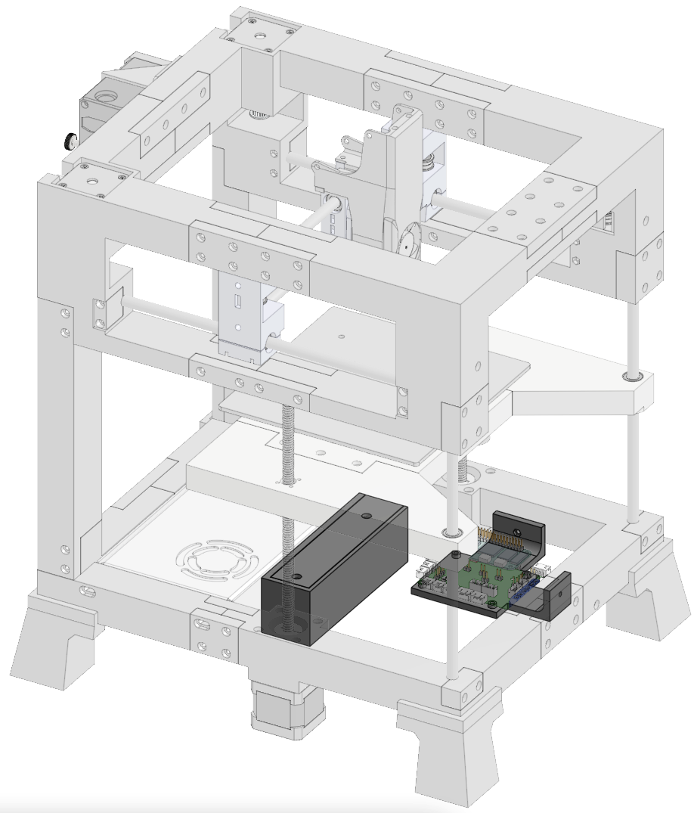
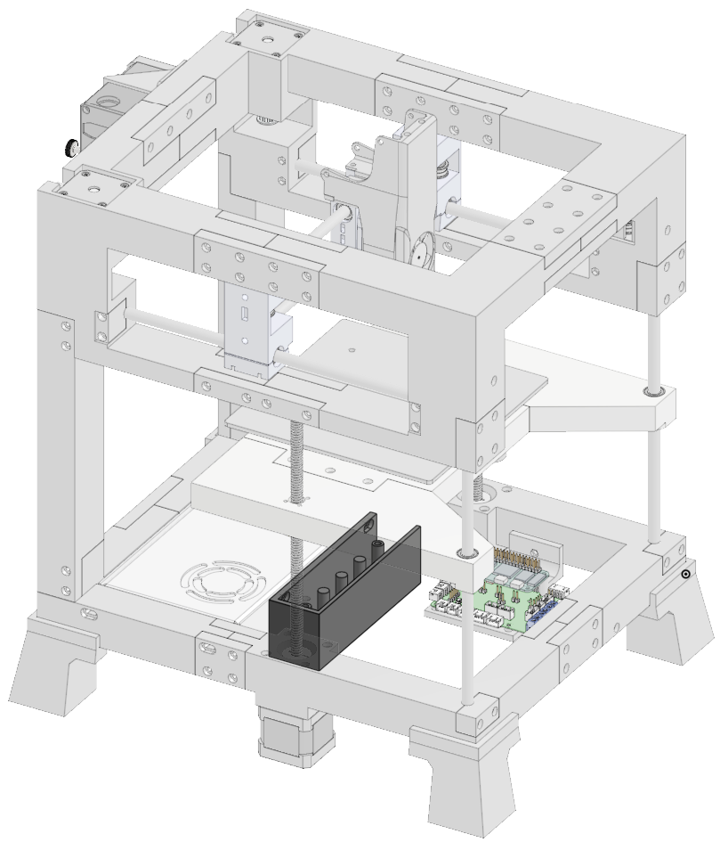
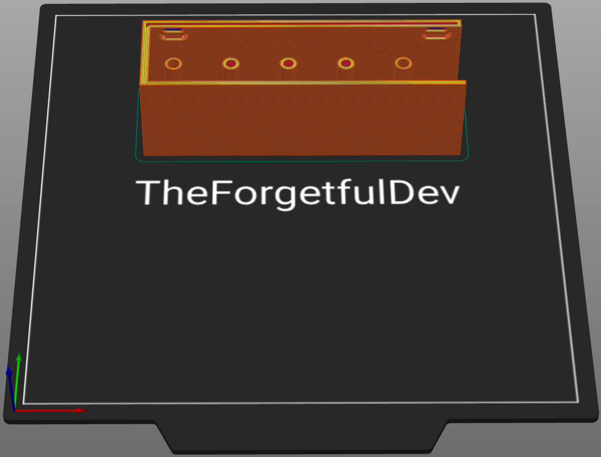
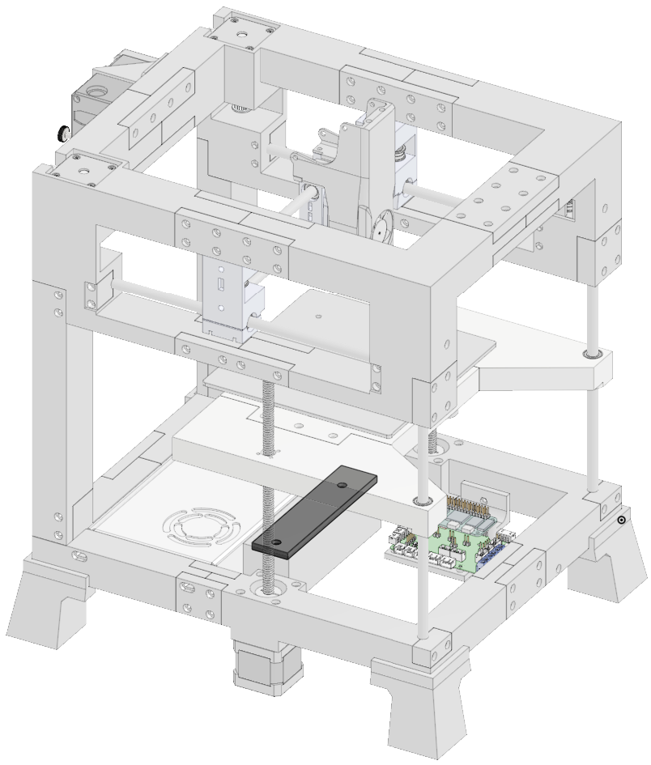
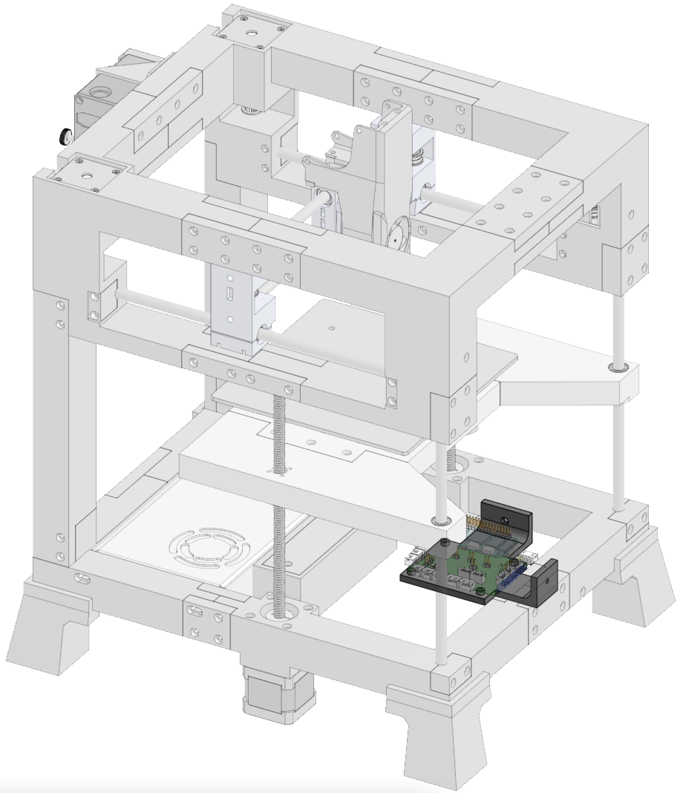
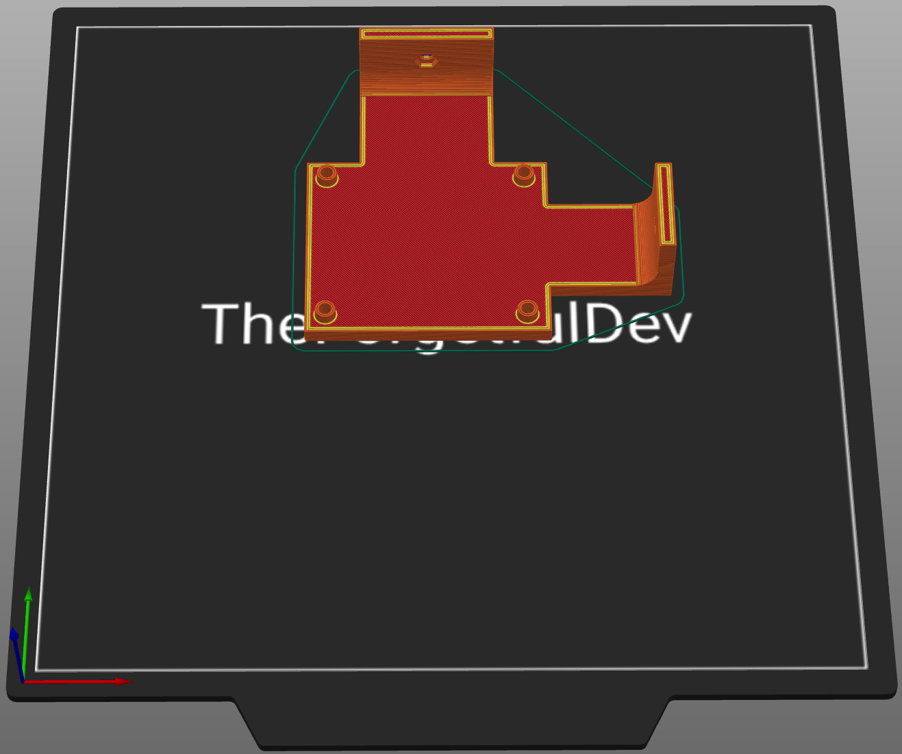

# Electronics
Everything you need to print to hold THE 100's electronics. You can't print the electronics themselves... yet. 

  

      
  

  

    <ul class="list-group">
      <li class="list-group-item d-flex justify-content-between align-items-center">
        
Printed parts

        
6

      </li>
    </ul>
     
    <ul class="list-group">
      <li class="list-group-item d-flex justify-content-between align-items-center">
        
Purchased parts

        
28

      </li>
    </ul>   
     
    <ul class="list-group">
      <li class="list-group-item d-flex justify-content-between align-items-center">
        
Filament

        
46.8m | 119.7g

      </li>
    </ul>   
     
    <ul class="list-group">
      <li class="list-group-item d-flex justify-content-between align-items-center">
        
Print time

        
7h 54m

      </li>
    </ul>  
  

### Printed parts
<table class="table table-sm">
  <thead>
    <tr>
      <th scope="col">Part Name</th>
      <th scope="col">STL</th>
      <th scope="col">Qty</th>
      <th scope="col">Notes</th>
    </tr>
  </thead>
  <tbody>
    <tr>
      <td>Cable Holder Frame</td>
      <td class="no-wrap"><a target="_blank" href="https://github.com/MSzturc/the100/blob/main/STL/Electronics/Cable%20Holder%20Frame.stl">github</a> / <a href="https://files.printables.com/media/prints/572689/stls/4581556_19129328-4335-465a-b671-f0bd2a63f9c6/cable-holder-frame.stl">printables</a></td>
      <td>1</td>
      <td><a href="#cable-holder-frame">More info</a></td>
    </tr>
    <tr>
      <td>Cable Holder Top</td>
      <td class="no-wrap"><a target="_blank" href="https://github.com/MSzturc/the100/blob/main/STL/Electronics/Cable%20Holder%20Top.stl">github</a> / <a href="https://files.printables.com/media/prints/572689/stls/4581557_c0b56564-be73-4338-9c44-279b15b9c600/cable-holder-top.stl">printables</a></td>
      <td>1</td>
      <td><a href="#cable-holder-top">More info</a></td>
    </tr>
    <tr>
      <td>Mainboard Holder</td>
      <td class="no-wrap"><a target="_blank" href="https://github.com/MSzturc/the100/blob/main/STL/Electronics/Mainboard%20Holder.stl">github</a> / <a href="https://files.printables.com/media/prints/572689/stls/4581558_7a9a4bd0-a8d6-4a6c-910a-24303c0e0896/mainboard-holder.stl">printables</a></td>
      <td>1</td>
      <td><a href="#mainboard-holder">More info</a></td>
    </tr>
  </tbody>
</table>

### Purchased Parts
<table class="table table-sm no-margin">
  <thead>
    <tr>
      <th scope="col">Item</th>
      <th scope="col">Qty</th>
      <th scope="col">Notes</th>
    </tr>
  </thead>
  <tbody>
    <tr>
      <td>m3 heat inserts</td>
      <td>2</td>
      <td></td>
    </tr>
    <tr>
      <td>m2.5x40 screw</td>
      <td>4</td>
      <td></td>
    </tr>
    <tr>
      <td>m2.5 nut</td>
      <td>12</td>
      <td></td>
    </tr>
    <tr>
      <td>m3x6 screw</td>
      <td>2</td>
      <td></td>
    </tr>
    <tr>
      <td>m3 nut</td>
      <td>2</td>
      <td></td>
    </tr>
  </tbody>
</table>

### Details

#### Cable Holder Frame
  
  
##### Print
<table class="table table-striped table-hover no-margin">
  <tbody class="table-group-divider">
    <tr>
      <th scope="row" class="no-wrap">Quantity</th>
      <td> </td>
      <td>1</td>
    </tr>
    <tr>
      <th scope="row" class="no-wrap">Filament Length</th>
      <td> </td>
      <td>28m</td>
    </tr>
    <tr>
      <th scope="row" class="no-wrap">Filament Weight</th>
      <td> </td>
      <td>63.6g</td>
    </tr>
    <tr>
      <th scope="row" class="no-wrap">Supports?</th>
      <td> </td>
      <td>No</td>
    </tr>
  </tbody>
</table>

##### Purchase
<table class="table table-striped table-hover no-margin">
  <thead>
    <tr>
      <th scope="col">Item</th>
      <th scope="col">Qty</th>
      <th scope="col">Note</th>
    </tr>
  </thead>
  <tbody>
    <tr>
      <td>m3 heat inserts</td>
      <td>2</td>
      <td></td>
    </tr>
  </tbody>
</table>

#### Cable Holder Top
  
  
##### Print
<table class="table table-striped table-hover no-margin">
  <tbody class="table-group-divider">
    <tr>
      <th scope="row" class="no-wrap">Quantity</th>
      <td> </td>
      <td>1</td>
    </tr>
    <tr>
      <th scope="row" class="no-wrap">Filament Length</th>
      <td> </td>
      <td>5.9m</td>
    </tr>
    <tr>
      <th scope="row" class="no-wrap">Filament Weight</th>
      <td> </td>
      <td>17.7g</td>
    </tr>
    <tr>
      <th scope="row" class="no-wrap">Supports?</th>
      <td> </td>
      <td>No</td>
    </tr>
  </tbody>
</table>

##### Purchase
<table class="table table-striped table-hover no-margin">
  <thead>
    <tr>
      <th scope="col">Item</th>
      <th scope="col">Qty</th>
      <th scope="col">Note</th>
    </tr>
  </thead>
  <tbody>
    <tr>
      <td>m3x6 screw</td>
      <td>2</td>
      <td></td>
    </tr>
  </tbody>
</table>

#### Mainboard Holder
  
  
##### Print
<table class="table table-striped table-hover no-margin">
  <tbody class="table-group-divider">
    <tr>
      <th scope="row" class="no-wrap">Quantity</th>
      <td> </td>
      <td>1</td>
    </tr>
    <tr>
      <th scope="row" class="no-wrap">Filament Length</th>
      <td> </td>
      <td>11m</td>
    </tr>
    <tr>
      <th scope="row" class="no-wrap">Filament Weight</th>
      <td> </td>
      <td>32.8g</td>
    </tr>
    <tr>
      <th scope="row" class="no-wrap">Supports?</th>
      <td> </td>
      <td>Yes - only in countersunk holes touching the buildplate</td>
    </tr>
  </tbody>
</table>

##### Purchase
<table class="table table-striped table-hover no-margin">
  <thead>
    <tr>
      <th scope="col">Item</th>
      <th scope="col">Qty</th>
      <th scope="col">Note</th>
    </tr>
  </thead>
  <tbody>
    <tr>
      <td>m2.5x40 screw</td>
      <td>4</td>
      <td>Optional. Just my custom solution for stacking.</td>
    </tr>
    <tr>
      <td>m2.5 nut</td>
      <td>12</td>
      <td>Optional. Just my custom solution for stacking.</td>
    </tr>
    <tr>
      <td>m3 nuts</td>
      <td>2</td>
      <td></td>
    </tr>
  </tbody>
</table>