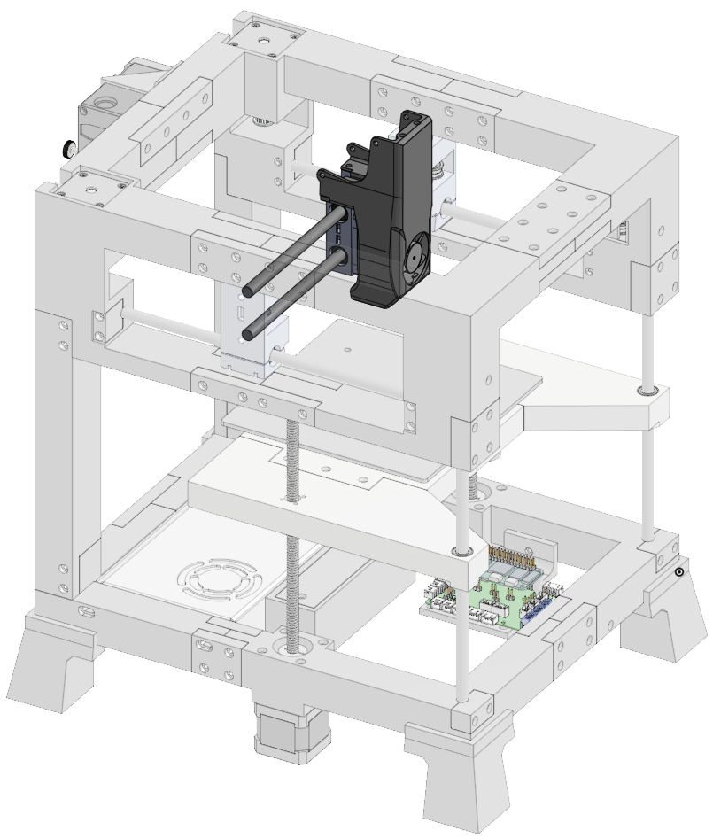
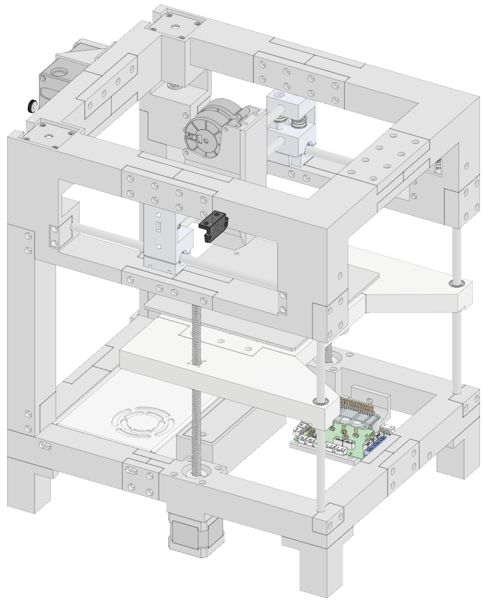
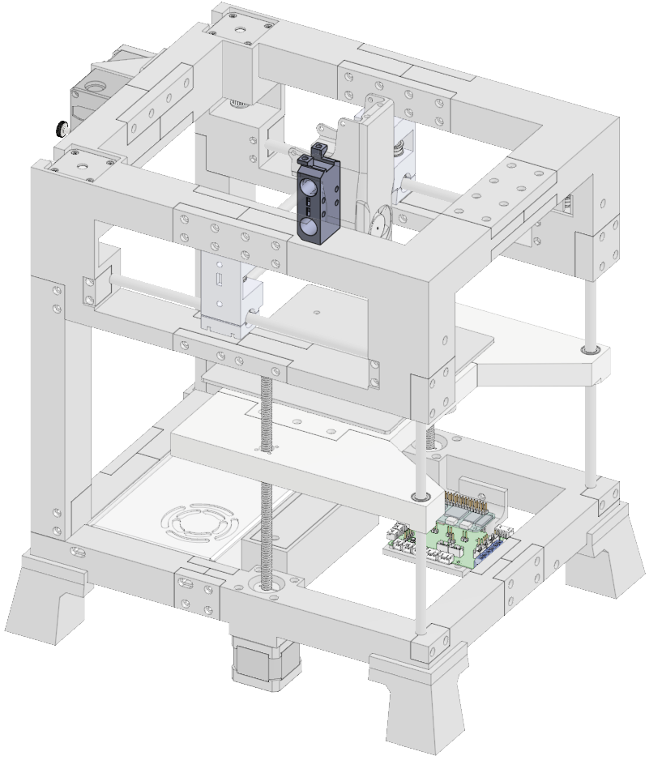
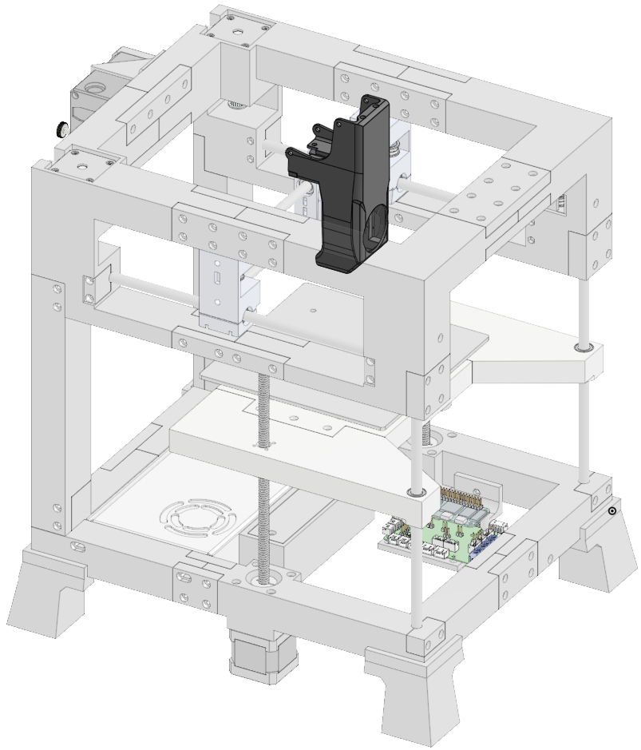
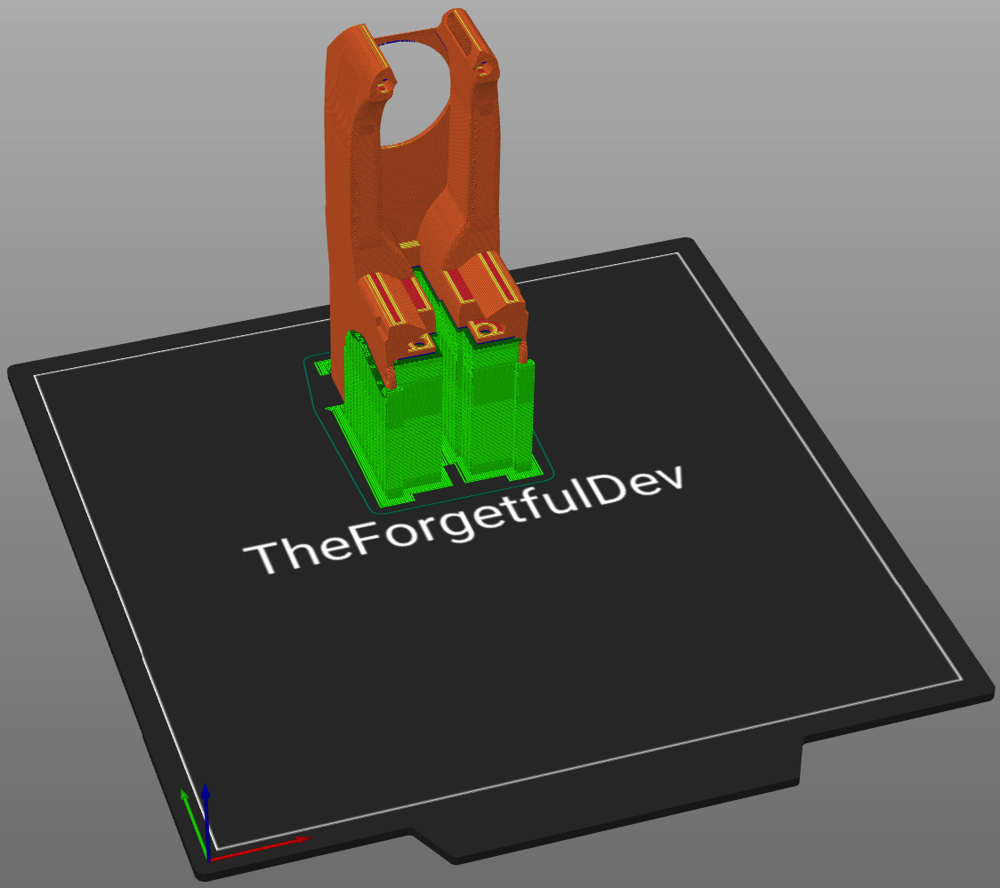
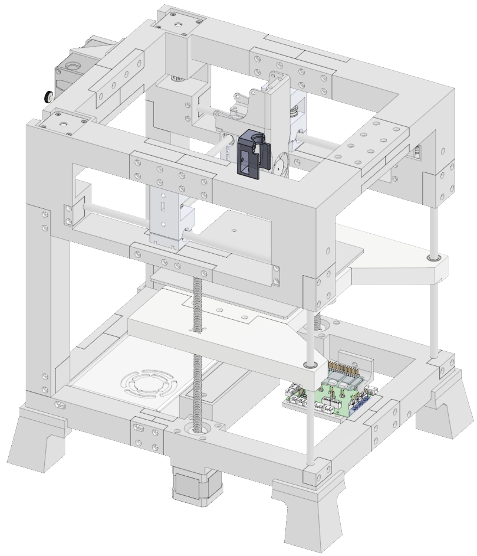
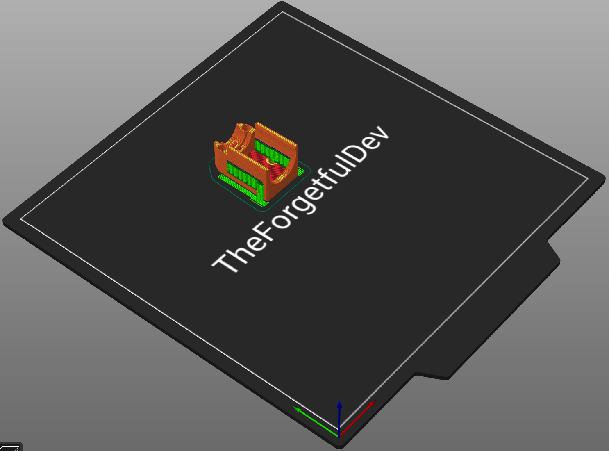
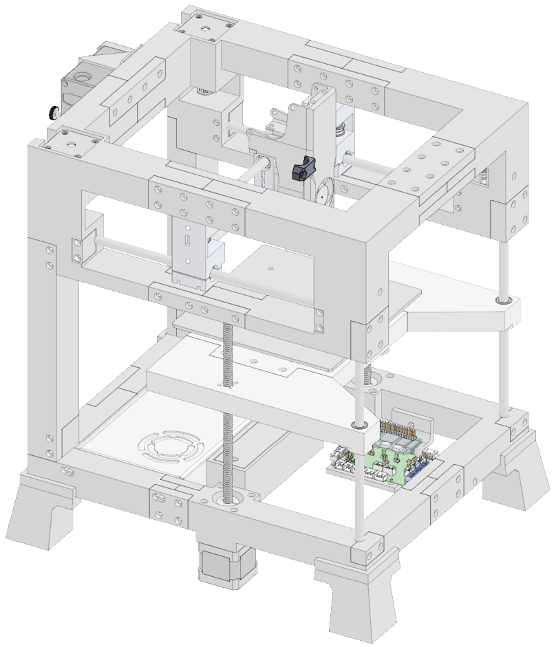

# Toolhead
There are five total parts you need to print for the toolhead. Three are the same for all hotends and two vary depending on if you're using the Rapido UHF or CHC Pro hotend. 

  

      

  

  

    <ul class="list-group">
      <li class="list-group-item d-flex justify-content-between align-items-center">
        
Printed parts

        
5

      </li>
    </ul>
     
    <ul class="list-group">
      <li class="list-group-item d-flex justify-content-between align-items-center">
        
Purchased parts

        
40

      </li>
    </ul>   
     
    <ul class="list-group">
      <li class="list-group-item d-flex justify-content-between align-items-center">
        
Filament

        
43.2m | 128.6g

      </li>
    </ul>   
     
    <ul class="list-group">
      <li class="list-group-item d-flex justify-content-between align-items-center">
        
Print time

        
9h 13m

      </li>
    </ul>   
  

## Printed parts

### All Hotends
These parts are required regardless of which hotend you're using. 
<table class="table table-sm">
  <thead>
    <tr>
      <th scope="col">File Name</th>
      <th scope="col">STL</th>
      <th scope="col">Qty</th>
      <th scope="col">Notes</th>
    </tr>
  </thead>
  <tbody>
    <tr>
      <td>Connector Plate</td>
      <td><a href="https://github.com/MSzturc/the100/blob/main/STL/Toolhead/Connector%20Plate.stl" target="_blank">github</a> / <a href="https://files.printables.com/media/prints/572689/stls/4581540_86c6c691-8518-4868-aa2c-6b6cbf8d862b/connector-plate.stl">printables</a></td>
      <td>1</td>
      <td><a href="#connector-plate">More info</a></td>
    </tr>
    <tr>
      <td>Rod Cradle</td>
      <td><a href="https://github.com/MSzturc/the100/blob/main/STL/Toolhead/Rod-Cradle.stl" target="_blank">github</a> / <a href="https://files.printables.com/media/prints/572689/stls/4581539_80e2a55d-72a0-40fe-b1b5-6b485eb09bdf/rod-cradle.stl">printables</a></td>
      <td>1</td>
      <td><a href="#rod-cradle">More info</a></td>
    </tr>
  </tbody>
</table>

### CHC Pro Only
Print these if you're using the CHC Pro as your hotend. 
<table class="table table-sm">
  <thead>
    <tr>
      <th scope="col">File Name</th>
      <th scope="col">STL</th>
      <th scope="col">Qty</th>
      <th scope="col">Notes</th>
    </tr>
  </thead>
  <tbody>
    <tr>
      <td>CHC Pro Mount</td>
      <td><a href="https://github.com/MSzturc/the100/blob/main/STL/Toolhead/CHC%20Pro/CHC%20Pro%20Mount.stl" target="_blank">github</a> / <a href="">printables</a></td>
      <td>1</td>
      <td><a href="#chc-pro-mount">More info</a></td>
    </tr>
    <tr>
      <td>CHC Pro Clamp</td>
      <td><a href="https://github.com/MSzturc/the100/blob/main/STL/Toolhead/CHC%20Pro/CHC%20Pro%20Clamp.stl" target="_blank">github</a> / <a href="">printables</a></td>
      <td>1</td>
      <td><a href="#chc-pro-clamp">More info</a></td>
    </tr>
    <tr>
      <td>CHC Pro Fanduct</td>
      <td><a href="https://github.com/MSzturc/the100/blob/main/STL/Toolhead/CHC%20Pro/CHC%20Fanduct.stl" target="_blank">github</a> / <a href="">printables</a></td>
      <td>1</td>
      <td><a href="#chc-pro-fanduct">More info</a></td>
    </tr>
  </tbody>
</table>

### Rapido UHF Only
Print these if you're using the Rapido UHF as your hotend. 
<table class="table table-sm">
  <thead>
    <tr>
      <th scope="col">File Name</th>
      <th scope="col">STL</th>
      <th scope="col">Qty</th>
      <th scope="col">Notes</th>
    </tr>
  </thead>
  <tbody>
    <tr>
      <td>Rapido UHF Hotend Mount</td>
      <td><a href="https://github.com/MSzturc/the100/blob/main/STL/Toolhead/Rapido%20UHF/Hotend%20Mount.stl" target="_blank">github</a> / <a href="https://files.printables.com/media/prints/572689/stls/4581545_ed41faf4-5ea1-4cf9-acd4-890f96e3aae0/rapido-uhf-hotend-mount.stl">printables</a></td>
      <td>1</td>
      <td><a href="#rapido-uhf-hotend-mount">More info</a></td>
    </tr>
        <tr>
      <td>Rapido UHF Hotend Clamp</td>
      <td><a href="https://github.com/MSzturc/the100/blob/main/STL/Toolhead/Rapido%20UHF/Hotend%20Clamp.stl" target="_blank">github</a> / <a href="https://files.printables.com/media/prints/572689/stls/4581546_52f53683-e976-423d-bee0-2b05dd87a355/rapido-uhf-hotend-clamp.stl">printables</a></td>
      <td>1</td>
      <td><a href="#rapido-uhf-hotend-clamp">More info</a></td>
    </tr>
    <tr>
      <td>Rapido UHF Fan Duct</td>
      <td><a href="https://github.com/MSzturc/the100/blob/main/STL/Toolhead/Rapido%20UHF/Fan%20Duct.stl" target="_blank">github</a> / <a href="https://files.printables.com/media/prints/572689/stls/4581544_51661fc1-2705-4c38-aed4-1e143fcf5ddd/rapido-uhf-fan-duct.stl">printables</a></td>
      <td>1</td>
      <td><a href="#rapido-uhf-fan-duct">More info</a></td>
    </tr>
  </tbody>
</table>

## Purchased Parts
<table class="table table-sm no-margin">
  <thead>
    <tr>
      <th scope="col">Item</th>
      <th scope="col"> </th>
      <th scope="col">Qty</th>
      <th scope="col"> </th>
      <th scope="col">Notes</th>
    </tr>
  </thead>
  <tbody>
    <tr>
      <td>m3 heat insert</td>
      <td></td>
      <td>18</td>
      <td></td>
      <td>4 of them go in the fans</td>
    </tr>
    <tr>
      <td>m3x6 screw</td>
      <td></td>
      <td>12</td>
      <td></td>
      <td></td>
    </tr>
    <tr>
      <td>m3x12 screw</td>
      <td></td>
      <td>2</td>
      <td></td>
      <td></td>
    </tr>
    <tr>
      <td>m3x35 screw</td>
      <td></td>
      <td>1</td>
      <td></td>
      <td>Optional for cable management. Replaces 1x m3x6 if used.</td>
    </tr>
    <tr>
      <td>Drylin</td>
      <td></td>
      <td>2</td>
      <td></td>
      <td></td>
    </tr>
    <tr>
      <td>Linear rod</td>
      <td></td>
      <td>2</td>
      <td></td>
      <td></td>
    </tr>
    <tr>
      <td class="no-wrap">5015 blower fan</td>
      <td></td>
      <td>2</td>
      <td></td>
      <td></td>
    </tr>
    <tr>
      <td>4010 axial fan</td>
      <td></td>
      <td>1</td>
      <td></td>
      <td></td>
    </tr>
    <tr>
      <td>Hot end</td>
      <td></td>
      <td>1</td>
      <td></td>
      <td>This is more than 1 physical piece but I'm counting it as 1 total object</td>
    </tr>
  </tbody>
</table>

## Details
#### Connector Plate
  
  
##### Print
<table class="table table-striped table-hover no-margin">
  <tbody class="table-group-divider">
    <tr>
      <th scope="row" class="no-wrap">Quantity</th>
      <td> </td>
      <td>1</td>
    </tr>
    <tr>
      <th scope="row" class="no-wrap">Filament Length</th>
      <td> </td>
      <td>1m</td>
    </tr>
    <tr>
      <th scope="row" class="no-wrap">Filament Weight</th>
      <td> </td>
      <td>2.9g</td>
    </tr>
    <tr>
      <th scope="row" class="no-wrap">Supports?</th>
      <td> </td>
      <td>No</td>
    </tr>
  </tbody>
</table>

##### Purchase
<table class="table table-striped table-hover no-margin">
  <thead>
    <tr>
      <th scope="col">Item</th>
      <th scope="col">Qty</th>
      <th scope="col">Note</th>
    </tr>
  </thead>
  <tbody>
    <tr>
      <td>m3x6 screw</td>
      <td>4</td>
      <td></td>
    </tr>
  </tbody>
</table>

#### Rod Cradle
  
  
##### Print
<table class="table table-striped table-hover no-margin">
  <tbody class="table-group-divider">
    <tr>
      <th scope="row" class="no-wrap">Quantity</th>
      <td> </td>
      <td>1</td>
    </tr>
    <tr>
      <th scope="row" class="no-wrap">Filament Length</th>
      <td> </td>
      <td>8.6m</td>
    </tr>
    <tr>
      <th scope="row" class="no-wrap">Filament Weight</th>
      <td> </td>
      <td>25.6g</td>
    </tr>
    <tr>
      <th scope="row" class="no-wrap">Supports?</th>
      <td> </td>
      <td>Yes - See notes</td>
    </tr>
    <tr>
      <th scope="row" class="no-wrap">Note</th>
      <td> </td>
      <td>I rarely struggle with bed adhesion but out of the entire printer, this is the only one that gave me trouble. It kept getting knocked off. I ended up having to use a brim and enable z-hop to prevent it. Make sure supports are only used on the one end and that you don't generate supports through the square holes in the middle where the belts will go in the future. Support under the "triangle" shape against the build plate is probably unnecessary but it's a very small amount and helps ensure that piece, which slides in to the fanhead, is nice and flat. </td>
    </tr>
  </tbody>
</table>

##### Purchase
<table class="table table-striped table-hover no-margin">
  <thead>
    <tr>
      <th scope="col">Item</th>
      <th scope="col">Qty</th>
      <th scope="col">Note</th>
    </tr>
  </thead>
  <tbody>
    <tr>
      <td>m3 heat insert</td>
      <td>8</td>
      <td></td>
    </tr>
    <tr>
      <td>Drylin</td>
      <td>2</td>
      <td></td>
    </tr>
    <tr>
      <td>Linear rods</td>
      <td>2</td>
      <td></td>
    </tr>
  </tbody>
</table>

#### CHC Pro Fanduct
  
  
##### Print
<table class="table table-striped table-hover no-margin">
  <tbody class="table-group-divider">
    <tr>
      <th scope="row" class="no-wrap">Quantity</th>
      <td> </td>
      <td>1</td>
    </tr>
    <tr>
      <th scope="row" class="no-wrap">Filament Length</th>
      <td> </td>
      <td>29.5m</td>
    </tr>
    <tr>
      <th scope="row" class="no-wrap">Filament Weight</th>
      <td> </td>
      <td>87.9g</td>
    </tr>
    <tr>
      <th scope="row" class="no-wrap">Supports?</th>
      <td> </td>
      <td>Yes</td>
    </tr>
    <tr>
      <th scope="row" class="no-wrap">Note</th>
      <td> </td>
      <td>This piece is printed upside down to limit the amount of supports that need generated while still maintaining the openings for the airways. </td>
    </tr>
  </tbody>
</table>

##### Purchase
<table class="table table-striped table-hover no-margin">
  <thead>
    <tr>
      <th scope="col">Item</th>
      <th scope="col">Qty</th>
      <th scope="col">Note</th>
    </tr>
  </thead>
  <tbody>
    <tr>
      <td>m3 heat insert</td>
      <td>8</td>
      <td>4 go in the fans themselves. FAQ: 2 on the top are used to attach an accelerometer during tuning and aren't part of the actual construction.</td>
    </tr>
    <tr>
      <td>m3x6</td>
      <td>6</td>
      <td></td>
    </tr>
    <tr>
      <td>m3x35</td>
      <td>1</td>
      <td>Optional. Used for cable management. Replaces 1x m3x6.</td>
    </tr>
    <tr>
      <td></td>
      <td></td>
      <td></td>
    </tr>
  </tbody>
</table>

#### CHC Pro Mount
  
  
##### Print
<table class="table table-striped table-hover no-margin">
  <tbody class="table-group-divider">
    <tr>
      <th scope="row" class="no-wrap">Quantity</th>
      <td> </td>
      <td>1</td>
    </tr>
    <tr>
      <th scope="row" class="no-wrap">Filament Length</th>
      <td> </td>
      <td>3.4m</td>
    </tr>
    <tr>
      <th scope="row" class="no-wrap">Filament Weight</th>
      <td> </td>
      <td>10.1g</td>
    </tr>
    <tr>
      <th scope="row" class="no-wrap">Supports?</th>
      <td> </td>
      <td>Yes</td>
    </tr>
    <tr>
      <th scope="row" class="no-wrap">Note</th>
      <td> </td>
      <td>You may be able to avoid supports if your printer is good at bridging. </td>
    </tr>
  </tbody>
</table>

##### Purchase
<table class="table table-striped table-hover no-margin">
  <thead>
    <tr>
      <th scope="col">Item</th>
      <th scope="col">Qty</th>
      <th scope="col">Note</th>
    </tr>
  </thead>
  <tbody>
    <tr>
      <td>m3 heat insert</td>
      <td>2</td>
      <td></td>
    </tr>
    <tr>
      <td>m3x6 screw</td>
      <td>2</td>
      <td></td>
    </tr>
  </tbody>
</table>

#### CHC Pro Clamp
  
  
##### Print
<table class="table table-striped table-hover no-margin">
  <tbody class="table-group-divider">
    <tr>
      <th scope="row" class="no-wrap">Quantity</th>
      <td> </td>
      <td>1</td>
    </tr>
    <tr>
      <th scope="row" class="no-wrap">Filament Length</th>
      <td> </td>
      <td>0.7m</td>
    </tr>
    <tr>
      <th scope="row" class="no-wrap">Filament Weight</th>
      <td> </td>
      <td>2.1g</td>
    </tr>
    <tr>
      <th scope="row" class="no-wrap">Supports?</th>
      <td> </td>
      <td>Yes - in countersunk screw holes touching the build plate.</td>
    </tr>
  </tbody>
</table>

##### Purchase
<table class="table table-striped table-hover no-margin">
  <thead>
    <tr>
      <th scope="col">Item</th>
      <th scope="col">Qty</th>
      <th scope="col">Note</th>
    </tr>
  </thead>
  <tbody>
    <tr>
      <td>m3x12 screw</td>
      <td>2</td>
      <td></td>
    </tr>
  </tbody>
</table>

#### Rapido UHF Fan Duct
Coming soon

#### Rapido UHF Hotend Mount
Coming soon

#### Rapido UHF Hotend Clamp
Coming soon
