# Top Frame
A number of parts in this section won't get installed until you make more progress on the printer build, but they ultimately make up the top frame.

  

      <a href="images/top_frame_cad.png">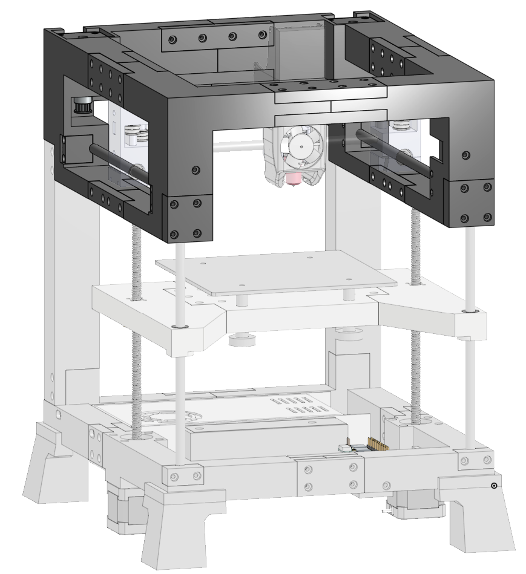</a>

  

  

    <ul class="list-group">
      <li class="list-group-item d-flex justify-content-between align-items-center">
        
Printed parts

        
24

      </li>
    </ul>
     
    <ul class="list-group">
      <li class="list-group-item d-flex justify-content-between align-items-center">
        
Purchased parts

        
186

      </li>
    </ul>   
     
    <ul class="list-group">
      <li class="list-group-item d-flex justify-content-between align-items-center">
        
Filament

        
484.6m | 1430.2g

      </li>
    </ul>   
     
    <ul class="list-group">
      <li class="list-group-item d-flex justify-content-between align-items-center">
        
Print time

        
72h 20m

      </li>
    </ul>   
  

### Printed Parts
<table class="table table-sm no-margin">
  <thead>
    <tr>
      <th scope="col">Part Name</th>
      <th scope="col">STL</th>
      <th scope="col">Qty</th>
      <th scope="col">Notes</th>
    </tr>
  </thead>
  <tbody>
    <tr>
      <td>Belt Fastener</td>
      <td class="no-wrap"><a target="_blank" href="https://github.com/MSzturc/the100/blob/main/STL/Top%20Frame/Belt%20Fastener.stl">github</a> / <a href="https://files.printables.com/media/prints/572689/stls/4581525_87e472ef-6a36-43a6-9751-2e740efa957c/belt-fastener.stl">printables</a></td>
      <td>2</td>
      <td><a href="#belt-fastener">More info</a></td>
    </tr>
    <tr>
      <td>Connector Back 1</td>
      <td class="no-wrap"><a target="_blank" href="https://github.com/MSzturc/the100/blob/main/STL/Top%20Frame/Connector%20Back%201.stl">github</a> / <a href="https://files.printables.com/media/prints/572689/stls/4581521_58ea394e-0e60-4c26-a20c-f840b4769e91/connector-back-1.stl">printables</a></td>
      <td>1</td>
      <td><a href="#connector-back-1">More info</a></td>
    </tr>
    <tr>
      <td>Connector Back 2</td>
      <td class="no-wrap"><a target="_blank" href="https://github.com/MSzturc/the100/blob/main/STL/Top%20Frame/Connector%20Back%202.stl">github</a> / <a href="https://files.printables.com/media/prints/572689/stls/4581526_5ead97cb-c136-4222-af1e-1338eaf93d38/connector-back-2.stl">printables</a></td>
      <td>1</td>
      <td><a href="#connector-back-2">More info</a></td>
    </tr>
    <tr>
      <td>Connector Top 1</td>
      <td class="no-wrap"><a target="_blank" href="https://github.com/MSzturc/the100/blob/main/STL/Top%20Frame/Connector%20Top%201.stl">github</a> / <a href="https://files.printables.com/media/prints/572689/stls/4581523_fc47f4d9-1e6a-4674-b428-31dbb98269a5/connector-top-1.stl">printables</a></td>
      <td>1</td>
      <td><a href="#connector-top-1">More info</a></td>
    </tr>
    <tr>
      <td>Connector Top 2</td>
      <td class="no-wrap"><a target="_blank" href="https://github.com/MSzturc/the100/blob/main/STL/Top%20Frame/Connector%20Top%202.stl">github</a> / <a href="https://files.printables.com/media/prints/572689/stls/4581522_48b7d7f4-428e-416c-845a-8c07ec453f0d/connector-top-2.stl">printables</a></td>
      <td>1</td>
      <td><a href="#connector-top-2">More info</a></td>
    </tr>
    <tr>
      <td>Connector Side 1</td>
      <td class="no-wrap"><a target="_blank" href="https://github.com/MSzturc/the100/blob/main/STL/Top%20Frame/Connector%20Side%201.stl">github</a> / <a href="https://files.printables.com/media/prints/572689/stls/4581528_fe45c077-96dc-4319-a27a-93bbb7a6b970/connector-side-1.stl">printables</a></td>
      <td>4</td>
      <td><a href="#connector-side-1">More info</a></td>
    </tr>
    <tr>
      <td>Connector Side 2</td>
      <td class="no-wrap"><a target="_blank" href="https://github.com/MSzturc/the100/blob/main/STL/Top%20Frame/Connector%20Side%202.stl">github</a> / <a href="https://files.printables.com/media/prints/572689/stls/4581524_dd4b2992-6b76-43a2-be93-310f72eac41b/connector-side-2.stl">printables</a></td>
      <td>4</td>
      <td><a href="#connector-side-2">More info</a></td>
    </tr>
    <tr>
      <td>Rod Holder</td>
      <td class="no-wrap"><a target="_blank" href="https://github.com/MSzturc/the100/blob/main/STL/Top%20Frame/Rod%20Holder.stl">github</a> / <a href="https://files.printables.com/media/prints/572689/stls/4581529_092e02c4-49e1-44f1-a37d-18ee14bb61f9/rod-holder.stl">printables</a></td>
      <td>4</td>
      <td><a href="#rod-holder">More info</a></td>
    </tr>
    <tr>
      <td>Connector Z Left</td>
      <td class="no-wrap"><a target="_blank" href="https://github.com/MSzturc/the100/blob/main/STL/Top%20Frame/Connector%20Z%20Left.stl">github</a> / <a href="https://files.printables.com/media/prints/572689/stls/4581527_9c2a4baf-fbb4-4ba9-8ce3-d89dd9b1dbe0/connector-z-left.stl">printables</a></td>
      <td>1</td>
      <td><a href="#connector-z-leftright">More info</a></td>
    </tr>
    <tr>
      <td>Connector Z Right</td>
      <td class="no-wrap"><a target="_blank" href="https://github.com/MSzturc/the100/blob/main/STL/Top%20Frame/Connector%20Z%20Right.stl">github</a> / <a href="https://files.printables.com/media/prints/572689/stls/4581530_3b08857d-95f8-452c-8335-98f9c89fac01/connector-z-right.stl">printables</a></td>
      <td>1</td>
      <td><a href="#connector-z">More info</a></td>
    </tr>
    <tr>
      <td>Back-Left</td>
      <td class="no-wrap"><a target="_blank" href="https://github.com/MSzturc/the100/blob/main/STL/Top%20Frame/Back-Left.stl">github</a> / <a href="https://files.printables.com/media/prints/572689/stls/4581520_e9d51127-2714-4f46-b235-6020a2bf3863/back-left.stl">printables</a></td>
      <td>1</td>
      <td><a href="#back-left">More info</a></td>
    </tr>
    <tr>
      <td>Back-Right</td>
      <td class="no-wrap"><a target="_blank" href="https://github.com/MSzturc/the100/blob/main/STL/Top%20Frame/Back-Right.stl">github</a> / <a href="https://files.printables.com/media/prints/572689/stls/4581519_d103da9f-32e1-46c1-a790-b68a5a1b9ffb/back-right.stl">printables</a></td>
      <td>1</td>
      <td><a href="#back-right">More info</a></td>
    </tr>
    <tr>
      <td>Front-Left</td>
      <td class="no-wrap"><a target="_blank" href="https://github.com/MSzturc/the100/blob/main/STL/Top%20Frame/Front-Left.stl">github</a> / <a href="https://files.printables.com/media/prints/572689/stls/4581531_806e410e-28e8-4f55-8313-58586de8e733/front-left.stl">printables</a></td>
      <td>1</td>
      <td><a href="#front-left">More info</a></td>
    </tr>
    <tr>
      <td>Front-Right</td>
      <td class="no-wrap"><a target="_blank" href="https://github.com/MSzturc/the100/blob/main/STL/Top%20Frame/Front-Right.stl">github</a> / <a href="https://files.printables.com/media/prints/572689/stls/4581532_6a7080f7-c7c6-4703-8c3c-4d11c72910fa/front-right.stl">printables</a></td>
      <td>1</td>
      <td><a href="#front-right">More info</a></td>
    </tr>
  </tbody>
</table>

### Purchased Parts
<table class="table table-sm no-margin">
  <thead>
    <tr>
      <th scope="col">Item</th>
      <th scope="col">Qty</th>
      <th scope="col">Notes</th>
    </tr>
  </thead>
  <tbody>
    <tr>
      <td>m3 heat insert</td>
      <td>84</td>
      <td></td>
    </tr>
    <tr>
      <td>m3x10 screw</td>
      <td>8</td>
      <td></td>
    </tr>
    <tr>
      <td>m3x12 screw</td>
      <td>56</td>
      <td></td>
    </tr>
    <tr>
      <td>m3x16 screw</td>
      <td>4</td>
      <td></td>
    </tr>
    <tr>
      <td>m3x25 screw</td>
      <td>8</td>
      <td></td>
    </tr>
    <tr>
      <td>m3x35 screw</td>
      <td>10</td>
      <td></td>
    </tr>
    <tr>
      <td>m5x30 screw</td>
      <td>2</td>
      <td></td>
    </tr>
    <tr>
      <td>m5 washer</td>
      <td>6</td>
      <td></td>
    </tr>
    <tr>
      <td>F695 bearing</td>
      <td>8</td>
      <td></td>
    </tr>
  </tbody>
</table>

### Details

#### Belt Fastener 
  <a href="images/belt_fastener_cad.png">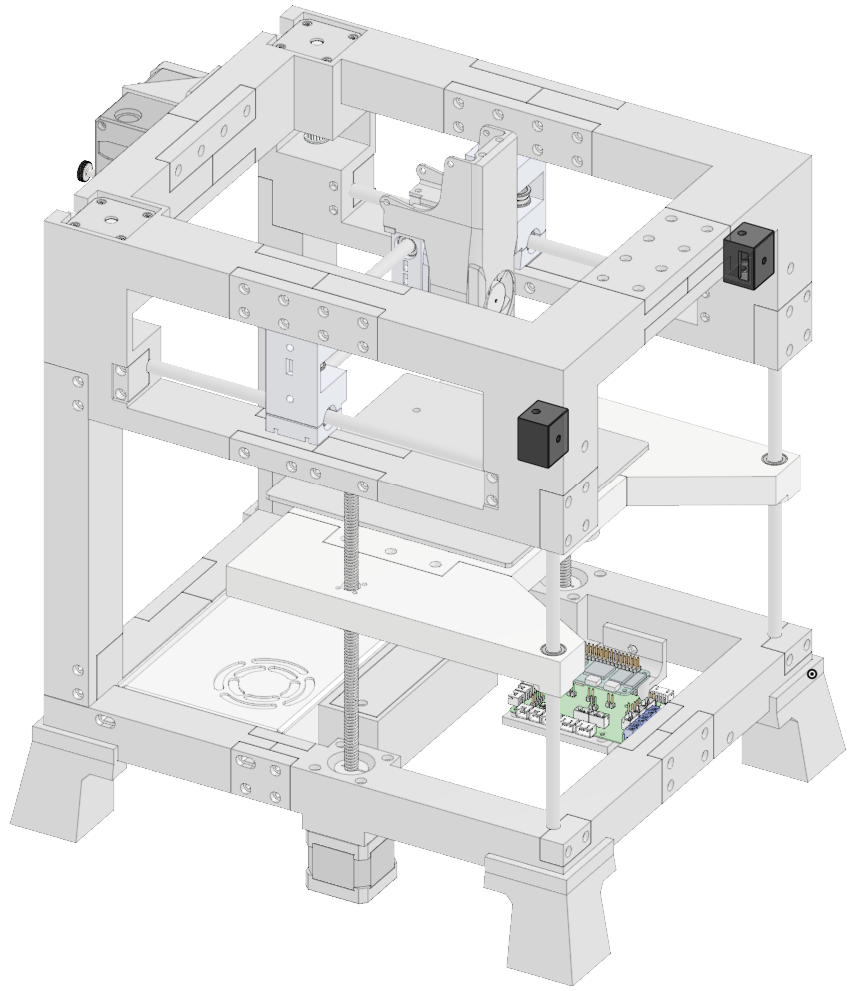</a>
  
##### Print
<table class="table table-striped table-hover no-margin">
  <tbody class="table-group-divider">
    <tr>
      <th scope="row" class="no-wrap">Quantity</th>
      <td> </td>
      <td>2</td>
    </tr>
    <tr>
      <th scope="row" class="no-wrap">Print Time</th>
      <td> </td>
      <td>36m</td>
    </tr>
    <tr>
      <th scope="row" class="no-wrap">Filament Length</th>
      <td> </td>
      <td>2.7m</td>
    </tr>
    <tr>
      <th scope="row" class="no-wrap">Filament Weight</th>
      <td> </td>
      <td>8.2g</td>
    </tr>
    <tr>
      <th scope="row" class="no-wrap">Supports?</th>
      <td> </td>
      <td>Yes - you may be able to get by without supports if your printer is good at bridging.</td>
    </tr>
  </tbody>
</table>

##### Purchase
<table class="table table-striped table-hover no-margin">
  <thead>
    <tr>
      <th scope="col">Item</th>
      <th scope="col">Qty</th>
      <th scope="col">Note</th>
    </tr>
  </thead>
  <tbody>
    <tr>
      <td>m3 nut</td>
      <td>1</td>
      <td>Insert before the bearing stack</td>
    </tr>
    <tr>
      <td>m5x30 screw</td>
      <td>1</td>
      <td></td>
    </tr>
    <tr>
      <td>F695 bearing</td>
      <td>4</td>
      <td></td>
    </tr>
    <tr>
      <td>m5 washer</td>
      <td>3</td>
      <td></td>
    </tr>
  </tbody>
</table>

#### Connector Back 1
  <a href="images/connector_back_upper_cad.png">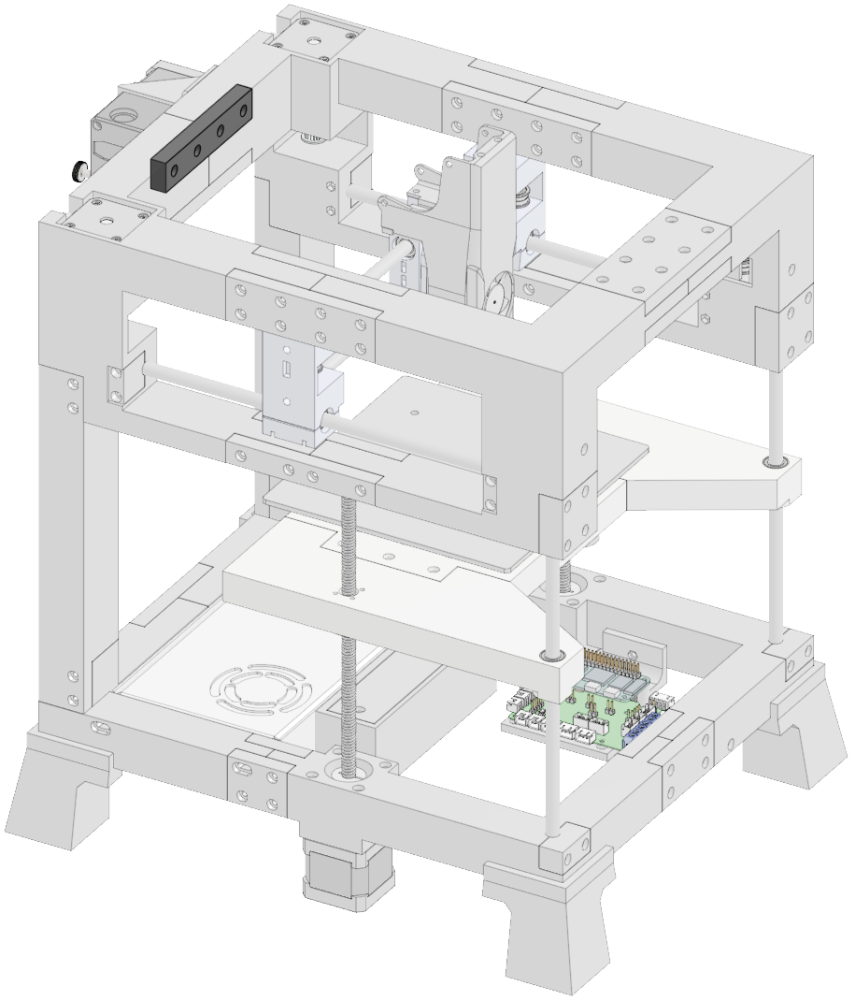</a>
  
##### Print
<table class="table table-striped table-hover no-margin">
  <tbody class="table-group-divider">
    <tr>
      <th scope="row" class="no-wrap">Quantity</th>
      <td> </td>
      <td>1</td>
    </tr>
    <tr>
      <th scope="row" class="no-wrap">Filament Length</th>
      <td> </td>
      <td>4.7m</td>
    </tr>
    <tr>
      <th scope="row" class="no-wrap">Filament Weight</th>
      <td> </td>
      <td>14.1g</td>
    </tr>
    <tr>
      <th scope="row" class="no-wrap">Supports?</th>
      <td> </td>
      <td>No</td>
    </tr>
  </tbody>
</table>

##### Purchase
<table class="table table-striped table-hover no-margin">
  <thead>
    <tr>
      <th scope="col">Item</th>
      <th scope="col">Qty</th>
      <th scope="col">Note</th>
    </tr>
  </thead>
  <tbody>
    <tr>
      <td>m3x12 screw</td>
      <td>4</td>
      <td></td>
    </tr>
  </tbody>
</table>

#### Connector Back 2
  <a href="images/connector_back_lower_cad.png">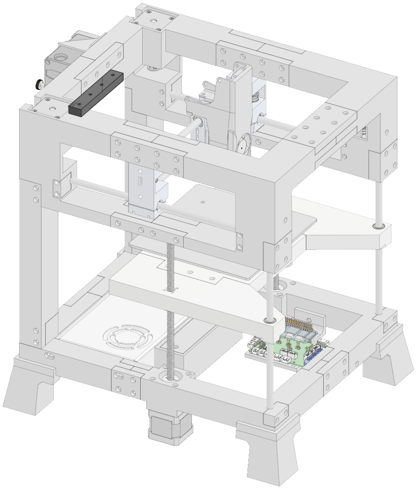</a>
  
##### Print
<table class="table table-striped table-hover no-margin">
  <tbody class="table-group-divider">
    <tr>
      <th scope="row" class="no-wrap">Quantity</th>
      <td> </td>
      <td>1</td>
    </tr>
    <tr>
      <th scope="row" class="no-wrap">Filament Length</th>
      <td> </td>
      <td>4.2m</td>
    </tr>
    <tr>
      <th scope="row" class="no-wrap">Filament Weight</th>
      <td> </td>
      <td>12.6g</td>
    </tr>
    <tr>
      <th scope="row" class="no-wrap">Supports?</th>
      <td> </td>
      <td>No</td>
    </tr>
  </tbody>
</table>

##### Purchase
<table class="table table-striped table-hover no-margin">
  <thead>
    <tr>
      <th scope="col">Item</th>
      <th scope="col">Qty</th>
      <th scope="col">Note</th>
    </tr>
  </thead>
  <tbody>
    <tr>
      <td>m3x12 screw</td>
      <td>4</td>
      <td></td>
    </tr>
  </tbody>
</table>

#### Connector Top 1
  <a href="images/connector_front_upper_cad.png">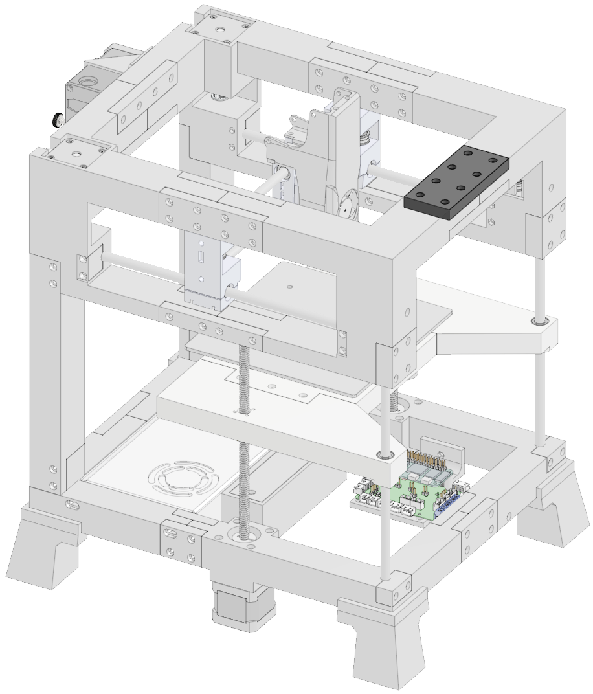</a>
  
##### Print
<table class="table table-striped table-hover no-margin">
  <tbody class="table-group-divider">
    <tr>
      <th scope="row" class="no-wrap">Quantity</th>
      <td> </td>
      <td>1</td>
    </tr>
    <tr>
      <th scope="row" class="no-wrap">Filament Length</th>
      <td> </td>
      <td>9.1m</td>
    </tr>
    <tr>
      <th scope="row" class="no-wrap">Filament Weight</th>
      <td> </td>
      <td>27.2g</td>
    </tr>
    <tr>
      <th scope="row" class="no-wrap">Supports?</th>
      <td> </td>
      <td>No</td>
    </tr>
    <tr>
      <th scope="row" class="no-wrap">Notes</th>
      <td> </td>
      <td>Uses screws that go all the way through in to nuts rather than heat inserts like the rest of the top frame connectors.</td>
    </tr>
  </tbody>
</table>

##### Purchase
<table class="table table-striped table-hover no-margin">
  <thead>
    <tr>
      <th scope="col">Item</th>
      <th scope="col">Qty</th>
      <th scope="col">Note</th>
    </tr>
  </thead>
  <tbody>
    <tr>
      <td>m3x25 screw</td>
      <td>8</td>
      <td>m3x30 will also work but sticks out slightly</td>
    </tr>
  </tbody>
</table>

#### Connector Top 2
  <a href="images/connector_front_lower_cad.png">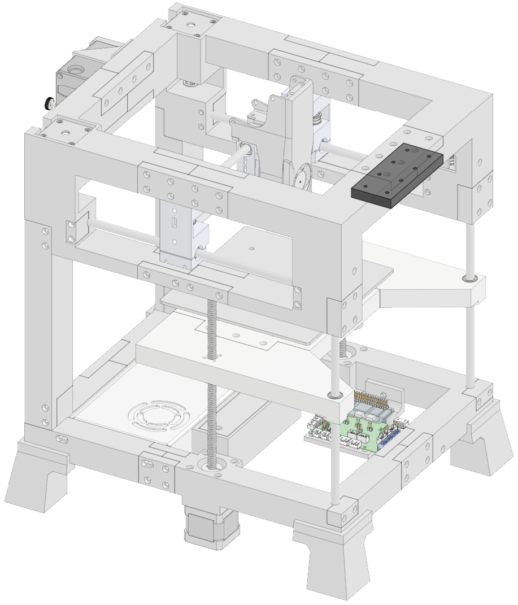</a>
  
##### Print
<table class="table table-striped table-hover no-margin">
  <tbody class="table-group-divider">
    <tr>
      <th scope="row" class="no-wrap">Quantity</th>
      <td> </td>
      <td>1</td>
    </tr>
    <tr>
      <th scope="row" class="no-wrap">Filament Length</th>
      <td> </td>
      <td>9.1m</td>
    </tr>
    <tr>
      <th scope="row" class="no-wrap">Filament Weight</th>
      <td> </td>
      <td>27.2g</td>
    </tr>
    <tr>
      <th scope="row" class="no-wrap">Supports?</th>
      <td> </td>
      <td>No</td>
    </tr>
    <tr>
      <th scope="row" class="no-wrap">Notes</th>
      <td> </td>
      <td>Uses inset nuts rather than heat inserts like the other top frame connectors.</td>
    </tr>
  </tbody>
</table>

##### Purchase
<table class="table table-striped table-hover no-margin">
  <thead>
    <tr>
      <th scope="col">Item</th>
      <th scope="col">Qty</th>
      <th scope="col">Note</th>
    </tr>
  </thead>
  <tbody>
    <tr>
      <td>m3 nut</td>
      <td>8</td>
      <td></td>
    </tr>
  </tbody>
</table>

#### Connector Side 1
  <a href="images/connector_side_upper_cad.png">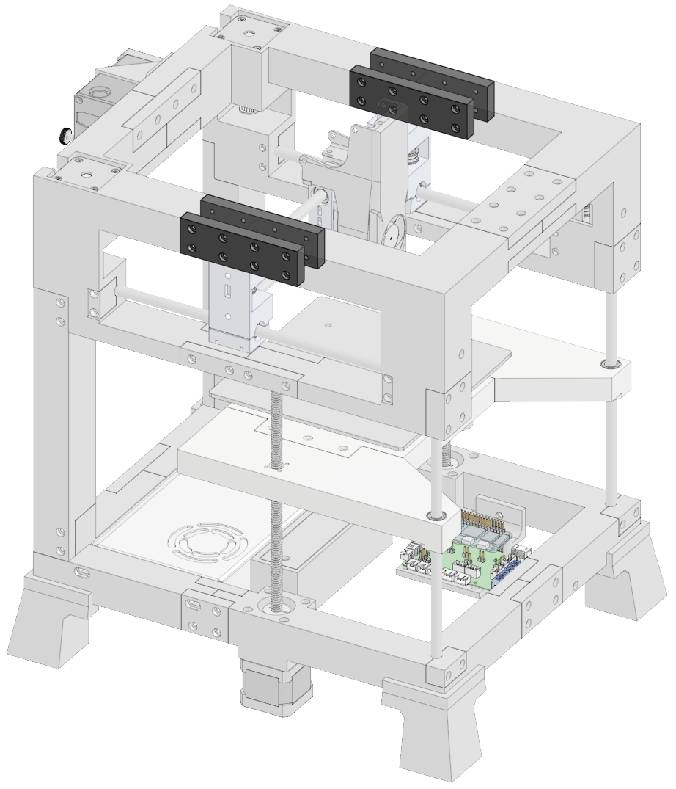</a>
  
##### Print
<table class="table table-striped table-hover no-margin">
  <tbody class="table-group-divider">
    <tr>
      <th scope="row" class="no-wrap">Quantity</th>
      <td> </td>
      <td>4</td>
    </tr>
    <tr>
      <th scope="row" class="no-wrap">Filament Length</th>
      <td> </td>
      <td>6.7m</td>
    </tr>
    <tr>
      <th scope="row" class="no-wrap">Filament Weight</th>
      <td> </td>
      <td>20.1g</td>
    </tr>
    <tr>
      <th scope="row" class="no-wrap">Supports?</th>
      <td> </td>
      <td>No</td>
    </tr>
  </tbody>
</table>

##### Purchase
<table class="table table-striped table-hover no-margin">
  <thead>
    <tr>
      <th scope="col">Item</th>
      <th scope="col">Qty</th>
      <th scope="col">Note</th>
    </tr>
  </thead>
  <tbody>
    <tr>
      <td>m3x12 screw</td>
      <td>8</td>
      <td></td>
    </tr>
  </tbody>
</table>

#### Connector Side 2     
  <a href="images/connector_side_lower_cad.png">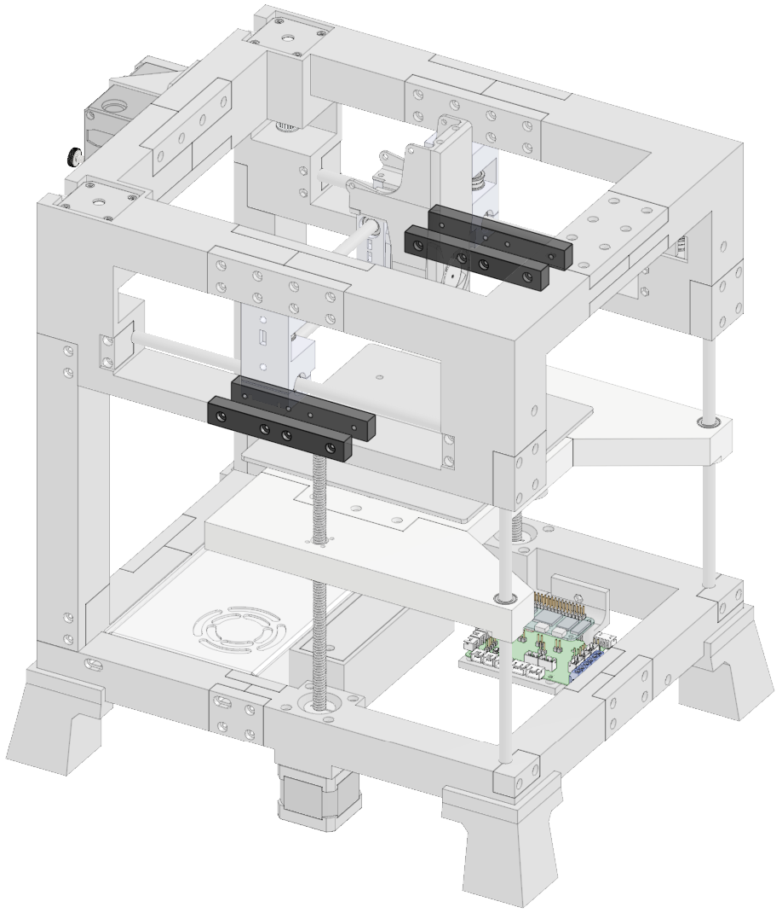</a>
  
##### Print
<table class="table table-striped table-hover no-margin">
  <tbody class="table-group-divider">
    <tr>
      <th scope="row" class="no-wrap">Quantity</th>
      <td> </td>
      <td>4</td>
    </tr>
    <tr>
      <th scope="row" class="no-wrap">Filament Length</th>
      <td> </td>
      <td>3.9m</td>
    </tr>
    <tr>
      <th scope="row" class="no-wrap">Filament Weight</th>
      <td> </td>
      <td>11.6g</td>
    </tr>
    <tr>
      <th scope="row" class="no-wrap">Supports?</th>
      <td> </td>
      <td>No</td>
    </tr>
  </tbody>
</table>

##### Purchase
<table class="table table-striped table-hover no-margin">
  <thead>
    <tr>
      <th scope="col">Item</th>
      <th scope="col">Qty</th>
      <th scope="col">Note</th>
    </tr>
  </thead>
  <tbody>
    <tr>
      <td>m3x12 screw</td>
      <td>4</td>
      <td></td>
    </tr>
  </tbody>
</table>

#### Rod Holder
  <a href="images/y_rod_holder_cad.png">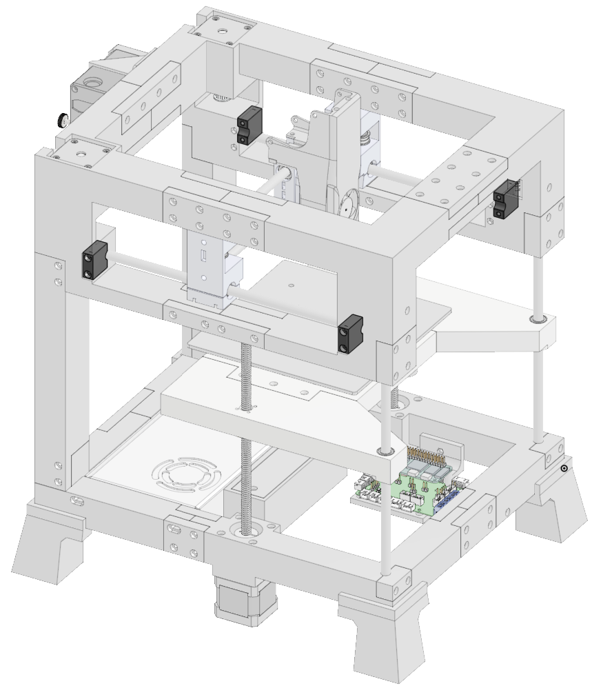</a>
  
##### Print
<table class="table table-striped table-hover no-margin">
  <tbody class="table-group-divider">
    <tr>
      <th scope="row" class="no-wrap">Quantity</th>
      <td> </td>
      <td>4</td>
    </tr>
    <tr>
      <th scope="row" class="no-wrap">Filament Length</th>
      <td> </td>
      <td>1.9m</td>
    </tr>
    <tr>
      <th scope="row" class="no-wrap">Filament Weight</th>
      <td> </td>
      <td>5.6g</td>
    </tr>
    <tr>
      <th scope="row" class="no-wrap">Supports?</th>
      <td> </td>
      <td>Yes - in the recessed screw holes touching the build plate</td>
    </tr>
  </tbody>
</table>

##### Purchase
<table class="table table-striped table-hover no-margin">
  <thead>
    <tr>
      <th scope="col">Item</th>
      <th scope="col">Qty</th>
      <th scope="col">Note</th>
    </tr>
  </thead>
  <tbody>
    <tr>
      <td>m3x35 screw</td>
      <td>2</td>
      <td></td>
    </tr>
  </tbody>
</table>  

#### Connector Z (Left/Right)
  <a href="images/z_rod_holder_cad.png">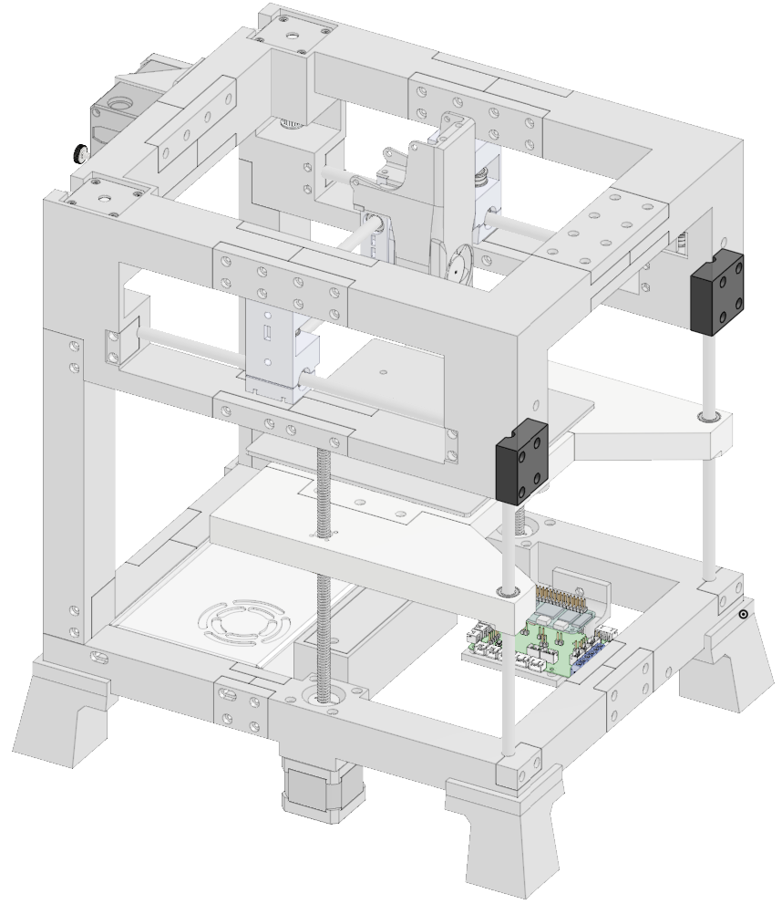</a>
  
##### Print
<table class="table table-striped table-hover no-margin">
  <tbody class="table-group-divider">
    <tr>
      <th scope="row" class="no-wrap">Quantity</th>
      <td> </td>
      <td>2</td>
    </tr>
    <tr>
      <th scope="row" class="no-wrap">Filament Length</th>
      <td> </td>
      <td>5.4m</td>
    </tr>
    <tr>
      <th scope="row" class="no-wrap">Filament Weight</th>
      <td> </td>
      <td>16.2g</td>
    </tr>
    <tr>
      <th scope="row" class="no-wrap">Supports?</th>
      <td> </td>
      <td>Yes - in the recessed screw holes touching the build plate</td>
    </tr>
    <tr>
      <th scope="row">Note</th>
      <td> </td>
      <td>This is listed as 2 separate parts but it's actually the same part used twice.</td>
    </tr>
  </tbody>
</table>

##### Purchase
<table class="table table-striped table-hover no-margin">
  <thead>
    <tr>
      <th scope="col">Item</th>
      <th scope="col">Qty</th>
      <th scope="col">Note</th>
    </tr>
  </thead>
  <tbody>
    <tr>
      <td>m3x16 screw</td>
      <td>4</td>
      <td>m3x20 will also work</td>
    </tr>
  </tbody>
</table>

#### Back-Left
  <a href="images/top_back_left_cad.png">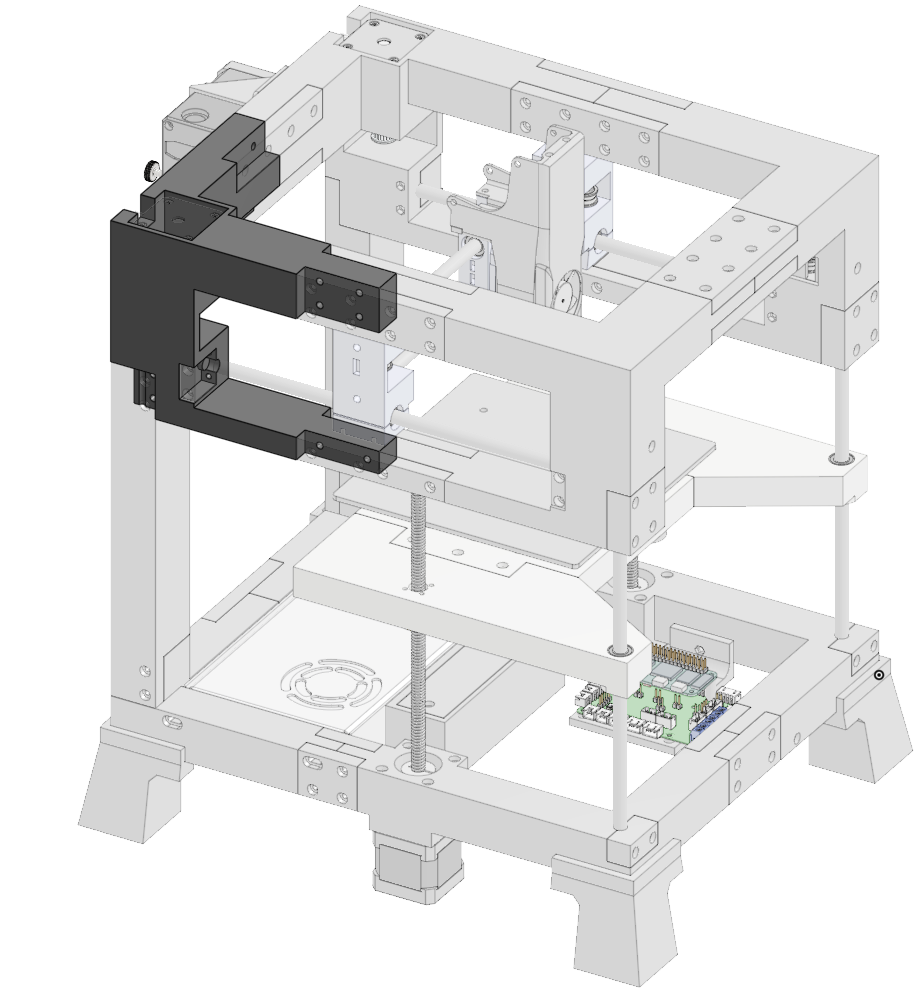</a>
  <a href="images/top_back_left_stl.png">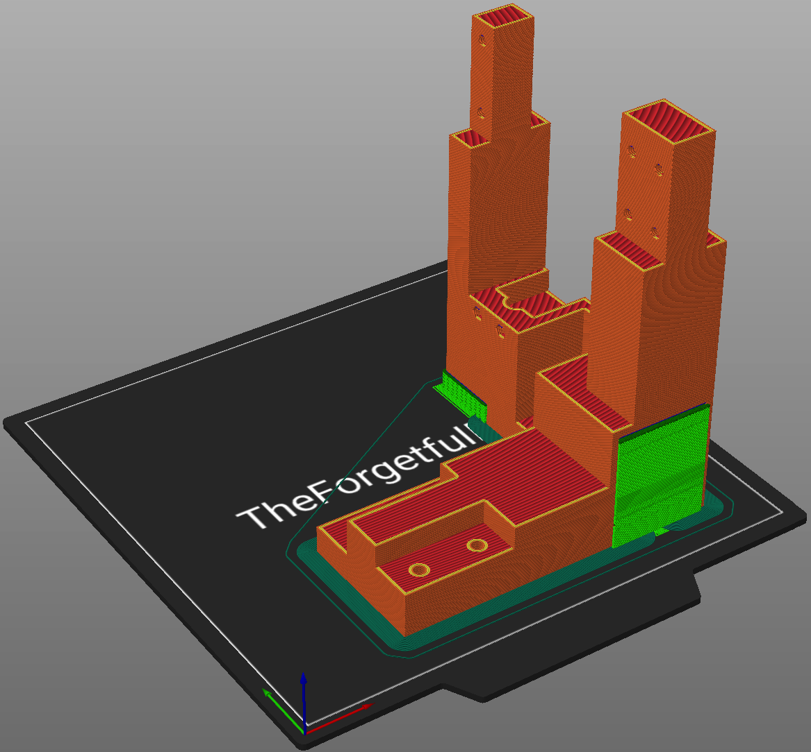</a>
##### Print
<table class="table table-striped table-hover no-margin">
  <tbody class="table-group-divider">
    <tr>
      <th scope="row" class="no-wrap">Quantity</th>
      <td> </td>
      <td>1</td>
    </tr>
    <tr>
      <th scope="row" class="no-wrap">Filament Length</th>
      <td> </td>
      <td>104.2m</td>
    </tr>
    <tr>
      <th scope="row" class="no-wrap">Filament Weight</th>
      <td> </td>
      <td>310.7g</td>
    </tr>
    <tr>
      <th scope="row" class="no-wrap">Supports?</th>
      <td> </td>
      <td>Yes - You may be able to eliminate some supports if your printer can bridge over the square where the motor goes.</td>
    </tr>
    <tr>
      <th scope="row" class="no-wrap">Notes</th>
      <td> </td>
      <td>I recommend printing this piece with a brim to prevent warping. </td>
    </tr>
  </tbody>
</table>

##### Purchase
<table class="table table-striped table-hover no-margin">
  <thead>
    <tr>
      <th scope="col">Item</th>
      <th scope="col">Qty</th>
      <th scope="col">Note</th>
    </tr>
  </thead>
  <tbody>
    <tr>
      <td>m3 heat insert</td>
      <td>22</td>
      <td></td>
    </tr>
    <tr>
      <td>m3 nut</td>
      <td>2</td>
      <td>rod holder</td>
    </tr>
    <tr>
      <td>m3x10 screw</td>
      <td>4</td>
      <td>m3x12 should fit too but it depends on your motor</td>
    </tr>
  </tbody>
</table>

#### Back-Right
  <a href="images/top_back_right_cad.png">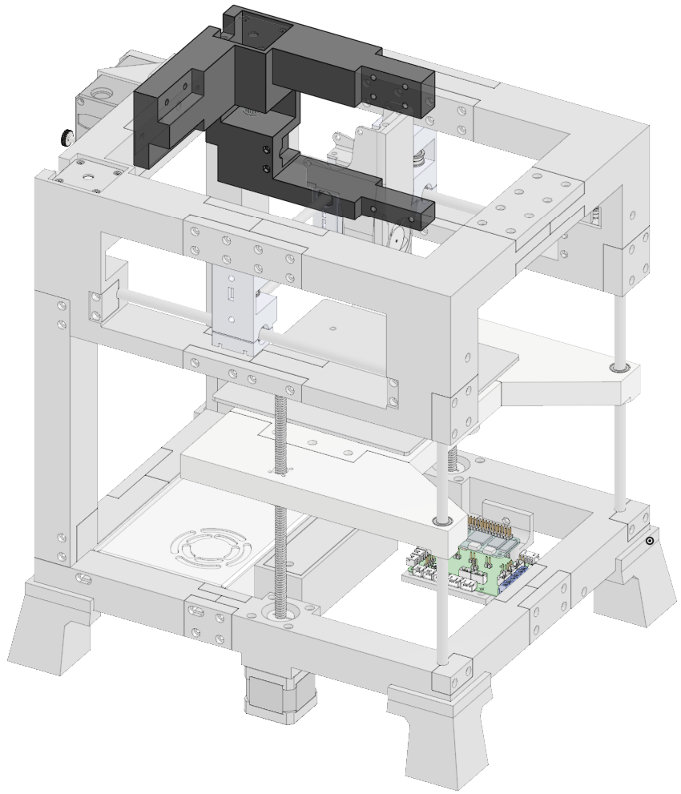</a>
  <a href="images/top_back_right_stl.png">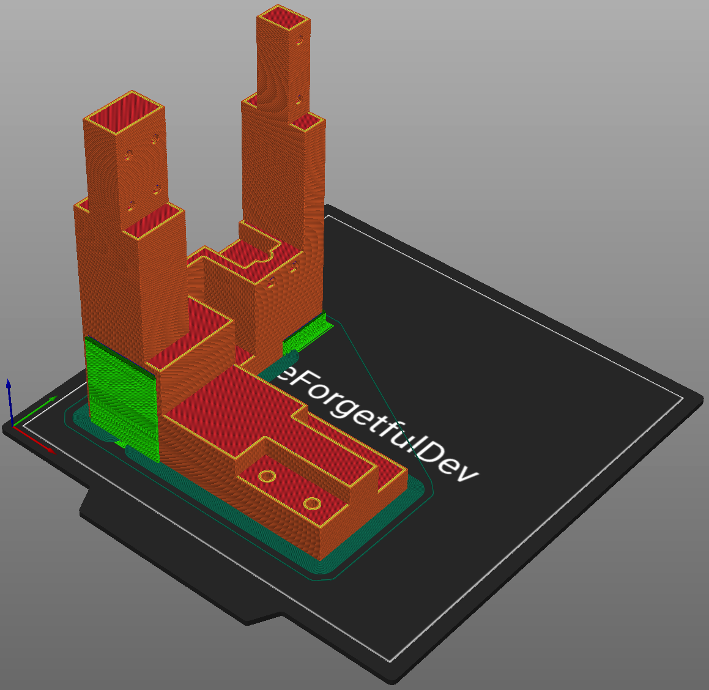</a>
##### Print
<table class="table table-striped table-hover no-margin">
  <tbody class="table-group-divider">
    <tr>
      <th scope="row" class="no-wrap">Quantity</th>
      <td> </td>
      <td>1</td>
    </tr>
    <tr>
      <th scope="row" class="no-wrap">Filament Length</th>
      <td> </td>
      <td>104.7m</td>
    </tr>
    <tr>
      <th scope="row" class="no-wrap">Filament Weight</th>
      <td> </td>
      <td>312.4g</td>
    </tr>
    <tr>
      <th scope="row" class="no-wrap">Supports?</th>
      <td> </td>
      <td>Yes - You may be able to eliminate some supports if your printer can bridge over the square where the motor goes.</td>
    </tr>
    <tr>
      <th scope="row" class="no-wrap">Notes</th>
      <td> </td>
      <td>I recommend printing this piece with a brim to prevent warping. </td>
    </tr>
  </tbody>
</table>

##### Purchase
<table class="table table-striped table-hover no-margin">
  <thead>
    <tr>
      <th scope="col">Item</th>
      <th scope="col">Qty</th>
      <th scope="col">Note</th>
    </tr>
  </thead>
  <tbody>
    <tr>
      <td>m3 heat insert</td>
      <td>30</td>
      <td></td>
    </tr>
    <tr>
      <td>m3 nut</td>
      <td>2</td>
      <td>rod holder</td>
    </tr>
    <tr>
      <td>m3x10 screw</td>
      <td>4</td>
      <td>m3x12 should fit too but it depends on your motor</td>
    </tr>
  </tbody>
</table>

#### Front-Left
  <a href="images/top_front_left_cad.png">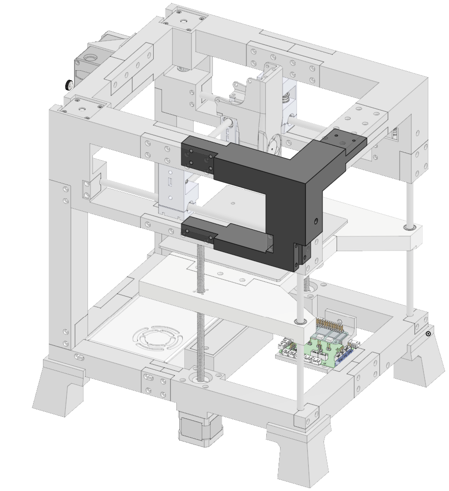</a>
  <a href="images/top_front_left_stl.png">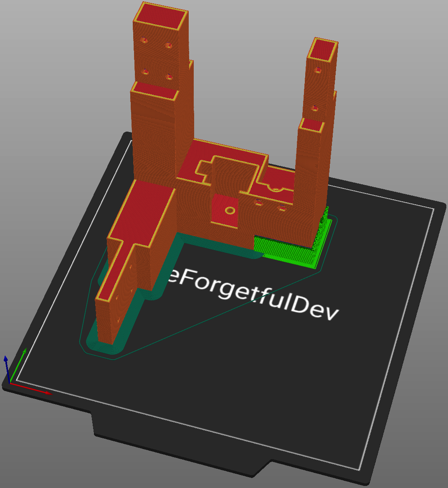</a>
##### Print
<table class="table table-striped table-hover no-margin">
  <tbody class="table-group-divider">
    <tr>
      <th scope="row" class="no-wrap">Quantity</th>
      <td> </td>
      <td>1</td>
    </tr>
    <tr>
      <th scope="row" class="no-wrap">Filament Length</th>
      <td> </td>
      <td>91.2m</td>
    </tr>
    <tr>
      <th scope="row" class="no-wrap">Filament Weight</th>
      <td> </td>
      <td>272.1g</td>
    </tr>
    <tr>
      <th scope="row" class="no-wrap">Supports?</th>
      <td> </td>
      <td>Yes</td>
    </tr>
    <tr>
      <th scope="row" class="no-wrap">Notes</th>
      <td> </td>
      <td>I recommend printing this piece with a brim to prevent warping. </td>
    </tr>
  </tbody>
</table>

##### Purchase
<table class="table table-striped table-hover no-margin">
  <thead>
    <tr>
      <th scope="col">Item</th>
      <th scope="col">Qty</th>
      <th scope="col">Note</th>
    </tr>
  </thead>
  <tbody>
    <tr>
      <td>m3 heat insert</td>
      <td>16</td>
      <td></td>
    </tr>
    <tr>
      <td>m3 nut</td>
      <td>2</td>
      <td>rod holder</td>
    </tr>
    <tr>
      <td>m3x35 screw</td>
      <td>1</td>
      <td>Can go as low as m3x25, but doing m3x35 gives you maximum travel on the belt tensioner</td>
    </tr>
  </tbody>
</table>

#### Front-Right
  <a href="images/top_front_right_cad.png">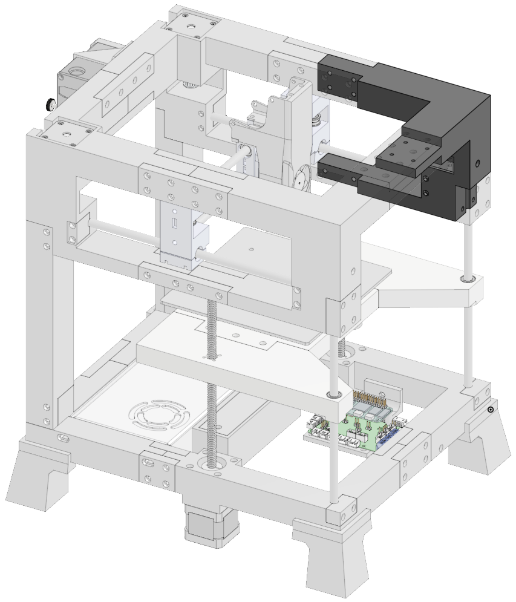</a>
  <a href="images/top_front_right_stl.png">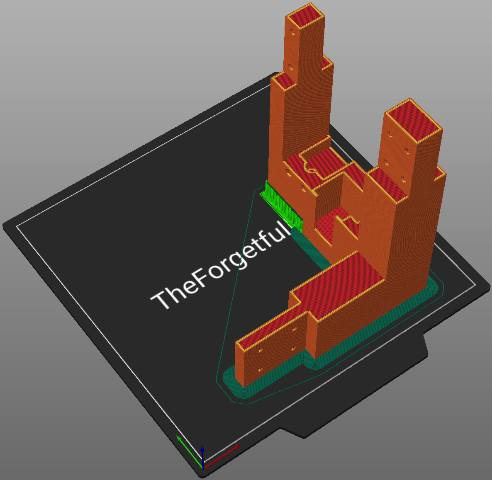</a>
##### Print
<table class="table table-striped table-hover no-margin">
  <tbody class="table-group-divider">
    <tr>
      <th scope="row" class="no-wrap">Quantity</th>
      <td> </td>
      <td>1</td>
    </tr>
    <tr>
      <th scope="row" class="no-wrap">Filament Length</th>
      <td> </td>
      <td>91.2m</td>
    </tr>
    <tr>
      <th scope="row" class="no-wrap">Filament Weight</th>
      <td> </td>
      <td>272.1g</td>
    </tr>
    <tr>
      <th scope="row" class="no-wrap">Supports?</th>
      <td> </td>
      <td>Yes</td>
    </tr>
    <tr>
      <th scope="row" class="no-wrap">Notes</th>
      <td> </td>
      <td>I recommend printing this piece with a brim to prevent warping. </td>
    </tr>
  </tbody>
</table>

##### Purchase
<table class="table table-striped table-hover no-margin">
  <thead>
    <tr>
      <th scope="col">Item</th>
      <th scope="col">Qty</th>
      <th scope="col">Note</th>
    </tr>
  </thead>
  <tbody>
    <tr>
      <td>m3 heat insert</td>
      <td>16</td>
      <td></td>
    </tr>
    <tr>
      <td>m3 nut</td>
      <td>2</td>
      <td>rod holder</td>
    </tr>
    <tr>
      <td>m3x35 screw</td>
      <td>1</td>
      <td>Can go as low as m3x25, but doing m3x35 gives you maximum travel on the belt tensioner</td>
    </tr>
  </tbody>
</table>