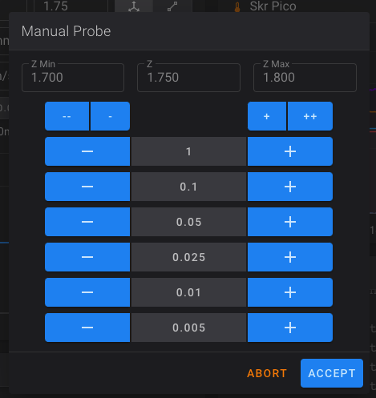
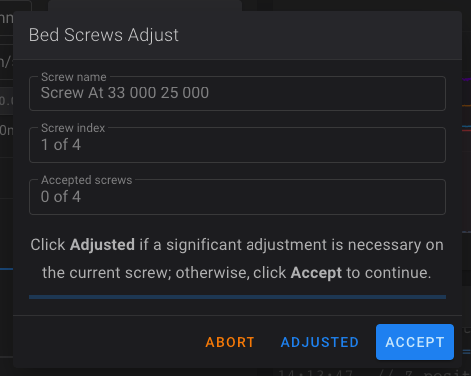

# Baseline tune
There are some fantastic printer tuning guides out there, and I have absolutely no intention of replacing them. In fact, I'll be linking to a number of them through the tuning guide with the expectation that you'll use their guides. 

To start off with, Matt (the creator of THE 100), has <a href="https://www.youtube.com/watch?v=ikvOHPZL6Cc" target="_blank">a great video on how he tunes 3d printers</a>. Matt starts his video by <a href="https://ellis3dp.com/Print-Tuning-Guide/" target="_blank">mentioning Ellis' Print Tuning Guide</a> which is the most detailed guide I've ever used. I highly recommend watching Matt's whole video and going through the entire Ellis guide. 

However... I know to get to this point you have spent weeks (or months) buying the parts, printing the pieces, assembling it all, and configuring everything. It has been a long journey and you just want to see something print already! For that reason, I'm going to focus on what I consider to be a baseline tune to where you can get something printed. 

The end result of this guide will be a printed calibration cube. This will not be the best calibration cube in existence and there will be plenty of fine tuning needed after it's printed, but it's still so exciting and motivating to finally print something! 

Now is the time.

## Requirements 
  * This guide is written with the assumption that you:
      * have followed my previous guides (the klipper/printer.cfg configuration in particular)
      * aren't using any of THE 100 mods
      * have everything built and ready to go
      * have successfully homed the printer
  
## Z endstop
The first item that requires calibrated is the Z offset. We need to know the exact distance between the nozzle and the bed when the Z endstop is triggered during the homing process. That way Klipper understands where Z=0 at. To do that we have to tell Klipper where the z endstop location is.

You can watch this process starting at <a href="https://youtu.be/ikvOHPZL6Cc?si=AI9MRj8QcVVIyNHO&t=138" target="_blank">2:18 in Matt's video</a>.

  1. Tighten your bed screws down and then loosen them all several turns. This gives us flexibility for bed leveling in the next step. 
  1. Home the printer
  1. Send the printer to location 80,80
      * `G90`
      * `G1 X80 Y80 F5000`
      * It should be basically over the center of the bed
  1. Send `Z_ENDSTOP_CALIBRATE` via the console
      * 
  1. Put a piece of paper under the nozzle and then use the screen displayed in fluidd to lower the print head until it holds the paper pretty tight
      * `-` lowers the print head and `+` raises it
      * It typically starts fairly high so you will likely start by hitting `-1` a couple times to get the nozzle closer to the paper, then start using `-0.1` until you get closer, then `-0.05`.
      * Use `+` if you go too far and need to raise it
  1. Once the paper is held pretty tight, hit `Accept`
  1. Send `SAVE CONFIG` via the console. It will update your `printer.cfg` automatically for you (check the bottom of the file for the changes it made) and it will reboot for you.

<div class="alert alert-info" role="alert">
    ℹ️ 	Because this process is calculating the distance between the nozzle and the bed, you will need to repeat these steps any time you make changes to the nozzle, the bed, the gantry, etc. Anything that would impact that distance even in a little bit. 
</div>

## Bed level
Now that your Z offset is correct, we need to level the bed.

You can watch this process starting at <a href="https://youtu.be/ikvOHPZL6Cc?si=4tYndgk2fGQ5IAcu&t=200" target="_blank">3:20 in Matt's video</a> with one exception: I don't pre-tighten the screws after doing the Z endstop calibration like he did. Either way works though. 

  1. Home the printer
  1. Send `BED_SCREWS_ADJUST` via the console
      * This will send the nozzle to above the front left screw and move it to Z=0. It then displays a window for you to interact with in fluidd. 
      * 
  1. Starting with the front left screw, use <a href="https://www.klipper3d.org/Bed_Level.html#the-paper-test" target="_blank">the paper test</a> to determine if you should tighten or loosen the screw. 
      * As you go through each screw you will either hit `Adjusted` if you had to make significant changes to the screw, or `Accept` if you didn't. If you do `Adjusted` then it will come back to that screw after it goes through the other 3. I highly recommend you select `Adjusted` for all 4 screws on your first pass. It's very likely you will need to do 2, 3, 4, or more passes on your first setup before you get it level. Once you're no longer having to change much on the screw, start hitting `Accept`.
      * You will very likely have to 
  * Will need to loosen other screws at first to get the bed to raise

After leveling the bed, it's recommended to <a href="/the100/1.1/tune/baseline/#z-endstop">repeat the Z endstop calibration again</a> as the position of your bed has almost definitely changed.

## PID tuning
PID tuning is an automated process for Klipper to learn how quickly your hotend and bed heat up. This is important so that it can minimize the under and overshooting it goes through when trying to get to the set temperature. Luckily this process is complete automated. 

You can read more about this process in <a href="https://www.klipper3d.org/Config_checks.html?h=pid#calibrate-pid-settings" target="_blank">the Klipper docs</a>. 

You can watch this process starting at <a href="https://youtu.be/ikvOHPZL6Cc?si=EiVLahYs7sb0sZQL&t=270" target="_blank">4:30 in Matt's video</a> 

### Bed
Run `PID_CALIBRATE HEATER=heater_bed TARGET=60` from the fluidd console and wait for it to complete. Then run `SAVE_CONFIG`. 

### Hot end
Run `PID_CALIBRATE HEATER=extruder TARGET=200` from the fluidd console and wait for it to complete. Then run `SAVE_CONFIG`. 

After completing both and saving them, you will see new values at the bottom of your `printer.cfg` that have been automatically added. 

If you swap out any components related to your heated bed or hotend -- anything that changes how they heat up or cool down -- you'll want to redo PID tuning. But standard changes don't require it. 

## E-Steps
Calibrating e-steps is the process of confirming that your extruder motor moves the same amount of filament that it's told to. Meaning if it should deliver 100mm, it actually does. 

I have used various methods of doing this, but Matt's process starting at <a href="https://youtu.be/ikvOHPZL6Cc?si=CzaSCsX20_koA0QG&t=465" target="_blank">7:45 in his video</a> is so simple. I highly recommend it. I describe the steps in a bit more detail than Matt does, but I recommend watching how he does it so the taping and measuring makes sense. 

  1. Manually feed filament through your extruder and bowden tube until it reaches the hotend and can't go further (your hotend should not be heated up for this).
  1. Run the following commands to ensure the extruder motor is engaged
      * `G91`
      * `G1 E-1 F60`
  1. Put a piece of tape directly below the extruder where the filament comes out. This will be used as the starting point for our measurement later. 
  1. Run `G1 E-100 F60` to retract 100mm of filament
  1. Once it has completed retracting, put another piece of tape on the filament at the bottom of the extruder
  1. Manually remove the filament from your extruder so you can lay it flat
  1. Measure the distance between the right side of each piece of tape to confirm it retracted 100mm as expected.
      * If it's 100mm, you're all set!
      * If it's off then you need to calculate a new `rotation_distance`

#### Calculate rotation distance
Only do this if you didn't get 100mm as expected.

  1. Find the `[extruder]` section in your printer.cfg. Note your current `rotation_distance`.
  1. Calculate your new `rotation_distance` using this formula:
      * <new_rotation_distance> = <previous_rotation_distance> * ( <actual_extrude_distance> / 100 )
      * Note: `actual_extrude_distance` in this formula is the amount you measured that your extruder actually retracted in the previous step. 
  1. Update `rotation_distance` under the `[extruder]` section. Save & Restart. 
  1. Repeat the process above to confirm you get 100mm.

## Add printing macros
Add the following macros to your `printer.cfg`. These tell the printer what to do to start, end, or cancel a print. For organization purposes I recommend putting them below the `[gcode_macro M80]` macro. 

Note that your cfg will now have a line at the bottom that reads `#*# DO NOT EDIT THIS BLOCK OR BELOW. The contents are auto-generated.`. The items below that line were added automatically from the steps above. Hopefully it's obvious but I'll say it anyways: don't add anything below that. 

```
[gcode_macro START_PRINT]
gcode:
   
   
   CLEAR_PAUSE

   
      M140 S{BED_TEMP-10}
   

   G90 ; use absolute coordinates
   G92 E0 ; reset extruder
   
   
      G28 ; home all axis
   
   G1 ; set units to millimeters

   
      M190 S{BED_TEMP-10}
   

   M104 S{EXTRUDER_TEMP}
   M190 S{BED_TEMP}
   M109 S{EXTRUDER_TEMP}
   DRAW_LINE SPEED=1200


[gcode_macro CANCEL_PRINT]
rename_existing: BASE_CANCEL_PRINT
gcode:
   M220 S100 ; Reset Speed factor override percentage to default (100%)
   M221 S100 ; Reset Extrude factor override percentage to default (100%)
   G91 ; Set coordinates to relative
   
      G1 F1800 E-1 ; Retract filament 3 mm to prevent oozing
   
   ;if all axis are homed, lift the hotend to leave room for hot filament to ooze and to keep it clear of the bed.
   
      G1 F1200 Z20 ; Move Z Axis up 10 mm to allow filament ooze freely
      G90 ; Set coordinates to absolute
      G1 X{ printer.toolhead.axis_minimum.x +10 } Y{ printer.toolhead.axis_maximum.y - 20 } F3600 ; Move Printer Head Out of Way
      ; M84 ; Disable stepper motors - don't so the gantry stays aligned
   
   ;set part fan speed to zero.
   M106 S0
   ;bed and hotend are left at the print temps in case I want to restart.
   CLEAR_PAUSE
   BASE_CANCEL_PRINT

[gcode_macro END_PRINT]
gcode:

    # Move nozzle away from print while retracting
    G91 ;releative positioning
    G1 E-1 F2700 ;Retract a bit
    G1 E-1 Z0.2 F2400 ;Retract and raise Z
    G1 X-3 Y-3 F3000 ;Wipe out
    G1 Z10 F400 ;Raise Z more

    # Turn off bed, extruder, and fan
    M140 S0
    M104 S0
    M106 S0

    G90 ; Absolute Positioning
    G1 X{ printer.toolhead.axis_minimum.x +10 } Y{ printer.toolhead.axis_maximum.y - 20 } F3600 ; Move Printer Head Out of Way

    M84 X Y E ;Disable all steppers but Z


[gcode_macro DRAW_LINE]
gcode:
    
    G92 E0 ;Reset Extruder
    G1 Z1.0 F400 ;Move Z Axis up

    G1 X5.1 Y140 Z0.3 F5000  ;Move to start position
    G1 X5.1 Y40.0 Z0.3 F{SPEED} E15 ;Draw the first line
    G1 X5.4 Y40.0 Z0.3 F{SPEED} ;Move to side a little
    G1 X5.4 Y140 Z0.3 F{SPEED}.0 E30 ;Draw the second line

    G92 E0 ;Reset Extruder
    G1 Z1.0 F400 ;Move Z Axis up
    G4 P500
    G1 X8 F{SPEED} ;Move to side so it doesn't crash in to the blob
```

Do `Save & Restart`.

## Print a calibration cube!
### Slice the model
  1. Download and install <a href="https://ultimaker.com/software/ultimaker-cura/#links" target="_blank">Cura 5.x</a>
  1. Add a new printer to Cura
      * Follow Matt's steps <a href="https://github.com/MSzturc/the100/blob/main/Cura/Readme.md" target="_blank">in his readme</a> to add a printer
        * Do not miss the step of adding the Start G-code and End G-code
        * You can skip his steps 4 and 5 for now
  1. Download and import <a href="https://github.com/MSzturc/the100/tree/main/Cura" target="_blank">Matt's Cura profiles</a>
      * Preferences -> Configure Cura -> Profiles -> Import
  1. Download the <a href="https://www.thingiverse.com/thing:1278865" target="_blank">calibration cube stl</a> and load it in to Cura
  1. Select `The-100-Quality-Profile` as your profile. Then slice and save the gcode. 

### Upload and print
The time has come to print! 

From fluidd: select the `Jobs` icon on the left, then `+` icon at the top right, and upload your sliced gcode. Be on standby, ready to hit Emergency Stop if anything goes wrong. Then watch, wait, and marvel at the printer you built (hopefully) printing its first model!

About 20 minutes later... done!!

<div class="alert alert-info" role="alert">
    💾 	Take a moment now to download a copy of your `printer.cfg` to your computer and rename it to include today's date, or `printer.cfg-holy_crap_it_printed` or something like that. If you end up breaking your cfg in future steps, or if your SD card gets corrupted, or anything else like that... you'll be glad you have this saved! I highly recommend repeating this process any time you make important cfg changes. 
</div>

Your first question may be: why did it take 20 minutes? Cura said 12 minutes. And I thought this thing could print a benchy in just a few minutes. Well the answer is: things were intentionally slow to prevent you from destroying your printer on the first print. 

Now that things are working, it's time to tune beyond the baseline. I recommend going through all of <a href="https://ellis3dp.com/Print-Tuning-Guide/" target="_blank">Ellis' Print Tuning Guide</a>. As you get things dialed in and you're ready to go faster, you'll need to make adjustments to your `printer.cfg` to allow it to move faster. In particular, these items at the top prevent it from going fast

```
max_velocity: 100
max_accel: 1000
max_z_velocity: 15
max_z_accel: 50
```

Good luck and have fun!